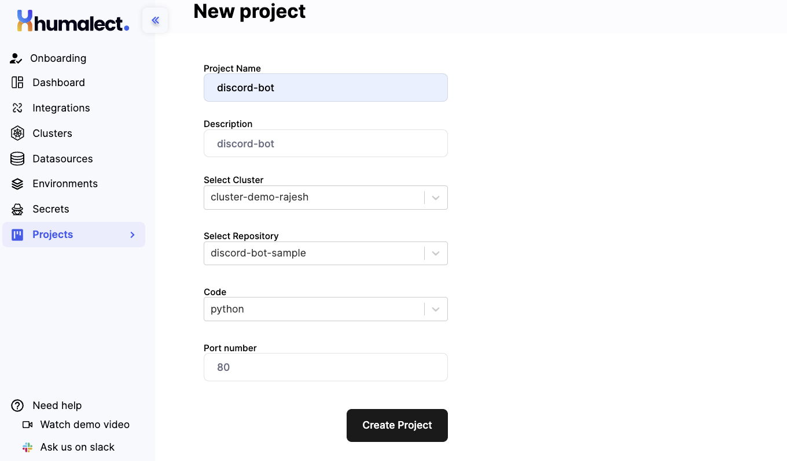
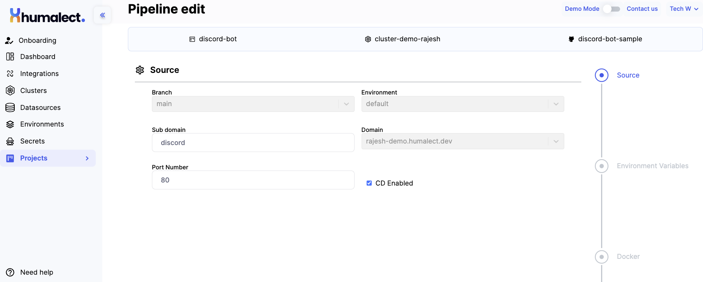
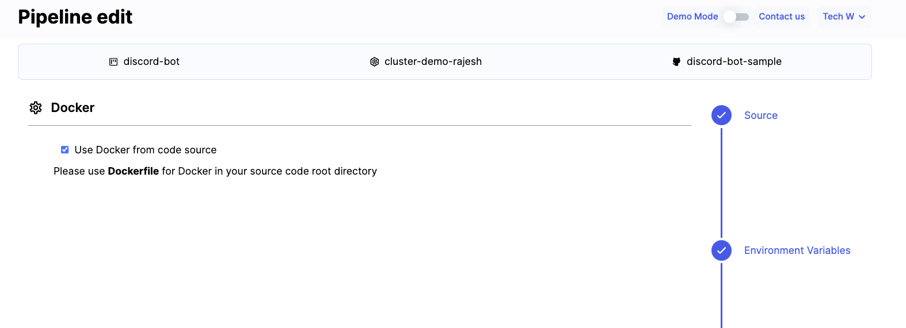
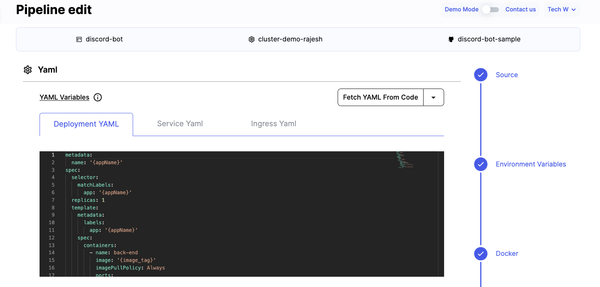
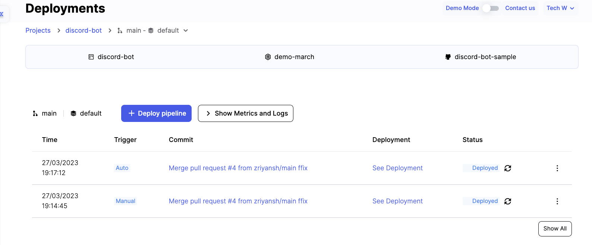
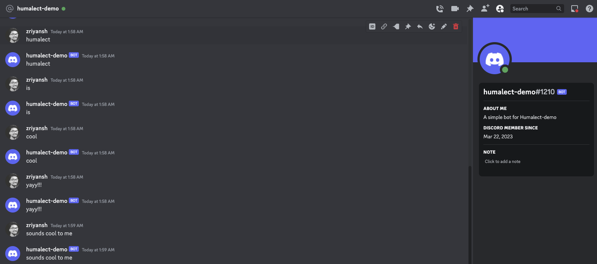
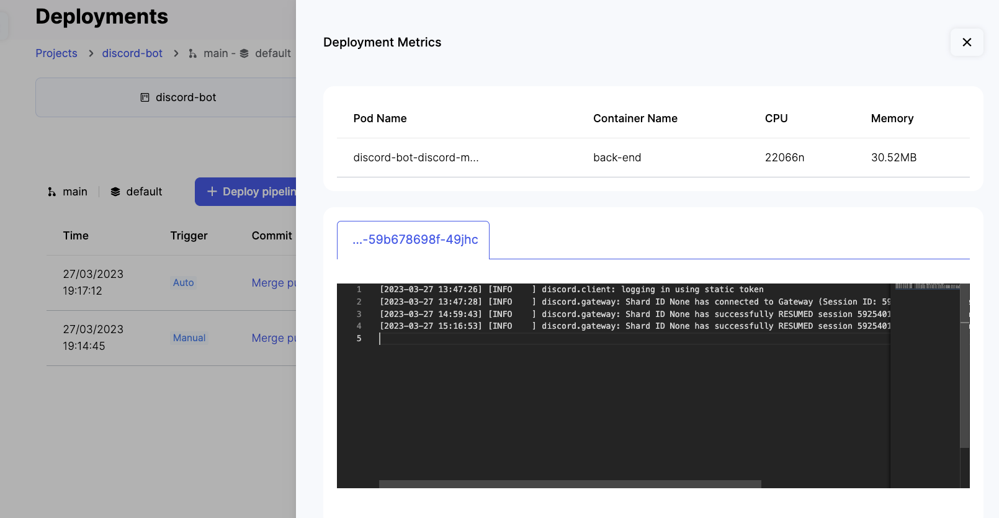
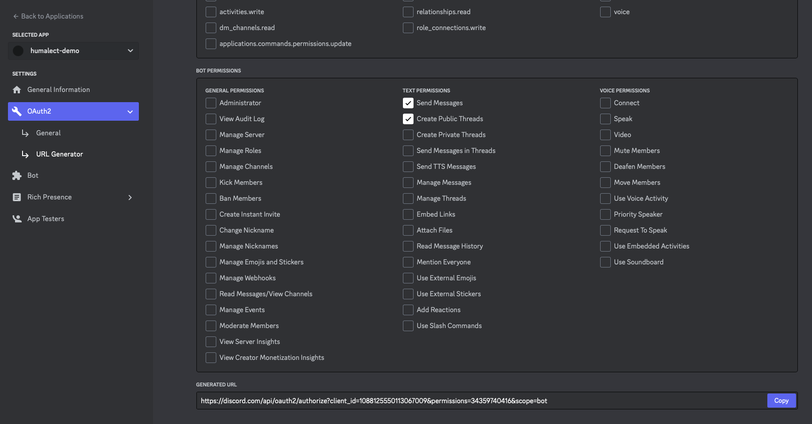

Discord bots are helpful artificial intelligence that can carry out a number of useful activities automatically on your server. That entails greeting any new participants, expelling disruptive individuals, and moderating the conversation. Several bots can even add games or audio to your server.

In this tutorial, we will see how can we deploy a sample Discord Bot application in a few clicks using the Humalect platform.

<!--truncate-->

Let's get started

### Example Discord Bot application

Fork [THIS](https://github.com/Humalect/discord-bot-sample) sample Discord Bot repository to get started.

Click on [THIS](https://discord.com/api/oauth2/authorize?client_id=1088125550113067009&permissions=534723950656&scope=bot) link to get an invite to see the bot in action (it mirrors whatever your say.)

### Humalect Account Setup

:::tip
Please skip to point 5 if you have setup your Humalect account and have a functional K8s cluster.
:::
1. **Sign up**: visit https://humalect.com and sign up. Complete the registration flow and log in.

2. **Integrate your Cloud Provider**: Connect AWS/Azure by visiting [THIS](https://console.humalect.com/user/integrations) link and following their respective workflows.

3. **Integrate your source code provider**: Visit [THIS](https://console.humalect.com/user/integrations) link, follow the respective workflow to connect Bitbucket/Github/GitLab.

4. **Create a Kubernetes Cluster**: Create a k8s cluster by referring to our [AWS](../Clusters/create-an-AWS-cluster) or [Azure](../Clusters/create-an-Azure-cluster) docs.

5. **Create an environment**

An environment is a logically isolated k8s namespace that contains all your deployment related entities for a pipeline.

Create an environment for your Go application. Check for various options that need to be configured to create a new environment or use an existing one.

:::info
These are some important fields:
- Name of the environment that you wish to created: can be dev, prod or test etc.
- Cluster in which you want to create this environment
- The namespace in the k8s cluster that will host this environment
:::
<!--  -->

6. **Create a project**.

A project maps the cluster and the code repository which needs to be deployed.

Refer the image below for various options that need to be configured to create a project.



7. **Create a pipeline**.

After creating your project, let's now create a pipeline to define few of the below things for our deployment:

- The subdomain on which you need your deployment to go live.
- The port on which your code runs.
- The branch from your code repo that you want to deploy.
- The environment that you want to deploy to.
- Whether you want to enable continuous deployments.
- The environment variables for your app.

Refer the image below for various options that need to be configured to create a pipeline.



next,



***Advanced Options***:

- You can use the Dockerfile available in the git repo, check the box **use Docker from source code**.
- Leave the autogenerated k8s YAML files, you can edit them if you wish (this can break things, edit only if you are aware of consequences)

Refer the image below for advanced options related to a pipeline.
 


8. **Deploy pipeline**.

Once your pipeline is created, hit the **deploy pipeline** button to deploy your app.
If you have enabled continuous deployments while pipeline creation, all your future commits will be automatically deployed.

Refer image below for pipeline deployment.



9. **See that your app is live**.

Hit the **See Deployment** link next to your latest deployment and it will take you to the URL of your deployed application. The SSL certificates are auto-generated for you.

Refer image below for live deployment.



10. **Check logs and metrics**.

Hit the **Show Metrics and Logs** button to view happenings of your latest deployment.

Refer image below for live deployment logs and metrics.



We are done!

Happy deploying!


## Working of the Discord Bot:

So far we have seen how to deploy your bot using Humalect, now lets dive into some technical details about the bot itself.


Here's the simple Dockerfile we wrote to run the bot in a Docker conatiner.

```Dockerfile title="Dockerfile"
#Deriving the latest base image
FROM python:latest

RUN pip3 install discord.py
RUN pip3 install python-dotenv

WORKDIR /app

COPY *.py ./

CMD [ "python", "./main.py"]
```

Below is the driver file for the bot. 

```python title="main.py" 
import bot

if __name__ == '__main__':
    bot.run_discord_bot()
```

Below is the response of the bot when user enters a prompt.

```python title="responses.py" 
def handle_response(message) -> str:
    p_message = message.lower()

    if p_message:
        return p_message

    return 'I do not know, trust me'
```

Below is the main logic for the bot.

```python title="bot.py"
import discord
import responses
import os

from dotenv import load_dotenv

load_dotenv()

TOKEN = os.getenv("TOKEN")

# Send messages
async def send_message(message, user_message, is_private):
    try:
        response = responses.handle_response(user_message)
        await message.author.send(response) if is_private else await message.channel.send(response)

    except Exception as e:
        print(e)


def run_discord_bot():
    
    client = discord.Client(intents=discord.Intents.default())

    @client.event
    async def on_ready():
        print(f'{client.user} is now running!')

    @client.event
    async def on_message(message):
        # Make sure bot doesn't get stuck in an infinite loop
        if message.author == client.user:
            return

        # Get data about the user
        username = str(message.author)
        user_message = str(message.content)
        channel = str(message.channel)

        # Debug printing
        print(f"{username} said: '{user_message}' ({channel})")

        # If the user message contains a '?' in front of the text, it becomes a private message
        if user_message[0] == '?':
            user_message = user_message[1:]  # [1:] Removes the '?'
            await send_message(message, user_message, is_private=True)
        else:
            await send_message(message, user_message, is_private=False)

    # Remember to run your bot with your personal TOKEN
    client.run(TOKEN)

```

### How to get Token for your Discord bot
1. Goto https://discord.com/developers/applications and create an application.
2. Click on the application you created and go to https://discord.com/developers/applications/1088125550113067009/bot to generate the TOKEN. 
3. Setup OAuth2 > URL Generator. Select Bot from Scopes and give the bot some permissions (or all).



4. Below you'll find the generated URL to add the bot your servers. 

As this tutorial is not on how to make a discord bot, refer to this [link](https://www.freecodecamp.org/news/create-a-discord-bot-with-python/) for full explanation of the same. 

That wraps up for this tutorial.

Feel free to [Reach out to us](https://humalect.com/docs/Contact-us/reach-out-to-us) in case you need help.

