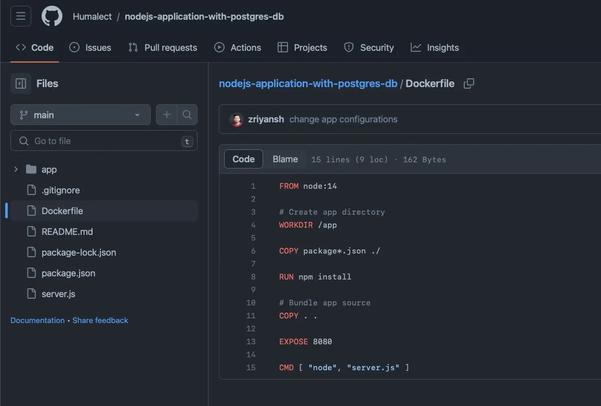
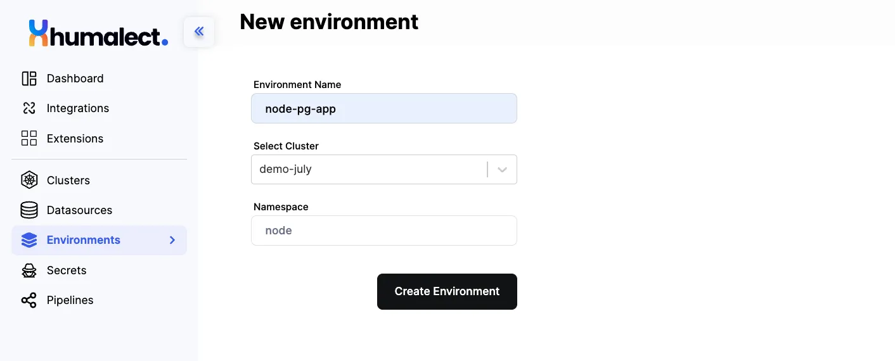
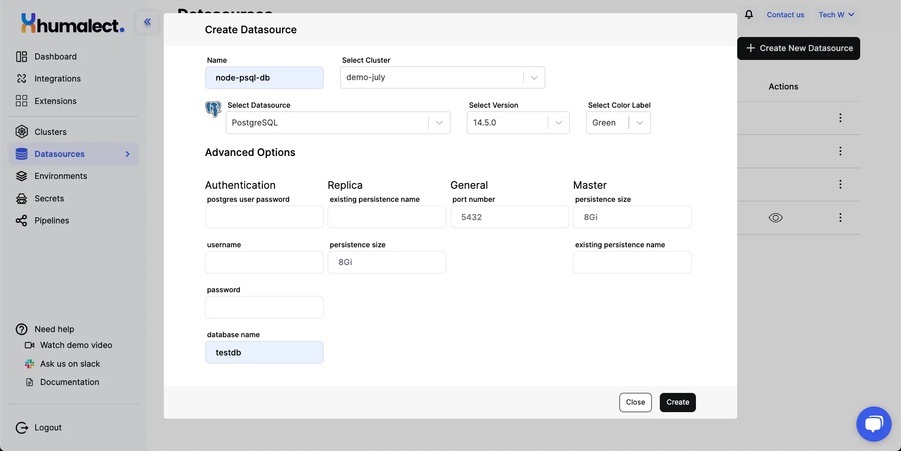
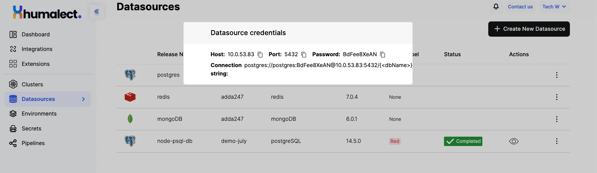
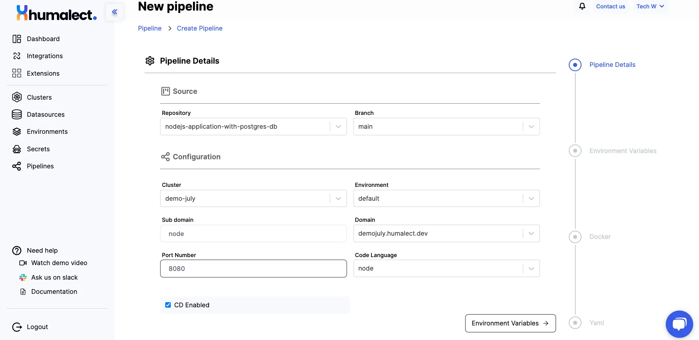
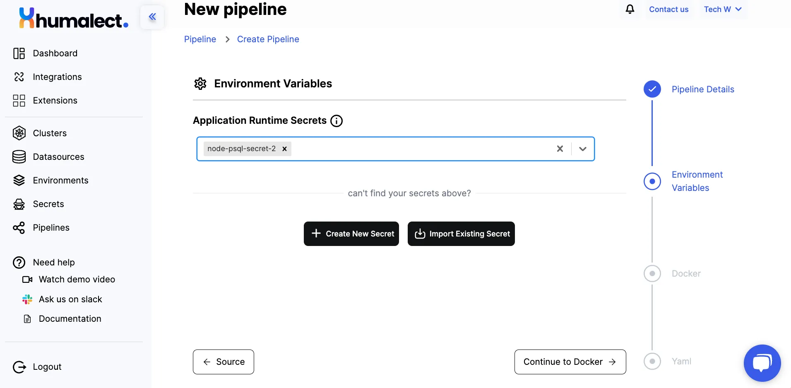
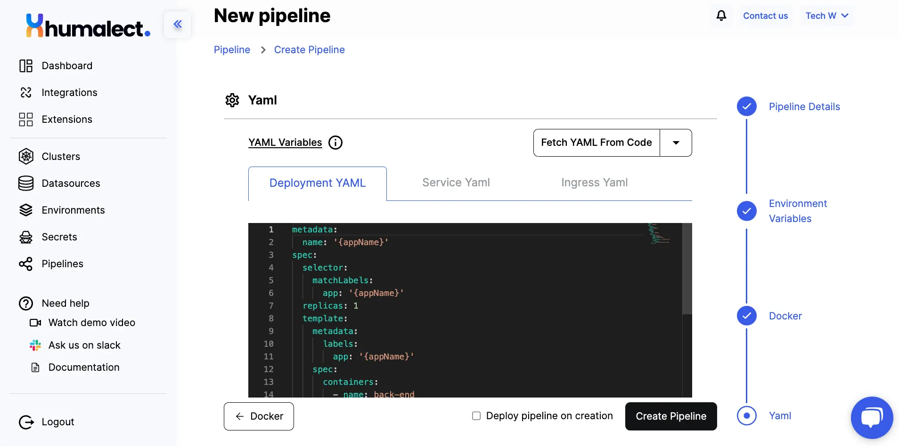
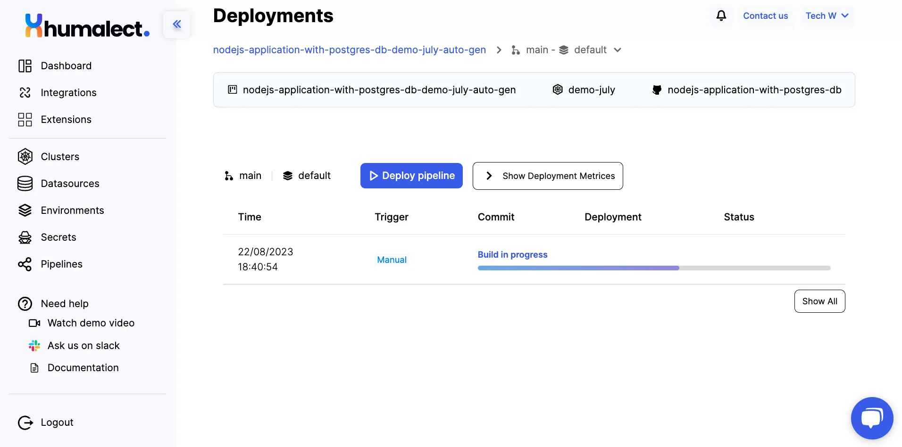
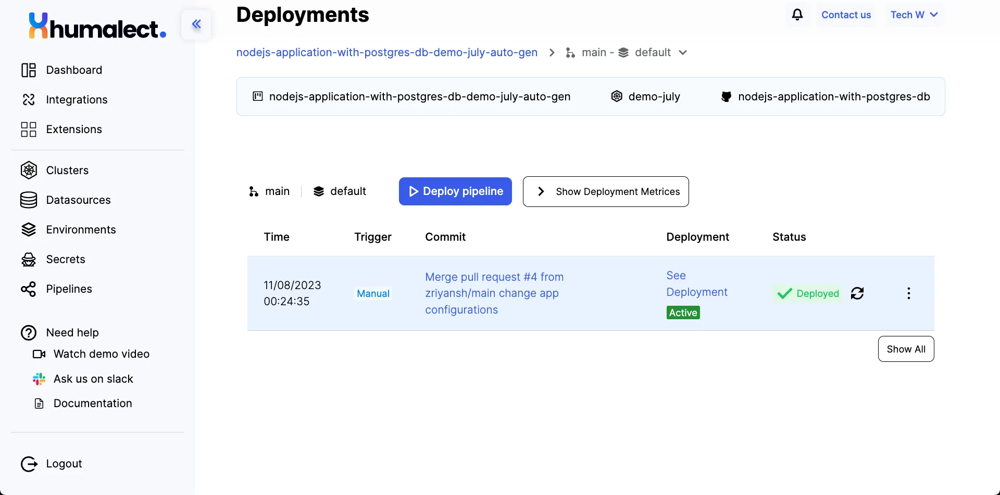

Before we get into the actual steps of deploying, it would make sense to get to know a little about the tech stack we are gonna use. 

**Node.js** is a server-side JS runtime environment built on top of the Google Chrome V8 JavaScript engine. It is mostly used to create web servers but can do a lot more.

**PostgreSQL** is an open-source relational database system frequently used in DevOps. It supports high availability through replication, automated deployment via tools like Ansible, and containerization with Docker and orchestration using Kubernetes.

In this tutorial, we will see how can we deploy a sample NodeJS application using a Postgres datasource in a few clicks using the Humalect platform.

<!--truncate-->

Let's get started!


### Example Node.JS + Postgres Application​

Fork <a href="https://github.com/Humalect/nodejs-application-with-postgres-db" rel="nofollow">this</a> sample Node.JS repository to get started. This NodeJS application exposes a static API that returns a static response and runs on port 8080. 

Below is the directory structure of the app we are going to use. 



### Humalect Account Setup​

Please skip to point 5 if you have set up your Humalect account and have a functional k8s cluster.

**Step 1: Sign up:** visit https://humalect.com and sign up. Complete the registration flow and log in.

**Step 2: Integrate your Cloud Provider:** Connect AWS/Azure by visiting this link and following their respective workflows.

**Step 3: Integrate your source code provider:** Visit this link, and follow the respective workflow to connect Bitbucket/Github/GitLab.

**Step 4: Create a Kubernetes Cluster:** Create a k8s cluster by referring to our AWS or Azure docs.

**Step 5: Create an environment**.

An environment is a logically isolated k8s namespace that contains all your deployment-related entities for a pipeline.

You can create an environment for your application or use the default environment. Refer to the image below for various options that need to be configured to create a new environment.

**These are some important fields:**
- Name of the environment that you wish to create: can be a dev, prod or test, etc.
- Cluster in which you want to create this environment.
- The namespace in the k8s cluster will host this environment.




### Datasource Creation
**Step 6: Create a Datasource**.
Every application needs some kind of database or cache to store data. There are multiple ways to use databases:
- Get a hosted database/cache from a cloud provider
- Take an open-source image and host it yourself

It takes a lot of effort for dev teams to set up and maintain open-source databases. That is why we created a datasources feature on the Humalect platform. Choose a database or cache of your choice and we host it for you via helm charts in a few clicks.

**List of Databases and their supported versions​:**

| Name | Version supported |
| --   |  --               |
| MongoDB | v6.0.1, v5.0.10 |
| Redis | v7.0.4, v6.2.7 |
| Postgres | v14.5.0, v11.14.0 |
| mySQL | v8.0.33, v8.0.29 |


For the purpose of this demonstration, we’ll be creating a `v14.5.0 Postgres DB`. 

**Step 7:** Here, the first task is to create a Postgres database from the Humalect platform. To do this, navigate to the database creation page and fill in the required details. You'll need to specify the database name, the cluster on which the database will be created, the desired database version, and even assign a color label for easy identification.

To create a new datasource, click on the + Create New Datasource at the center or click on the button towards the right top (you will see this option if you already have created some datasources previously).


Follow these steps to create a new datastore.



A picture representing the state of UI while creating Datasources

- **Step 1:** Enter a Datasource Name.
- **Step 2:** Select the Cluster in which you want to host your datasource.
- **Step 3:** Select Postgres v14.5.0 from the list.
- **Step 4:** You can edit advanced options like username and replica count, database name, and passwords.
- **Step 5:** Hit create button and Voila it's done.

The datasource creation will take under 60 seconds, you’ll be able to see the created datasource in the image below. 



**Step 8:** With the database successfully created, it's time to obtain the crucial credentials required to connect your backend application to the database. Simply click on the eye icon that says Fetch Credentials, and the necessary information, including the host address, port number, password, and database name, will be displayed. 

Copy this information to a notepad for later use.

### Pipeline Creation

**Step 9:** Now, let's move on to creating a pipeline for your Node.js application. To do this, hit the "`Create New Pipeline`" button. 



In this section, you'll need to provide some vital details to configure the pipeline. First, select your connected repository, and choose the specific branch that contains the code you wish to deploy.

**Step 10:** Next, configure the pipeline by selecting the appropriate cluster and environment for deployment. You'll also need to specify a subdomain, choose a connected and verified domain from the cluster, set the desired port number, and indicate the code language for your application.

For those looking to take automation to the next level, you can enable Continuous Deployment (CD) by clicking on the "CD Enabled" button, as shown above. This feature allows Humalect to automatically deploy new changes as they are pushed to your repository, saving you time and effort.

### Adding Secrets to the Pipeline

**Step 11:** Now, let's explore the Environment Variables section. Click on the corresponding button at the bottom, and you'll be presented with three options:
- Option 1: Select an already-made secret from the drop-down list.
- Option 2: Create a new secret file to store sensitive information securely.
- Option 3: Import an existing secret from your cloud account.




For the purpose of this tutorial, we'll create a new secret file. Click on the "Create New Secret" button and fill in the required fields.
- Provide a unique name for the secret
- Choose the Vault Provider option, such as AWS Secrets Manager or Azure Key Vault.
- Next, select the type of secret. The two options available are "Runtime Environment Variables" and "File to be Mounted Inside the Container."


**Files to be Mounted Inside the Container:** With this option, AWS Secrets Manager stores the secret data securely and allows you to reference it using a specific file path. 

When you run your container, you can configure the container to mount the secret file from AWS Secrets Manager to a specific location inside the container.

For this tutorial, we'll choose "Runtime Environment Variables" and proceed to paste the relevant environment values from the [repository's](https://github.com/Humalect/nodejs-application-with-postgres-db) readme section.

```
HOST=
USER=postgres
PASSWORD=
DB=testdb
DIALECT=postgres
POOL_MAX=5
POOL_MIN=0
POOL_ACQUIRE=30000
POOL_IDLE=10000
```

**Step 12:** Remember I asked you to copy HOST and PASSWORD values that we got during datasource creation in the previous steps? Add those values here as runtime variables for secure access to the Postgres database.

Once everything is set, hit the "Create" button to generate the new secret.

**Step 13:** Select the secret you just created from the drop-down menu. It's essential to note that you can have more than one secret for your application, depending on your security needs and configuration style.

**Step 14:** Click on "Continue to Docker" to move to the next step. 


### Setup Dockerfile

**Step 15:** In the Docker section, you have two options:
- Option 1: Copy and paste your Dockerfile directly.
- Option 2: Utilize the Dockerfile from your code source repository, provided it's located in the root folder.


We’ll be fetching the Dockerfile from the source code repository. Here’s a quick glimpse of how that file looks file.

```
FROM node:14

# Create app directory
WORKDIR /app

COPY package*.json ./

RUN npm install

# Bundle app source
COPY . .

EXPOSE 8080

CMD [ "node", "server.js" ]
```

### YAML Config
**Step 16:** After completing this step, click on the "Yaml" button to access the YAML variables for further customization.



**Step 17:** The YAML configuration allows you to fine-tune settings such as Deployment YAML, Service YAML, and Ingress YAML. Here, you can set up your deployment environment precisely as desired.

**Step 18:** You can also fetch YAML from your source code or even import configurations from other pipeline projects, streamlining your deployment process further.

**Step 19:** If you wish to automate deployment whenever changes are made to this pipeline, click on the "Deploy pipeline on update" checkbox. This feature ensures your application is continuously up-to-date without manual intervention.

**Step 20:** Once you've made all necessary adjustments and are satisfied with your pipeline configuration, click on the "Create Pipeline" button. 

### Application Deployment



**Step 21:** Please note that the pipeline creation process may take anywhere from 2 to 10 minutes, depending on your application's complexity and the number of simultaneous deployments. During this time, feel free to grab a cup of coffee and relax. I’ll skip to the moment these deployments are over.

### Successful Deployment



**Step 22:** Once your pipeline is successfully created, and you wish to deploy again, you can deploy your application with a single click of the "Deploy Pipeline" button. 

**Step 23:** Additionally, you can edit various aspects of your pipeline, such as the subdomain, port number, checkbox buttons, secrets, Dockerfile, and YAML configurations. 

**Step 24:** Click on Show Metrics and Logs button to get more information on what’s on going out with your application. 


**Step 25:** If you ever encounter a warning sign indicating that your subdomain is not verified, don't worry. Just click on the refresh button, and the error will vanish. However, if you haven't verified the subdomain, click on the information button to access the steps on how to map or add the CNAME with your host provider.


```
Connect domain to cluster
Please add the following A record to your DNS provider (AWS Route53/GoDaddy/Namecheapetc.) portal.

Depending on your DNS provider, you might have to remove your root domain from the Name field below before entering it in your DNS provider portal

Name: node1.demojuly.humalect.dev OR *.demojuly.humalect.dev

Value: 20.204.185.55
```

Well, You've successfully deployed your Node.js application with a Postgres database on Humalect. This accomplishment is a testament to your dedication to excellence and innovation.

If you have any questions or need further assistance, our passionate support team is just a click away. We're here to support your journey every step of the way.

Thank you for joining me in this comprehensive tutorial. I'm Priyansh, and I hope this guide helped you to make the most of Humalect's advanced features for your Node.js applications. 

Stay tuned for more exciting tutorials, Happy coding! 

