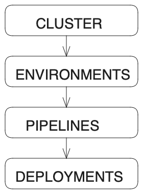

# Terminologies and their Relationship 

In this section, we will be discussing about:
- Clusters
- Enviroments
- Datasources
- Pipelines
- Secrets
- Deployments

## Cluster
Cluster refers to the Kubernetes clusters that are created via the Humalect platform. These are managed K8s EKS/AKS clusters provided by cloud providers. Cluster is the starting point and everything that exists in the Humalect world gets created inside clusters.

:::tip
To know more about cluster, visit [Cluster](./../docs/cluster-overview).
:::

<!--  -->

## Environments
The Environment Page provides an insight into the concept of environments within the context of Kubernetes, shedding light on their significance in the application development lifecycle.

**Definition of Environment:**
An environment, in this contex  t, is a designated Kubernetes namespace that operates as an independent and self-contained unit. Within this isolated space, multiple application deployments and datasources can coexist without interference, ensuring a high level of segregation.

:::tip
To know more about environment, visit [Environment](./../docs/Environments/Overview).
:::

<!-- ### Projects

A project is a logical entity in which the user maps two options:
1. The cluster on which the application is to be deployed
2. The code repository that is to be deployed

To know more about projects, visit [Project](./../docs/projects/overview).

<b>Note:-</b> Project is not a physical/infra entity, it is just a logical entity to map the cluster and code repo for application deployments. -->

## Datasources
Data sources refer to the databases, services, or files from which an application gathers, stores, or retrieves data. In the context of software development, data sources are essential for applications to interact with and manage data. These sources can be in various formats such as databases, APIs, files, streams, and more.

There are multiple ways to use databases:

- Get a hosted database/cache from a cloud provider
- Take an opensource image and host it yourself
- It takes a lot of effort for dev teams to setup and maintain opensource databases. That is why we created a datasources feature on the Humalect platform. Choose a database or cache of your choice and we host it for you via helm charts in a few clicks.

:::tip
To know more about Datasources, visit [Datasources](./../docs/Datasources/overview).
:::

## Pipelines
Pipeline is a logical entity which lets you configure some vital details for the deployment. Configurations like selecting your connected repository, and choosing the specific branch that contains the code you wish to deploy, set the desired port number and indicate the code language for your application.

User can also enter their choice of subdomain on which the application deployment is to be hosted, the main domain related to the AWS/Azure cluster and all the manifests like Dockerfiles, YAMLs and environment variables can be edited in a pipeline.

:::tip
To know more about pipelines, visit [Pipelines](./../docs/Pipelines/overview).
:::

:::info
Pipeline is not a physical/infra entity, it is just a logical entity to map the cluster and code repo for application deployments. 
:::

## Secrets

The "Secrets" feature in Humalect offers users a secure and convenient way to manage environment variables and sensitive information for their applications. Here's a quick overview of it:

- **Secure Storage**: Store sensitive information in your cloud account, ensuring protection against unauthorized access.
- **Easy Management**: Effortlessly manage environment variables – store, update, and delete secrets with just a few clicks.
- **Seamless Kubernetes Integration:** Integrate seamlessly with Kubernetes for secure deployment and management of applications, keeping sensitive data separate from code and configuration files.

:::tip
To know more about Secrets, visit [Secrets](./../docs/Secrets/secrets).
:::

## Deployments
After the creation of a pipeline, the next step is initiating its deployment. This can be achieved through two primary methods: direct commits on code repositories and manual deployments via the pipelines page user interface (UI). The overarching goal is to facilitate the release of code changes to users in a controlled and efficient manner.

:::tip
To know more about deployments, visit [Deployments](./../docs/Pipelines/how-to-deploy-a-pipeline).
:::

## Example
Let us consider an example of a Food Delivery App(FDA) to understand the concepts better.

1. **FDA is a Food Delivery Company Requiring a Cluster on Humalect's Console:**
   - FDA, which stands for the Food Delivery Company, is a business that delivers food to customers.
   - To manage their software applications and services, they need to use a cluster within Humalect's console. A cluster is a group of interconnected servers or nodes used to deploy and manage applications.

2. **Two Running Environments - Test/Testing and Production:**
   - FDA's software applications are divided into different environments to segregate various stages of development and deployment.
   - The two environments mentioned are "test" or "testing" (used for testing new changes) and "production" (where the final, customer-facing version runs).

3. **Two Running Pipelines - API and FDA:**
   - Pipelines are automated workflows that handle the steps from code to deployment.
   - FDA's cluster has two pipelines: "api" and "fda." Each pipeline represents a different set of processes and stages for deploying code.
   - These pipelines are responsible for taking the code from repositories and moving it through various stages until it's ready for deployment.

4. **Multiple Deployments for Each Pipeline:**
   - Whenever new code changes are committed to the respective code repositories, the pipelines initiate actions to deploy those changes.
   - Additionally, manual deployment can also be triggered through the pipeline's interface.
   - Each pipeline can handle multiple deployments, allowing for the management of different versions of the codebase.

FDA is utilizing Humalect's console to manage their software deployments. They have organized their applications into environments (test and production) and pipelines (api and fda) to facilitate efficient development, testing, and deployment of their code. This structure helps FDA ensure that code changes are properly tested before being released to their production environment, providing a controlled and reliable software delivery process.

### Troubleshooting
Need help? [Contact](./../docs/Contact-us/reach-out-to-us) us

