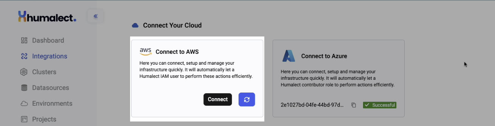
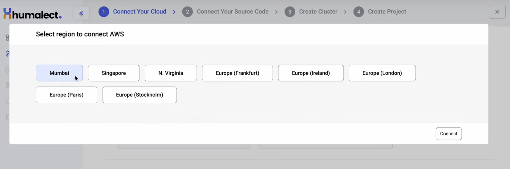
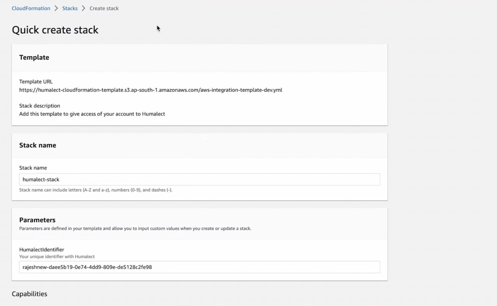

> ## This article covers
> 1. What is AWS
> 2. AWS Use Cases
> 3. Connecting your AWS Account

**Humalect** provides AWS as one of the cloud provider integrations.

## What is AWS?

AWS is a cloud platform that provides infrastructure and services to help organizations implement continuous integration, delivery, and deployment. AWS services like CodePipeline, CodeBuild, and CodeDeploy enable DevOps teams to automate code deployment and infrastructure management, and to monitor and improve application performance. 

AWS also provides tools for security and compliance, such as AWS Identity and Access Management (IAM) and AWS Config, to ensure that applications and infrastructure meet industry standards and regulations.

## AWS Use Cases
1. **Infrastructure as Code (IaC):** AWS CloudFormation and AWS Elastic Beanstalk help DevOps teams define and manage infrastructure as code.
2. **Monitoring and logging:** AWS provides services like CloudWatch and X-Ray that enable DevOps teams to monitor application performance, detect issues, and troubleshoot in real-time.
3. **Security and compliance:** AWS offers a range of services to help DevOps teams implement security and compliance best practices, such as AWS Identity and Access Management (IAM), AWS Config, and AWS Security Hub.
4. **Scalability and high availability:** AWS provides services like Auto Scaling, Elastic Load Balancing, and Amazon RDS that help DevOps teams ensure that applications are highly available and can scale up or down as needed.

> ## Prerequisites
> 1. Must have valid Humalect account credentials.
> 2. Must have valid AWS account.

## Connecting your AWS Account

**Step 1:** To get started with using AWS, Go to the `integrations` tab on the Humalect platform and click on the `Connect` button of the `AWS` integration and follow along.

 

<i>Image showing AWS integration on the integrations page on Humalect platform. </i>
  

**Step 2:** Select the region for your AWS account as shown in the picture below and click on `Connect`.
 

<i>Image showing AWS integration region. </i>
 

**Step 3:** Login to your AWS account if not already. 

 

**Step 4:** In the next step, there will be a Predefined CloudFormation template that Humalect has created for you. This template will create some IAM roles and policies inside your account through which you can create the infrastructure really easily.

**Step 5:** Click on the `Create Stack` button at the bottom of the page, it will take around 30 seconds to process and your cloud account will be connected to Humalect. 

**Step 6:** Back in the You'll see a successful tag in the UI after performing the above mentioned steps. 

### Troubleshooting
Need help? Contact [Humalect support.](https://humalect.com/)