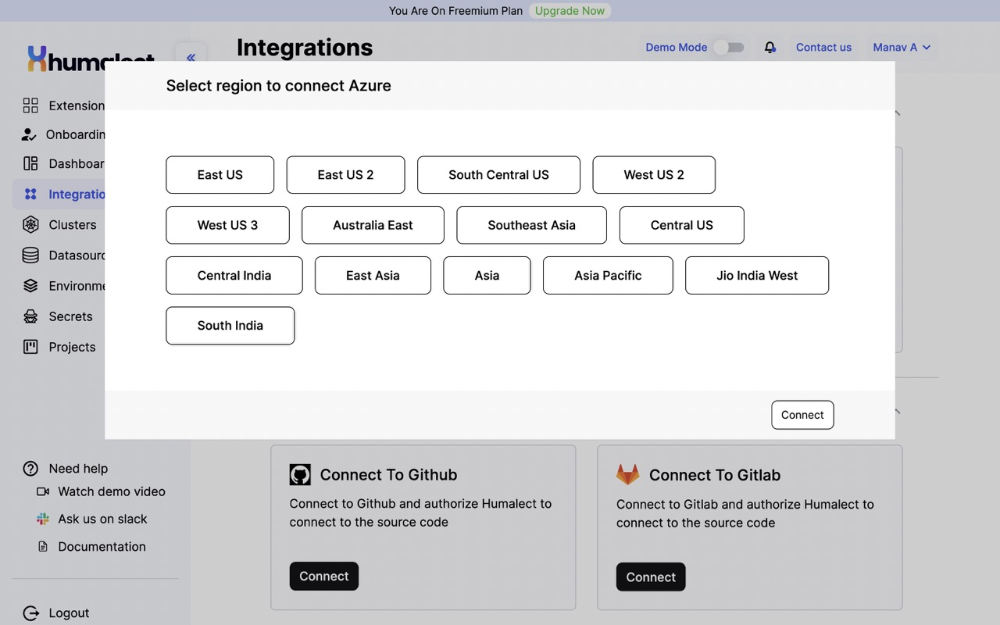
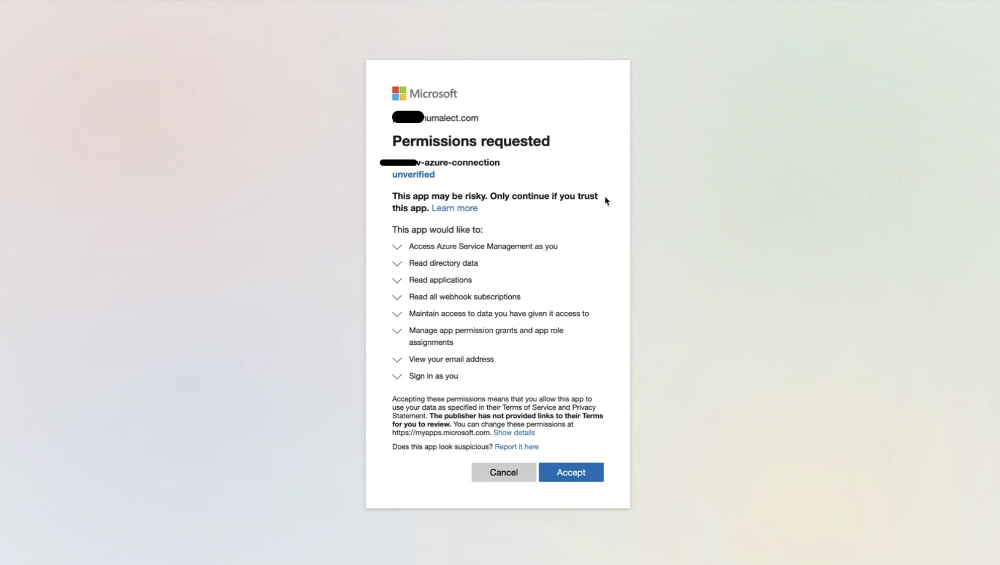
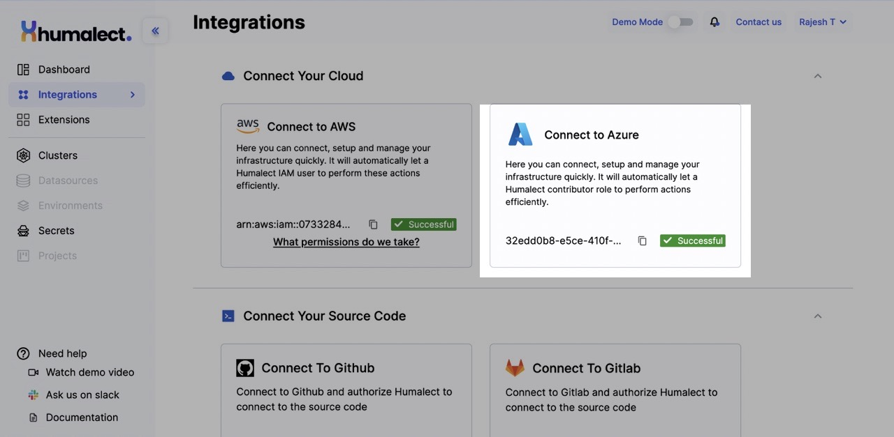

**Humalect** provides Azure as one of the cloud provider integrations.

## What is Azure?

Azure Cloud is a comprehensive and powerful cloud computing platform that provides a wide range of services, tools, and solutions for building, deploying, and managing cloud applications and infrastructure. It offers a wide range of features such as virtual machines, storage, databases, analytics, artificial intelligence, Internet of Things (IoT), security, and more

## Azure Use Cases
1. Continuous Integration and Deployment: Organizations can use Azure DevOps to build and test their applications in the cloud, deploy applications to Azure, and manage their entire release pipeline. 
2. Infrastructure as Code: Azure provides a range of services and tools for managing infrastructure as code (IaC) using popular tools such as Terraform and Ansible. 
3. Application Monitoring and Analytics: Including Azure Monitor and Application Insights, these services provide deep insights into application performance and behavior, allowing organizations to identify issues and bottlenecks quickly, and optimize their applications for better performance and user experience. 

## Prerequisites
> 1. Must have valid Humalect account credentials.
> 2. Must have valid Azure account.

## Connecting your Azure Account

**Step 1:** To get started with using Azure, Go to the `integrations` tab on the Humalect platform and click on the `Connect` button of the `Azure` integration and follow along.

<i>Image showing Azure integration on the integrations page on Humalect platform. </i>
 

**Step 2:** Select the region for your Azure account as shown in the picture below and click on `Connect`.

<i>Image showing AWS integration region. </i>
 

**Step 3:** You'll be redirected to login to your Azure account if you are not already logged in. 

**Step 4:** The following are the permissions that Humalect requests.

    ✅ Access Azure Service Management as you
    ✅ Read directory data
    ✅ Read applications
    ✅ Read all webhook subscriptions
    ✅ Maintain access to data you have given it access to 
    ✅ Manage app permission grants and app role assignments
    ✅ View your email address
    ✅ Sign in as you

**Step 5:** Read all the permissions carefully and then click on the `Accept` button.  

**Step 6:** Head back to Humalect console, you'll see the successful message.

### Troubleshooting
Need help? Contact [Humalect support.](https://humalect.com/)
