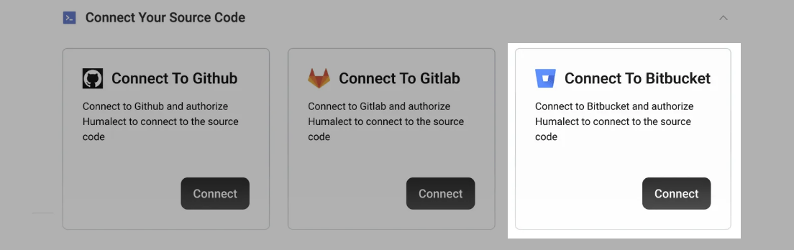
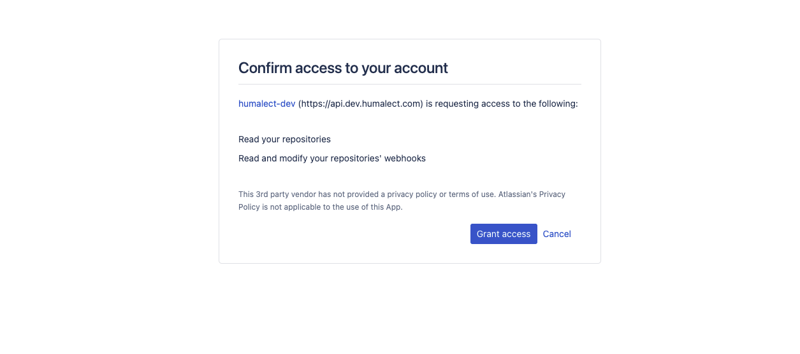
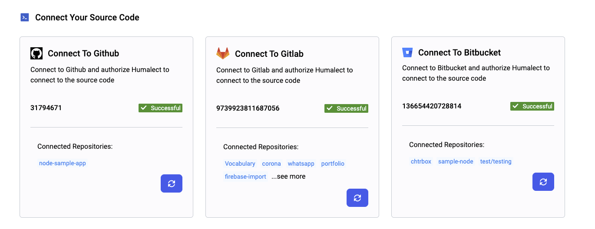

**Humalect** provides Bitbucket as one of the source code provider integrations.

## What is Bitbucket?

**Bitbucket** is a web-based version control and collaboration tool for software development. It allows teams to host and manage their code, collaborate on development, and build and deploy their applications with integrated CI/CD. Let's look at some of its use cases.

## Bitbucket Use Cases

1. **Code Hosting and Collaboration**: Bitbucket allows teams to host and manage their code in a centralized location, making it easy for team members to collaborate on development and review each other's code.
2. **Continuous Integration and Deployment (CI/CD):** Bitbucket integrates with popular CI/CD tools such as Jenkins and Bamboo, making it easy for teams to automate the build and deployment of their applications.
3. **Access Control and Permissions:** Bitbucket allows teams to set up granular access controls and permissions, making it easy to manage who has access to specific code repositories and what actions they can perform.

> ## Prerequisites
> 1. You or your organization must have an active Bitbucket account that contains the source code of the application.
> 2. The **NAT-IP** for the cluster that is to be used should be whitelisted from the bitbucket account if your bitbucket account is not public.

## Connecting your Bitbucket Account

**Step 1:** To get started with using Bitbucket, Go to the `integrations` tab on the Humalect platform and click on the `Connect` button of the `Bitbucket` integration and follow along.

**Step 2:** Now, you will be redirected to Bitbucket to authorize Humalect, click on the `grant access` button to authorize Humalect to access all or selected repositories from your Bitbucket account.

> *On the redirected page, you will clearly be able to see all the access and permissions that you will grant to Humalect.*

Here, we keep our permissions to a bare minimum, i.e:
1. **Read your repositories**
2. **Read and modify your repositories webhooks**

**Step 3:** After successful integration, you'll get automatically redirected to Humalect's platform and will see a `✅ Successful` checkmark.
You can also check the connected repositories from the Dashboard and `integration id` [here.](https://console.humalect.com/user/integrations)

