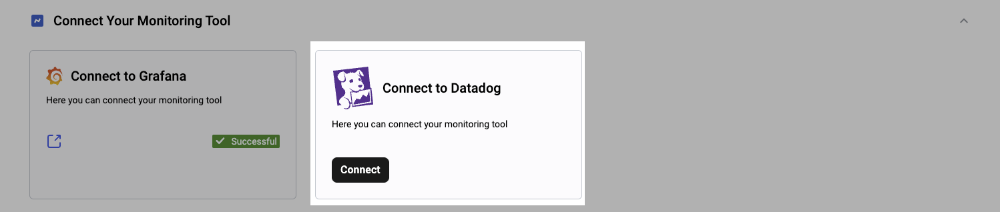
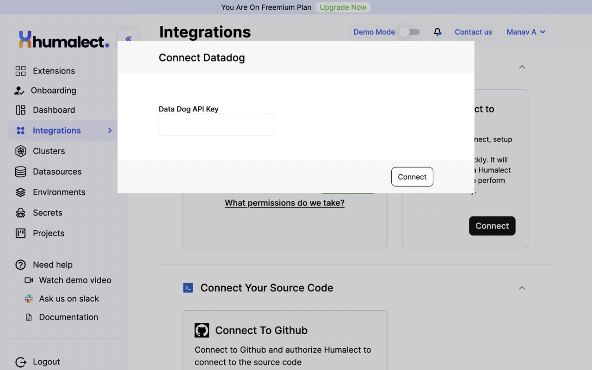
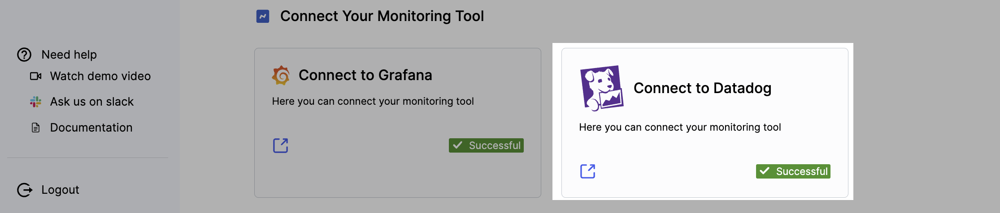
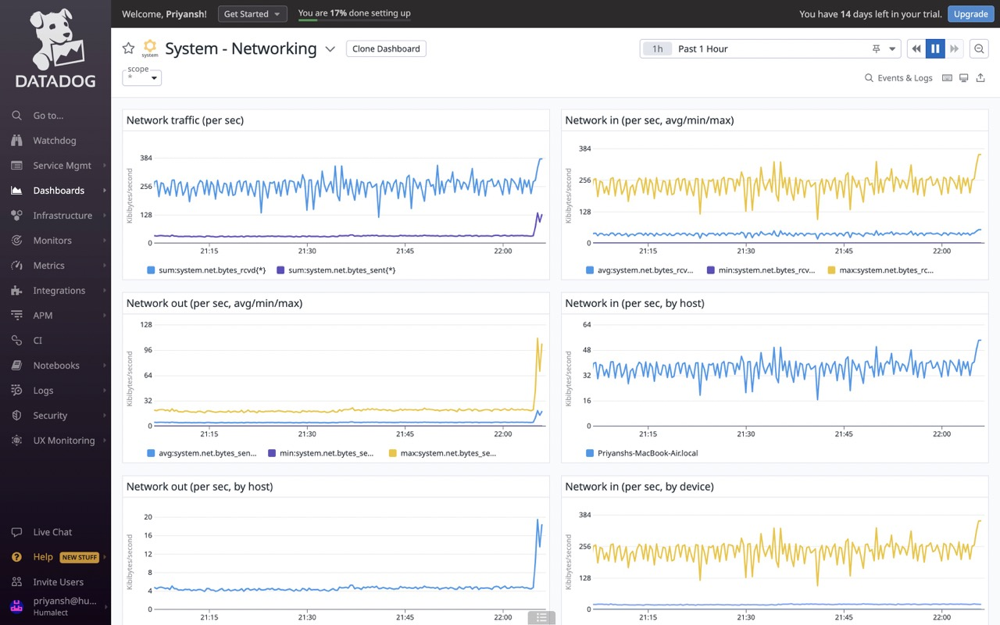

> ## This article covers
> 1. What is Datadog?
> 2. Prerequisites
> 3. Connect Datadog with Humalect

**Humalect** provides Datadog as one of the Monitoring integrations.

Datadog is a cloud-based monitoring and analytics platform that allows businesses to track and analyze their IT infrastructure and applications. It helps organizations identify and resolve issues in real-time, as well as gain insights into their performance and user behavior. Datadog integrates with a wide range of tools and services, including AWS, Kubernetes, and Slack.

## Prerequisites
1. You need to have a cloud account (AWS / Azure)  connected with Humalect.

## Connect Datadog with Humalect

To connect Humalect to Datadog, refer to these steps.

**Step 1.** Click on the `Connect` button present in the UI.

**Step 2.** You'll be prompted to enter the DataDog API key. Open your Datadog account and search for the API key or refer to [this documentation by Datadog team (recommended).](https://docs.datadoghq.com/account_management/api-app-keys/)

**Step 3**. Enter the DataDog API key (make sure you enter the correct API keys) and click on `Connect`, 

**Step 4.** Datadog will be connected to Humalect and you can then visualise the Metrics, Traces and Logs of your application in the Datadog Dashboard by clicking on the external link icon to take it to your Datadog dashboard.

 

### Troubleshooting
Need help? [Contact](https://docs.humalect.com/en/contact) us.
