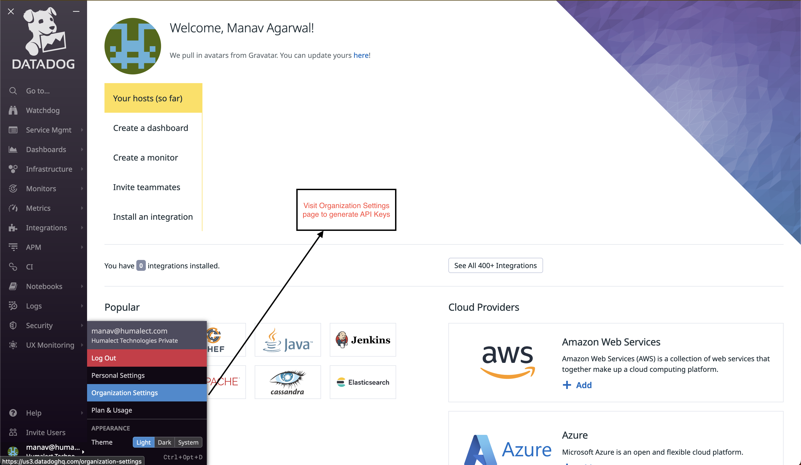
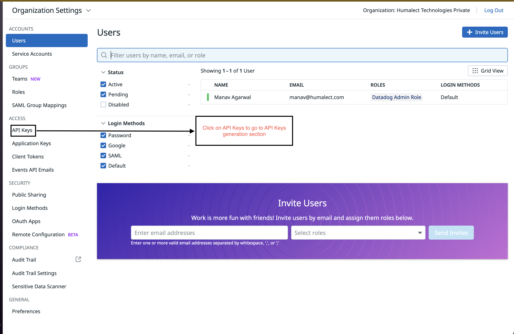
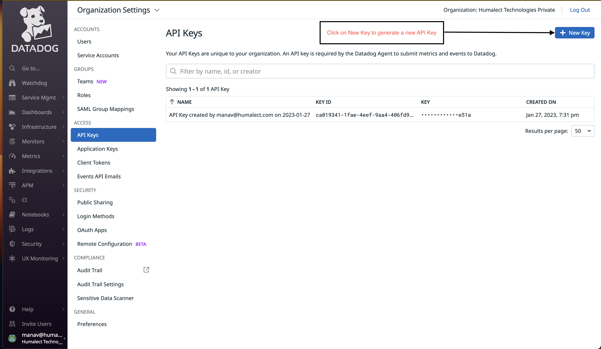
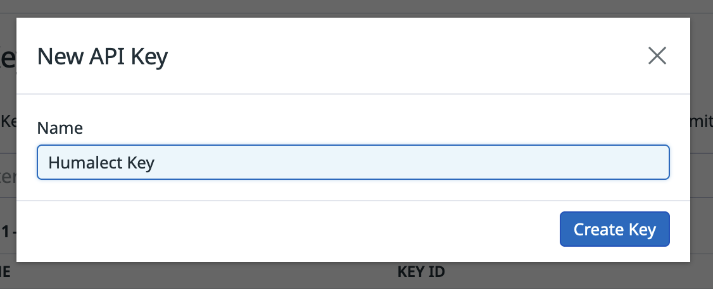
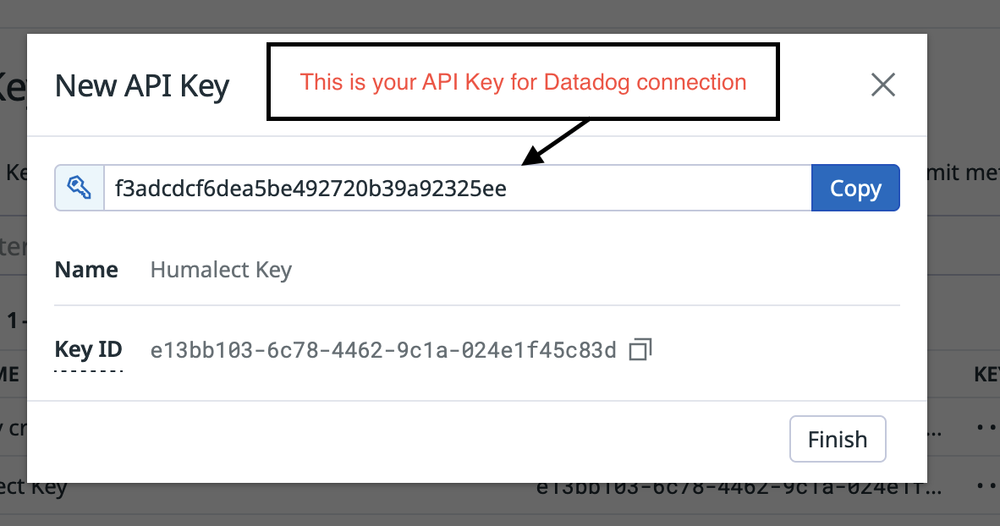

**Humalect** provides Datadog as one of the Monitoring integrations.

Datadog is a cloud-based monitoring and analytics platform that allows businesses to track and analyze their IT infrastructure and applications. It helps organizations identify and resolve issues in real-time, as well as gain insights into their performance and user behavior. Datadog integrates with a wide range of tools and services, including AWS, Kubernetes, and Slack.

## Prerequisites

1. You need to have a cloud account (AWS / Azure) connected with Humalect.

## Connect Datadog with Humalect

There are 2 major steps involved to connect Datadog with Humalect.

1. [Generate a Datadog API Key](#datadog-api-key).
2. [Integrate Datadog on Humalect using your Datadog API Key.](#humalect-datadog)

### 1. Generate a Datadog API Key.

In order to connect Datadog with Humalect, You will have to generate an API key. To do so, refer the following steps and if you have the API Key with you, You may skip the following steps and directly start with [Integrate Datadog on Humalect using your Datadog API Key.](#humalect-datadog)

**Step 1.** Open the Datadog Dashboard And go to organization Settings from the menu on the bottom left corner.

**Step 2.** In the organization settings page select API Keys on the left to move to API Keys Section.

**Step 3.** Now, Click on New Key button to generate a new API Key.

**Step 4.** Now, enter the Name for the API key and hit the Create Key button.

**Step 4.** Now, you can see the API key, Copy the API key by clicking the Copy button.

### 2. Integrate Datadog on Humalect using your Datadog API Key.

**Step 1.** Visit [https://console.humalect.com/user/integrations](https://console.humalect.com/user/integrations) and under the `Connect Your Monitoring Tool` section click on the Connect button under `Connect to Datadog` column.

**Step 2.** You'll be prompted to enter the DataDog API key. Open your Datadog account and search for the API key or refer to [this documentation by Datadog team (recommended).](https://docs.datadoghq.com/account_management/api-app-keys/)

**Step 3**. Enter the DataDog API key (make sure you enter the correct API keys) and click on `Connect`,

**Step 4.** Datadog will be connected to Humalect and you can then visualise the Metrics, Traces and Logs of your application in the Datadog Dashboard by clicking on the external link icon to take it to your Datadog dashboard.

### Troubleshooting

Need help? [Contact](./../Contact-us/reach-out-to-us) us
