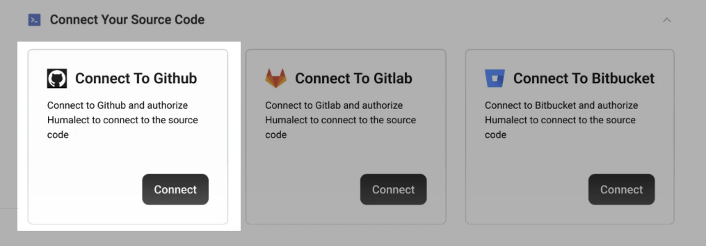
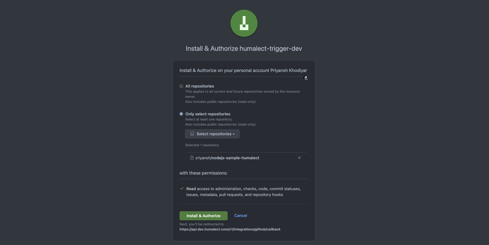

> ## This article covers
> 1. What is GitHub
> 2. GitHub Use Cases
> 3. Connecting your GitHub Account

**Humalect** provides GitLab as one of the source code provider integrations.

## What is GitHub?
**Github** is a web-based platform for version control and collaboration on code projects. It allows multiple users to work on a single codebase and track changes made by each user. It also offers project management tools and integrates with CI/CD tools for automated deployment.

Github is widely used by software developers, organizations, and open-source communities for collaboration and distribution of code.

## GitHub Use Cases:

1. **Code Collaboration**: Github is a platform that allows multiple users to work on a single code project simultaneously. This makes it an ideal platform for open-source software development, where developers from all over the world can contribute to a project. 
2. **Project Management**: Github also offers a wide range of project management tools, such as issues tracking, project boards, pull requests, and wikis, which makes it easy for project managers to organize, track, and manage the development of their projects.
3. **Continuous Integration and Deployment**: Github integrates with many popular Continuous Integration and Deployment (CI/CD) tools, such as Jenkins, Travis CI, and CircleCI, to automate the build, test, and deployment processes. 

> ## Prerequisites
> 1. You or your organization must have an active GitHub account that contains the source code of the application.

## Connecting your GitHub Account

**Step 1:** To get started with using GitHub, Go to the `integrations` tab on the Humalect platform and click on the `Connect` button of the `GitHub` integration and follow along.

 

**Step 2:** Now, you will be redirected to GitHub to authorize Humalect, click on the `Install and Authorize` button to authorize Humalect to access all or selected repositories from your GitHub account. 

> *On the redirected page, you will clearly be able to see all the access and permissions that you will grant to Humalect.*

 

Here, we keep our permissions to bare minimum i.e: `Read access to administration, checks, code, commit statuses, issues, metadata, pull requests, and repository hooks` only.

**Step 3:** After successful integration, you'll get automatically redirected to Humalect's platform and will see a `✅ Successful` checkmark. 
You can also check the connected repositories from the Dashboard and `integration id` [here.](https://console.humalect.com/user/integrations)

 

<!--
### Revoke Access

You can configure Humalect's access to your Github repositories by going to https://github.com/settings/installations and clicking on the `Configure` button.

This will take you to the Permissions and Repository Access page. Select either all or Selected Repositories or remove already integrated repositories from there. 

On the same page, you can also `Suspend` or `Uninstall` Humalect from your Github account at once by clikcing on the `Suspend` or `Uninstall` button as shown in the image.

You can revove the access of Humalect to access your code by going to https://github.com/settings/apps/authorizations and clicking on the `Revoke` button.

-->

Need help? [Contact](https://docs.humalect.com/en/contact) us.
