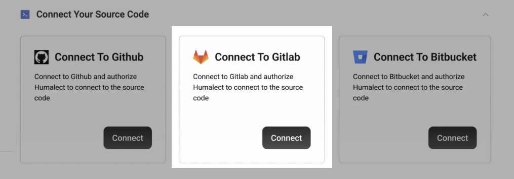
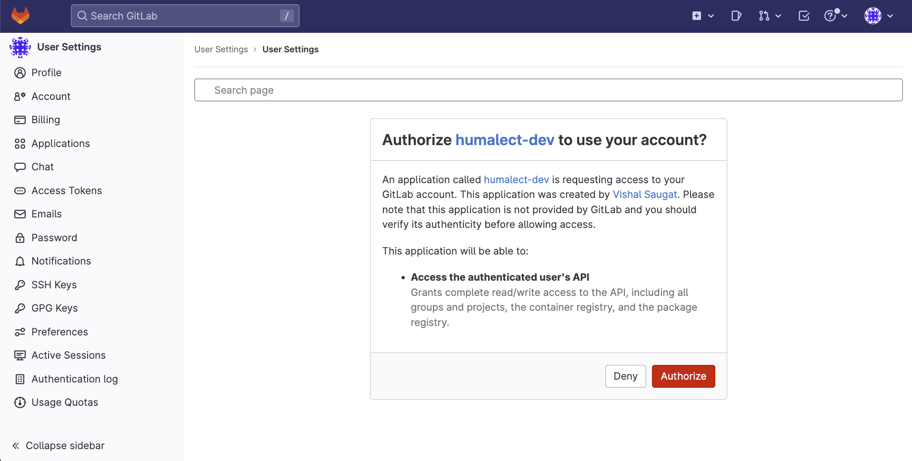

**Humalect** provides GitLab as one of the source code provider integrations.

## What is GitLab?

**GitLab** is a web-based Git repository manager that provides source code management (SCM) and continuous integration/continuous delivery (CI/CD) capabilities.

It allows teams to collaborate on code, track changes, and manage projects in a centralized location, while also providing tools for code review, testing, and deployment.

## GitLab Use Cases:

1. **Continuous Integration/Continuous Deployment (CI/CD)** - GitLab can be used as a central platform for automating software builds, testing, and deployment to various environments.
2. **Source Code Management (SCM)** - GitLab can be used as a repository for storing and managing the source code of software projects, enabling multiple developers to collaborate on a project and track changes over time.
3. **Project Management** - GitLab includes built-in tools for managing software development projects, such as issue tracking, project boards, and a powerful kanban-style workflow that can help teams prioritize and manage their work.

> ## Prerequisites
> 1. You or your organization must have an active GitLab account that contains the source code of the application.

## Connecting your GitLab Account

**Step 1:** To get started with using Gitlab, Go to the `integrations` tab on the Humalect platform and click on the `Connect` button of the `GitLab` integration and follow along.

 

<i>Image showing GitLab integration on the integrations page on Humalect platform. </i>

**Step 2:** Now, you will be redirected to GitLab to authorize Humalect, click on the `Authorize` button to authorize Humalect to access all or selected repositories from your Gitlab account. 

:::info 
On the redirected page, you will clearly be able to see all the access and permissions that you will grant to Humalect.
:::

 

<i>Image showing Permissions Page for GitLab. </i>

 

Here, we keep our permissions to bare minimum, and need only:- 
- **Access to the authenticated user's API**
	* Grants complete read/write access to the API, including all groups and projects, the container registry, and the package registry.
 

 

**Step 3:** After successful integration, you'll get automatically redirected to Humalect's platform and will see a `✅ Successful` checkmark. 
You can also check the connected repositories from the Dashboard and `integration id` [here.](https://console.humalect.com/user/integrations)

 

<i>Image showing successful connection to Gitlab. </i>

<!--
### Revoke Access

You can revove the access of Humalect to access your code by going to [https://gitlab.com/-/profile/applications](https://gitlab.com/-/profile/applications) and clicking on the Revoke button.

 

-->

### Troubleshooting
Need help? [Contact](./../Contact-us/reach-out-to-us) us

