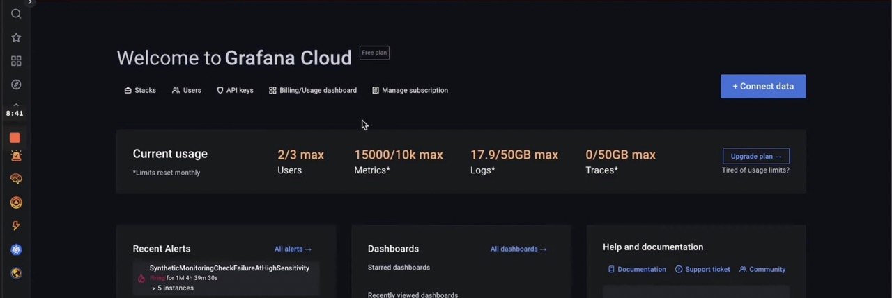
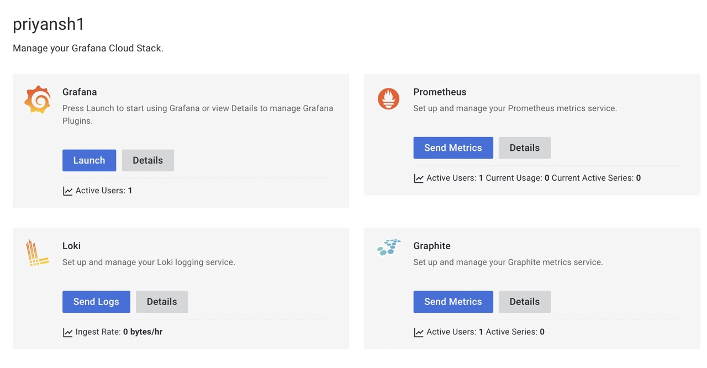
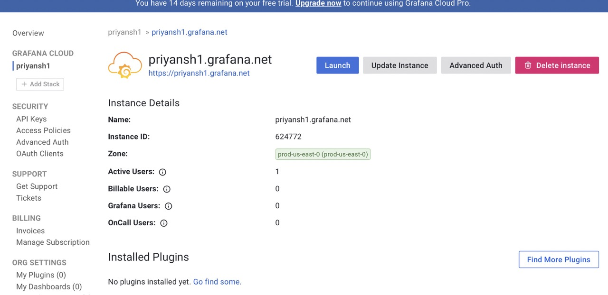
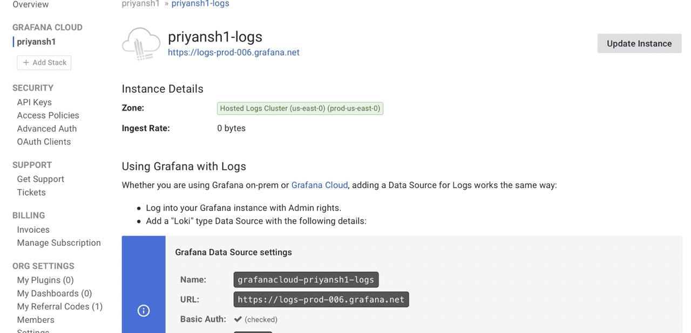
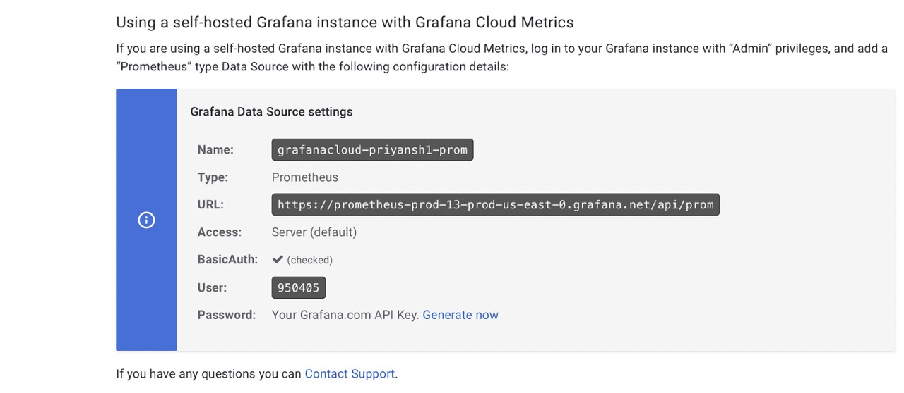
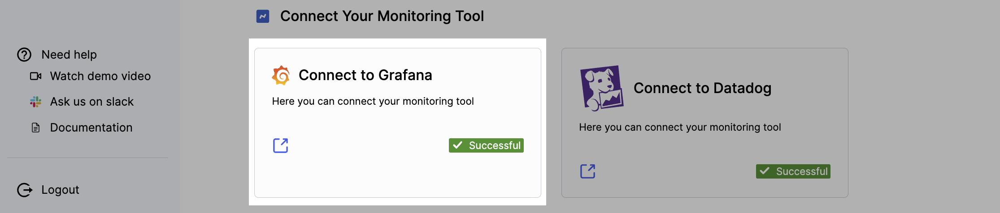
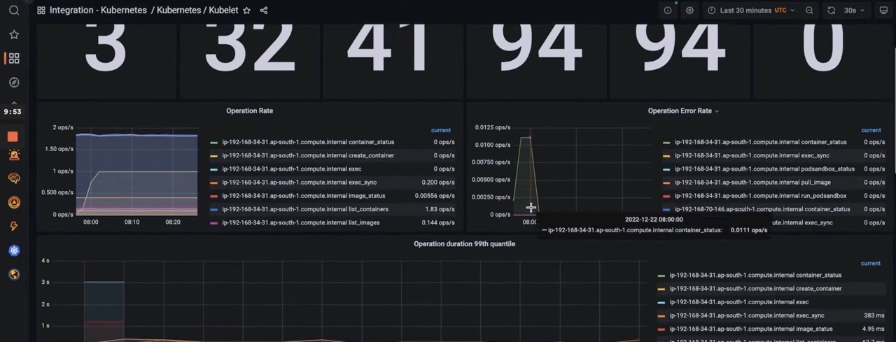

> ## This article covers
> 1. What is Grafana?
> 2. Prerequisites
> 3. Connect Grafana with Humalect

**Humalect** provides Grafana as one of the open source Monitoring integrations.

Grafana Cloud is a cloud-based version of Grafana, an open-source platform for monitoring and analytics. It allows users to easily create and share dashboards, alerts, and other visualizations of their data. 

It provides a scalable and reliable infrastructure for running Grafana, so users don't have to worry about managing and maintaining the software themselves.

## Prerequisites
1. You need to have a cloud account (AWS / Azure) connected with Humalect.

## Connect Grafana with Humalect

Under the `Connect Your Monitoring Tool` section, select `Grafana` and follow the mentioned steps. 

**Step 1**. Click on the `Connect` button present in the UI.

**Step 2.** Fill in the following details and hit `Connect`:-

|Sl. | Field-1| Field-2 | Field-3 (generated token) | 
| -- | -- | -- | --- |
|1. | Grafana URL | - | - |
|2. | Prometheus URL |  Prometheus Username| Prometheus Password |
|3. | Loki URL  | Loki Username| Loki Password |

After you have successfully entered the above details, you'll see a screen shown in the image below welcoming you to Grafana Cloud. 

### Where to get these details from?

:::info
Find all the details mentioned below from here - https://grafana.com/orgs/priyansh1/
P.s. - Change the username to your organization name. 
:::

Click on `Details` button of the stack you wish to know the credentials for.

<i> Image showing Grafana Details. </i>
  

<i> Image showing Loki Details. </i>
  

<i> Image showing Prometheus Details. </i>
  

**Step 3.** You'll see `✅ Successful` checkmark and you successfully connected Grafana. 

**Step 4.** Once Grafana is connected, click on the external link icon to take it to your connected Grafana dashboard. 

The above picture shows various metrics dashboards of the apps connected to Humalect platform. 

### Troubleshooting
Need help? Contact [Humalect support.](https://humalect.com/)