**Humalect** provides Grafana as one of the open source Monitoring integrations.

Grafana Cloud is a cloud-based version of Grafana, an open-source platform for monitoring and analytics. It allows users to easily create and share dashboards, alerts, and other visualizations of their data.

It provides a scalable and reliable infrastructure for running Grafana, so users don't have to worry about managing and maintaining the software themselves.

## Prerequisites

1. You need to have a cloud account (AWS / Azure) connected with Humalect.

## Connect Grafana with Humalect

There are 2 major steps involved to connect Grafana with Humalect.

1. [Arrange your Grafana account details required for integration](#grafana-details).
2. [Integrate Grafana on Humalect using your Grafana account details.](#humalect-grafana)

### 1. Arrange your Grafana account details required for integration.

In order to connect your Grafana console with Humalect, You will need the following parameters:

1. **Grafana URL** - Your Grafana Account URL.  
   Example: `https://username.grafana.net/`
2. **Prometheus URL** - The URL of prometheus for metrics (please remove `/api/prom` from the URL)  
   Example: `https://prometheus-prod-us-east-0.grafana.net/`
3. **Prometheus Username** - Username of prometheus.  
   Example: `999999`
4. **Prometheus Password** - The API key generated for `MetricsPublisher` Role.  
   Example: `eyJrIjoiN2FhZjlmTEzMSIsIm4iOiJzdGFjay02Mjc0MjktZWFzeXN0YXJ0LXByb20tcHVibGlzaGVyIiwiaWQiOjg0MTk5M30=`
5. **Loki URL** - The URL of Loki for Logs.  
   Example: `https://logs-prod-006.grafana.net`
6. **Loki Username** - Username of loki.  
   Example: `444444`
7. **Loki Password** - The API key generated for `MetricsPublisher` Role.  
   Example: `eyJrIjoiN2FhZjlmTEzMSIsIm4iOiJzdGFjay02Mjc0MjktZWFzeXN0YXJ0LXByb20tcHVibGlzaGVyIiwiaWQiOjg0MTk5M30=`

If you have above mentioned details with you, You may skip the following steps and directly start with [Integrate Grafana on Humalect using your Grafana account details.](#humalect-grafana)

**Step 1.** Sign in to [https://grafana.com/](https://grafana.com/) and go **My Account** section at [https://grafana.com/](https://grafana.com/) on the top right corner.

**Step 2.** Now Click on the Details button under Prometheus section on My Account page.
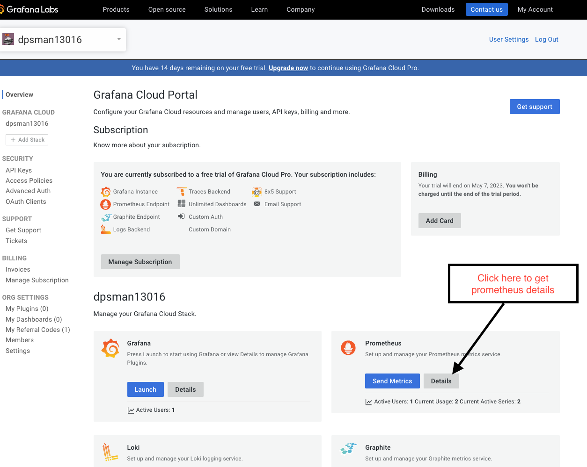

**Step 3.** On the details page, you can find the `Prometheus URL` above instance details and `Prometheus Username` at the bottom of the page. Please note them so that you can use them in further steps.
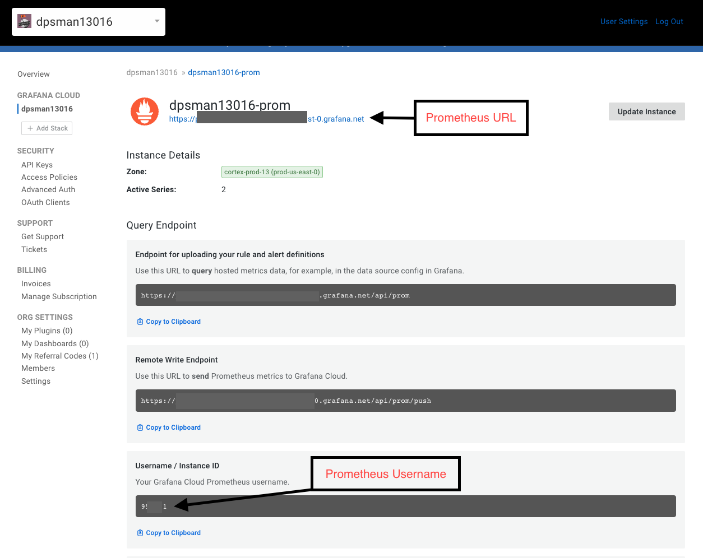

**Step 4.** Go back to My Account page and click on the `Details` button under Loki section on My Account page.
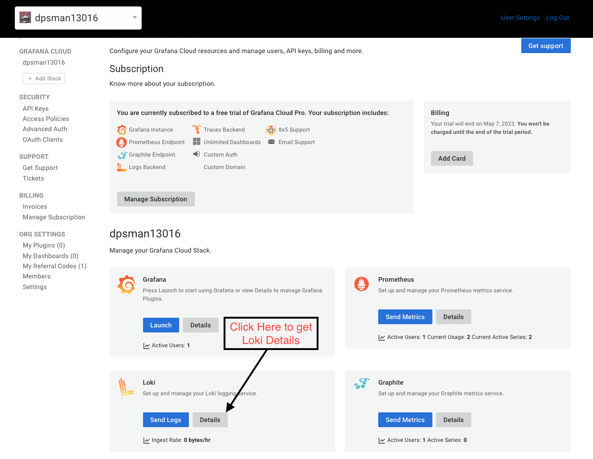

**Step 5.** On the details page, you can find the `Loki URL` above instance details and `Loki Username` at the bottom of the page. Please note them so that you can use them in further steps.
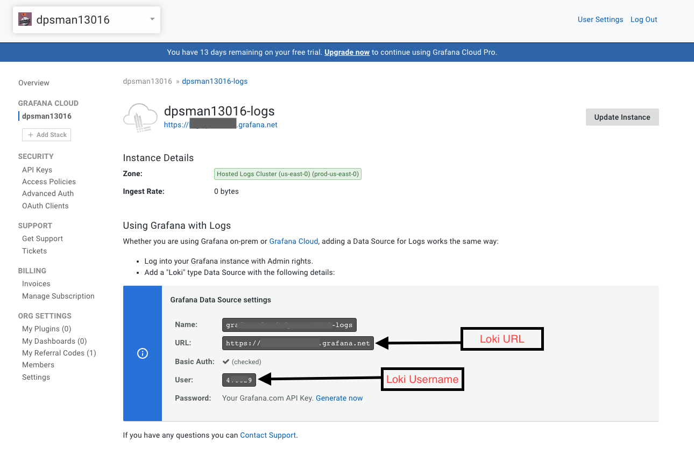

**Step 6.** Now, to generate an API key go back to My Account page and select API Keys button on the left.
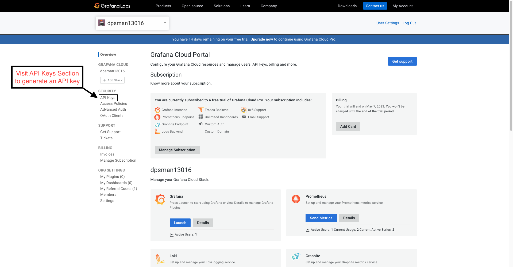

**Step 7.** Click on `Add API Key` button on the right side.
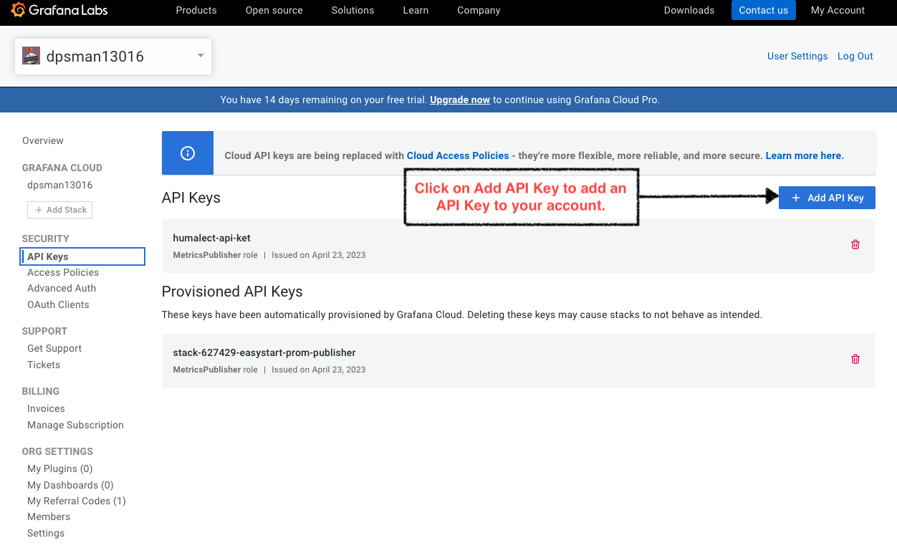

**Step 8.** Enter the Name for the API key which could be used for your reference. And in Role dropdown, select `MetricsPublisher` and then click on Create API Key.
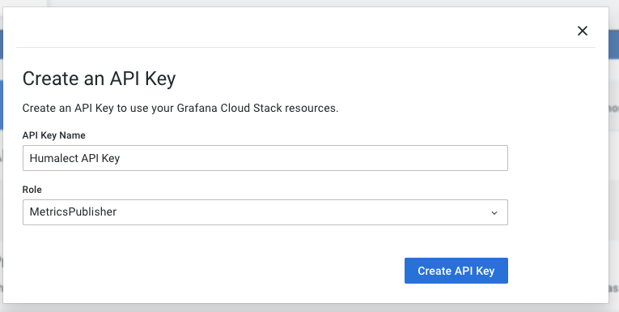

**Step 9.** Now, you have successfully generated an API key. Copy this API key and save it so that this can be used in further steps as `Prometheus Password` and `Loki Password`.
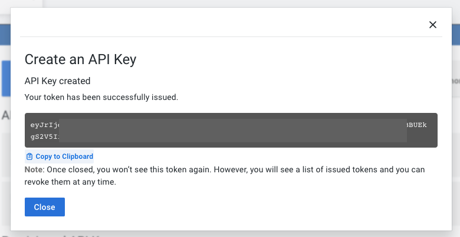

**Step 10.** Go back to My Account page and click on the `Details` button under Grafana section on My Account page.
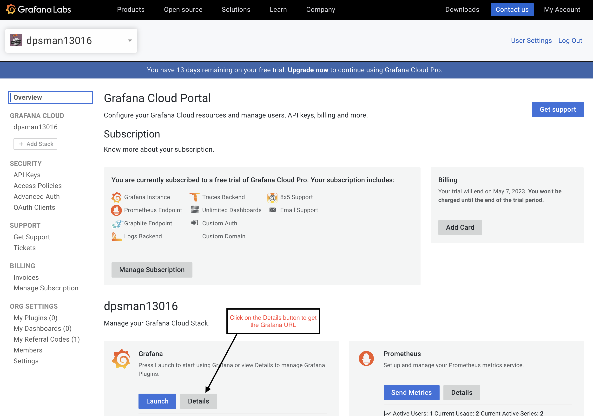

**Step 11.** On the details page, you can find the `Grafana URL` above instance details. Please note the URL so that you can use it in further steps.
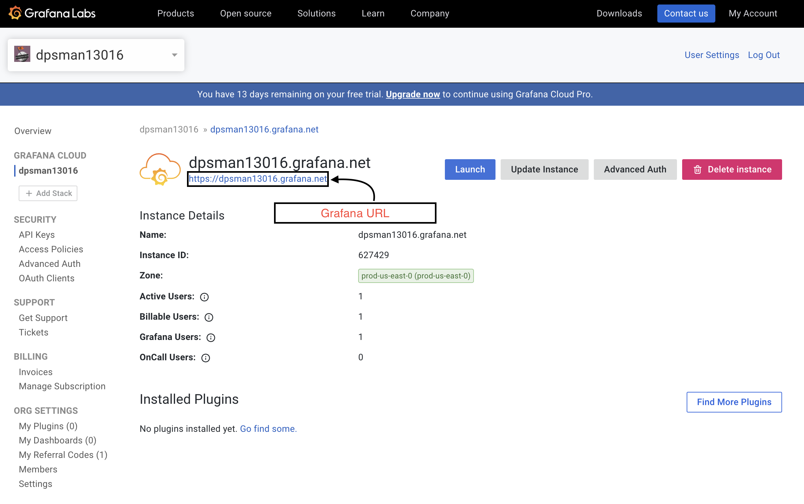

### 2. Integrate Grafana on Humalect using your Grafana account details.

**Step 1**. Visit [https://console.humalect.com/user/integrations](https://console.humalect.com/user/integrations) and under the `Connect Your Monitoring Tool` section click on the Connect button under `Connect to Grafana` column.

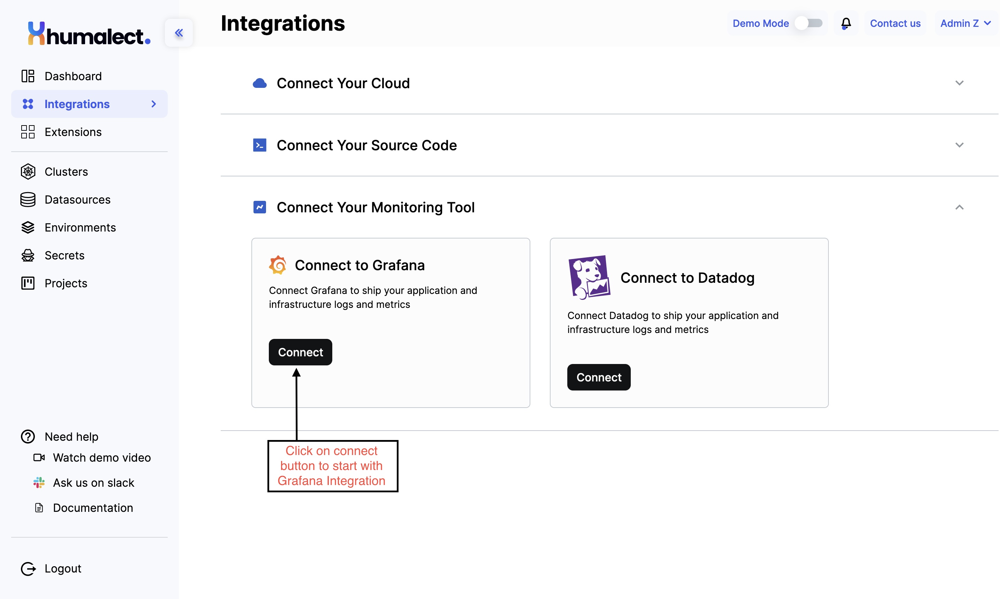

**Step 2.** Fill in the values that we collected above in the respective fields. **Please fill the API Key for MetricsPublisher(which we generated above) Role in Loki Password and Prometheus Password.** and click on Connect button.

**Step 3.** You'll see `✅ Successful` checkmark and you successfully connected Grafana.

**Step 4.** Once your grafana account is integrated with Humalect. You can not just select Grafana in monitoring tools while creating a cluster (Visit [https://console.humalect.com/user/clusters/new](https://console.humalect.com/user/clusters/new) to create a cluster) to integrate Grafana in a cluster.
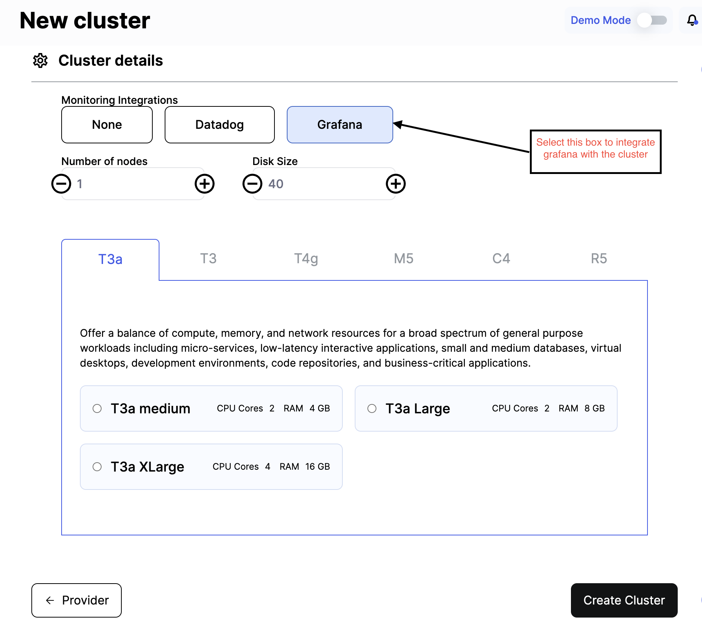

Once the integration is successful and the cluster is functional, you would be able to see such dashboards on Grafana.

### Troubleshooting

Need help? [Contact](./../Contact-us/reach-out-to-us) us
