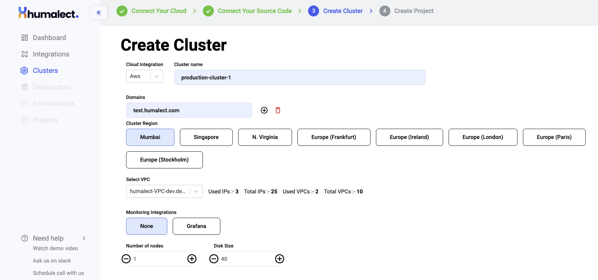

## Steps to create an AWS EKS Cluster
Go to the `clusters` tab from the left side navigation bar on the Humalect platform and click on `Create new cluster`.

**Step 1:** From the Cloud Integration drop-down menu, select `AWS`.

**Step 2:** Next, name your cluster in the `Cluster Name` field.

**Step 3:** Type a `Domain Name(s)`, you can add or delete domain names by clicking on the `(+)` or delete symbol respectively. These domains are the ones on which all the deployments in this cluster will be hosted.

**Step 4:** Then, select `Cluster Region`, and choose the one nearest to your geological location. For AWS, you'll get the following options to configure from.

- Mumbai
- Singapore
- N. Virginia
- Europe (Frankfurt)
- Europe (Ireland)
- Europe (London)
- Europe (Paris)
- Europe (Stockholm)

**Step 5:** Next, select `VPC`. You can create a new VPC or select one from the drop list.
 you'll see the following details here (This is to let you know the available resources from your AWS allocated Quota limit):
 *a. Used IPs
 b. Total IPs
 c. Used VPCs
 d. Total VPCs*

**Step 6:** Select `Monitoring Integrations` We provide integration with `Grafana` and `Datadog` as of now. You can also select `None`.

**Step 7:** Select the `Number of Nodes` and `Disk Size` by clicking on the (+) and/or (-) button or by manually entering a value.

**Step 8:** Select a suitable instance type for nodes of your cluster. Here is a list of currently supported instance types:
- T3a - offers balance of compute, memory, and network resources
- T3 - offers balance of compute, memory, and network resources
- T4g - Arm-based Graviton2 processors delivering better performance over T3
- M5 - latest generation of General Purpose Instances powered by Intel Xeon® Platinum 8175M processors
- C4 - Optimized for compute-intensive workloads
- R5 - Designed to deliver fast performance for workloads that process large data sets in memory.

<!---
## Select a Virtual Machine:

### 1. T3a Instances
Offer a balance of compute, memory, and network resources for a broad spectrum of general-purpose workloads including micro-services, low-latency interactive applications, small and medium databases, virtual desktops, development environments, code repositories, and business-critical applications.

### 2. T3 Instances
Offer a balance of compute, memory, and network resources and are designed for applications with moderate CPU usage that experience temporary spikes in use.

### 3. T4g Instances
Offers a balance of compute, memory, and network resources for a broad spectrum of general-purpose workloads including large-scale micro-services, small and medium databases, virtual desktops, and business-critical applications.

### 4. M5 Instances
This family provides a balance of computing, memory, and network resources, and is a good choice for many applications.

### 5. C4 Instances
Instances are optimized for compute-intensive workloads and deliver very cost-effective high performance at a low price-per-compute ratio.

### 6. R5 Instances
Memory-optimized instances are designed to deliver fast performance for workloads that process large data sets in memory.

-->

After you select any one of the machines from the above options, click on the `create cluster` button at the bottom right to start creating your cluster.

:::note 
A cluster creation can take about 10-15 minutes, depending on the cloud provider.
:::

## Create CDNs in AWS Cluster

Once the AWS cluster is successfully created, you'll see the details like DNS URL, VPC Name, Public and Private subnets, cluster version, etc. 

### Troubleshooting
Need help? [Contact](./../Contact-us/reach-out-to-us) us

