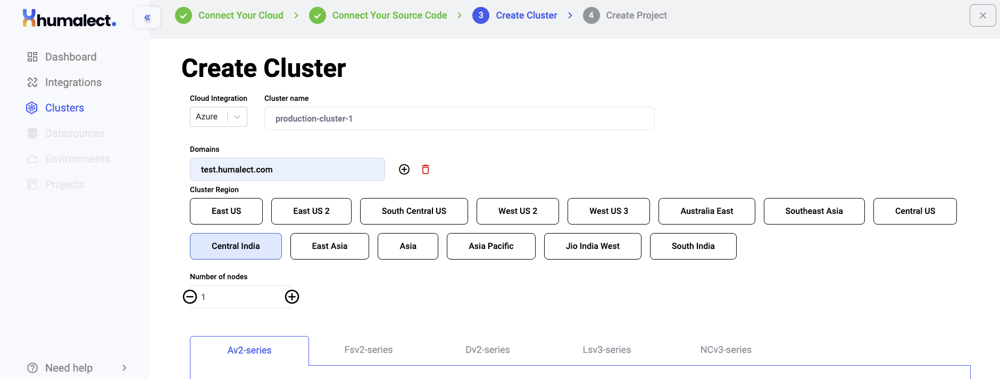
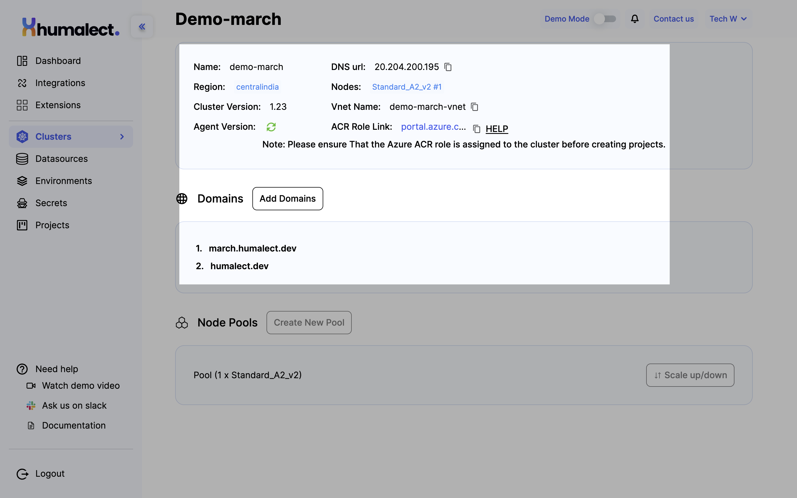
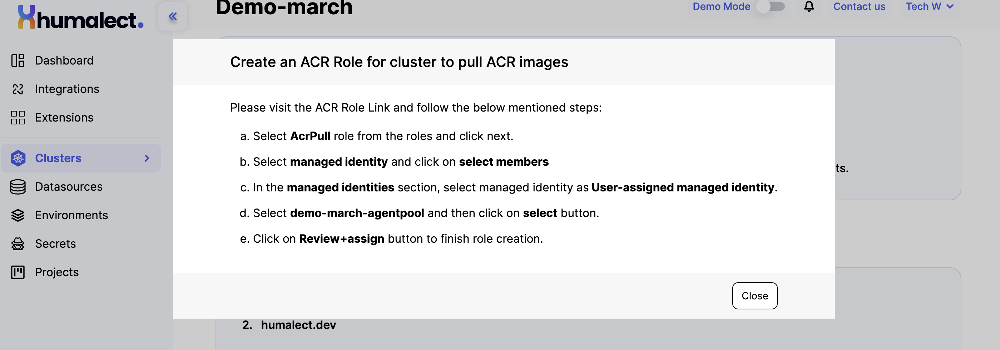

<!---
Let's look at how you can configure your cluster based on Microsoft Azure.

## What is a Cluster?
At a high level, a computer cluster is a group of two or more computers, or nodes, that run in parallel to achieve a common goal. This allows workloads consisting of a high number of individual, parallelizable tasks to be distributed among the nodes in the cluster. As a result, these tasks can leverage the combined memory and processing power of each computer to increase overall performance.

## Getting started with Microsoft Azure

The below image shows steps to create an AWS cluster in Humalect Dashboard.

-->

## Steps to create an Azure Cluster:
Go to the clusters tab from the left side navigation bar on the Humalect platform and click on `Create new cluster`.

**Step 1:** From the Cloud Integration drop-down menu, select `Azure`.

**Step 2:** Next, Name your cluster in the `Cluster Name` field.

**Step 3:** Type a `Domain Name(s)`, you can add or delete domain names by clicking on the `(+)` or delete symbol respectively. These domains are the ones on which all the deployments in this cluster will be hosted.

**Step 4:** Then, select `Cluster Region`, and choose the one nearest to your geological location. For Azure, you'll get the following options:

- East US
- East US 2
- South Central US
- West US 2
- West US 3
- Australia East
- Southeast Asia
- Central US
- Central India
- East Asia
- Asia
- Asia Pacific
- Jio India West
- South India

**Step 5:** Select the `Number of Nodes` by clicking on the (+) and/or (-) button or by manually entering a value.

**Step 6:** Select a suitable Virtual Machine for nodes of your cluster, for `Azure` below are a few available options:
- Azure Av2-series
- Fsv2-series
- Dv2-series
- Lsv3-series
- NCv3-series

<!---
## Azure Av2-series
A-series VMs have CPU performance and memory configurations best suited for entry-level workloads like development and testing. This size is throttled, based on the hardware.

> | Tier Name | RAM | Size |
> | --------------- | ----- | ---- |
> | Standard A1 v2 | 1 RAM | 2GB |
> | Standard A2 v2 | 2 RAM | 4GB |
> | Standard A4 v2 | 4 RAM | 8GB |
> | Standard A8 v2 | 8 RAM | 16GB |
> | Standard A2m v2 | 2 RAM | 16GB |
> | Standard A4m v2 | 4 RAM | 32GB |
> | Standard A8m v2 | 8 RAM | 64GB |

 

## Fsv2-series
The Fsv2-series runs on the 3rd Generation Intel® Xeon® Platinum 8370C (Ice Lake), the Intel® Xeon® Platinum 8272CL (Cascade Lake) processors, or the Intel® Xeon® Platinum 8168 (Skylake) processors. It features a sustained all-core Turbo clock speed of 3.4 GHz and a maximum single-core turbo frequency of 3.7 GHz. Intel® AVX-512 instructions are new on Intel Scalable Processors.

> | Tier Name | RAM | Size |
> | ---------------- | ------ | ------ |
> | Standard F2s v24 | 2 RAM | 4 GB |
> | Standard F4s v2 | 4 RAM | 8 GB |
> | Standard F8s v2 | 8 RAM | 16 GB |
> | Standard F16s v2 | 16 RAM | 32 GB |
> | Standard F32s v2 | 32 RAM | 64 GB |
> | Standard F48s v2 | 48 RAM | 96 GB |
> | Standard F64s v2 | 64 RAM | 128 GB |
> | Standard F72s v2 | 3 RAM | 72 GB |

 

## Dv2-series
Dv2 and DSv2-series are ideal for applications that demand faster vCPUs, better temporary storage performance, or higher memory demands. They offer a powerful combination for many enterprise-grade applications.

> | Tier Name | RAM | Size |
> | --------------- | ------ | ------ |
> | Standard D11 v2 | 2 RAM | 14 GB |
> | Standard D12 v2 | 4 RAM | 28 GB |
> | Standard D13 v2 | 8 RAM | 56 GB |
> | Standard D14 v2 | 16 RAM | 112 GB |
> | Standard D15 v2 | 20 RAM | 140 GB |

 

## Lsv3-series
The Lsv3 series runs on the third Generation Intel® Xeon® Platinum 8370C (Ice Lake) processor in a hyper-threaded configuration. This new processor features an all-core turbo clock speed of 3.5 GHz with Intel® Turbo Boost Technology, Intel® Advanced-Vector Extensions 512 (Intel® AVX-512), and Intel® Deep Learning Boost.

> | Tier Name | RAM | Size |
> | ---------------- | ------ | ------ |
> | Standard L8s v3 | 8 RAM | 64 GB |
> | Standard L16s v3 | 16 RAM | 128 GB |
> | Standard L32s v3 | 32 RAM | 256 GB |
> | Standard L64s v3 | 64 RAM | 512 GB |
> | Standard L80s v3 | 80 RAM | 640 GB |

 

## NCv3-series
The NCv3-series sizes are optimized for compute-intensive GPU-accelerated applications. Some examples are CUDA and OpenCL-based applications and simulations, AI, and Deep Learning.

> | Tier Name | RAM | Size |
> | -------------------------------- | ----- | ------ |
> | Standard NC6s v3 | 6RAM | 112 GB |
> | Standard NC12s v3 | 12RAM | 224 GB |
> | Standard NC24s v3 | 24RAM | 448 GB |
> | Standard NC24rs v3(RDMA capable) | 24RAM | 448 GB |
-->

After you select from the above virtual machines, click on the `Create Cluster` button at the bottom right.

It will take around 15 mins for your cluster to be provisioned.

## Create ACR role in Azure Cluster

Once the Azure cluster is successfully created, you'll see the details like DNS URL, ARC Role link, cluster version, etc. 

### Create an ACR Role for cluster to pull ACR images

Please visit the ACR (Azure Container Registry) Role Link and follow the below mentioned steps:
1. Select `AcrPull` role from the roles and click next.
2. Select managed identity and click on select members
3. In the managed identities section, select managed identity as User-assigned managed identity.
4. Select `<cluster-name>-agentpool` and then click on select button.
5. Click on Review+assign button to finish role creation.

more details [here.](https://learn.microsoft.com/en-us/azure/container-registry/container-registry-roles?tabs=azure-cli)

:::note
Please ensure That the Azure ACR role is assigned to the cluster before creating projects.
:::

You can also click on the `HELP` button on the cluster details UI to see the steps for creating ARC roles.

### Troubleshooting
Need help? [Contact](./../Contact-us/reach-out-to-us) us

