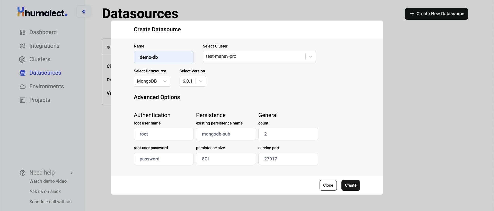
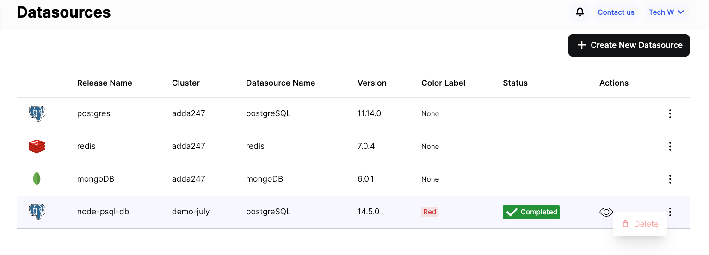

Humalect provides several databases that you can integrate and bring your data to the platform, in this article, we will be focusing on **MongoDB**.

MongoDB is a *NoSQL*, document-based database management system. It uses JSON-like documents to store and retrieve data, offering high scalability, flexibility and performance. It also supports indexing, transactions, and rich querying capabilities.

:::info
For more information, see [MongoDB Docs.](https://www.mongodb.com/docs/)
:::

## Prerequisites
1. Have a connected cloud provider
2. Have a connected source code provider
3. Have a cluster

## Create a MongoDB Datasource

Let's create a Datasource with `MongoDB version 6.0.1`.

**Step 1:** Go to the DataSources Tab from the UI ([or click here to get redirected](https://console.humalect.com/user/datasources)) and click on `+ Create New Datasource.`

**Step 2:** Enter the following details:

> | Field | Desc |
> | -- | -- |
> | **Name** | name of your Datasource|
> | **Select Cluster** | cluster name where you want your Datasource to be created |
> | **Select DataSource** | choose database/cache of your choice|
> | **Select Version** | `v6.0.1`, `v5.0.10` ([click for more details on MongoDB versions](https://www.mongodb.com/evolved))|
> | **Select Color Label**| choose b/w RED, GREEN, BLUE| 

**Step 3:** After you enter the above details, you'll be prompted to enter additional details such as `persistence size`, `service port`, etc. Refer to the below table for more information.

### MongoDB Advanced Options

Under the `Advanced Options`, enter the following details:

| Authentication | Desc | Persistence | Desc | General | Desc |
| ------------------ | ---- | ------------------------- | ---- | ------------ | ---- |
| **root user name** | | **existing persistence name** | If you already have a previous persistent volume claim and want to reuse it, you directly attach it using this setting | **count** | Number of replicas |
| **root user password** | | **persistence size** | This is a measure of size of a MongoDB database and can vary depending on the amount and type of data stored, as well as the configuration of the MongoDB instance. | **service port** | The default port for MongoDB is 27017, but it can be configured to listen on a different port using this setting. |

**Step:4** After you successfully fill in all the required details, click on `Create` and the Datasource creation process will start.

<i>Advanced options available to create mongoDB datasource</i>

**Step 5:** Once the MongoDB Datasource is successfully created, you'll see them listed in the DataSources tab with details like:

- Release Name - User entered name
- Related Cluster Name - The name of cluster which hosts the datasource
- Datasource name - [Redis | MongoDB | PostgreSQL | MySQL ]
- Database version used
- Color Label
- Status - Datasource creation Completed or Failed. 
- Action - To fetch Datasource credentials

**Step 6:** If you wish to **delete** the datasource, click on the vertical 3 dots next to the datasource card and click on `Delete`. This will initiate the deletion process.

:::caution
Do not delete any datasource if you are not sure about it as it can lead to dataloss.
:::

## How to use existing datasources in a pipeline?
TBD

### Troubleshooting
Need help? [Contact](./../Contact-us/reach-out-to-us) us

