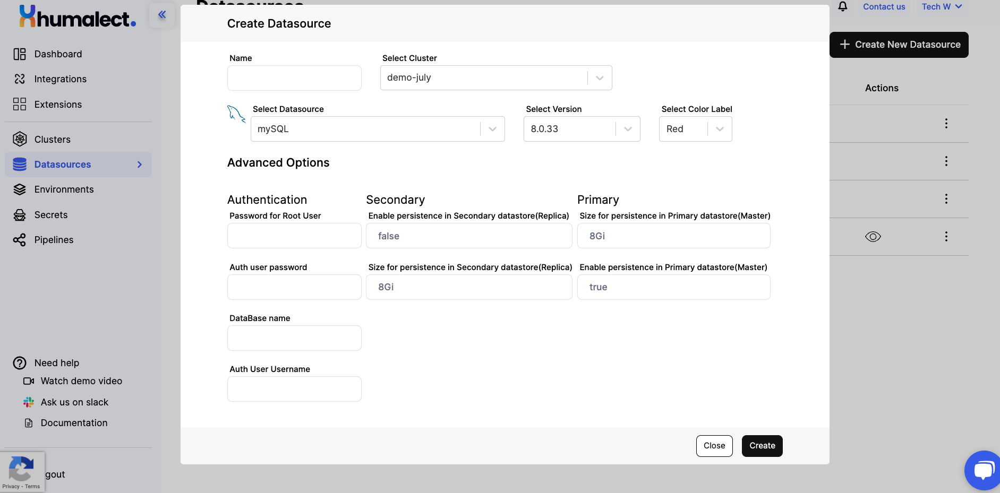

Humalect provides several databases that you can integrate and bring your data to the platform with minimal permissions from Humalect's side, in this article, we will be focusing on **MySQL**.

MySQL is an open-source relational database management system (RDBMS) that provides a structured way to store, manage, and retrieve data. It uses Structured Query Language (SQL) to interact with databases and is widely used in various applications and industries for storing and manipulating data. 

MySQL offers features such as data security, scalability, high availability, and support for various programming languages, making it a popular choice for building and maintaining databases in a wide range of software applications.

:::info
For more information, see [MySQL Docs.](https://dev.mysql.com/doc/)
:::

## Prerequisites
1. Have a connected cloud provider
2. Have a connected source code provider
3. Have a cluster

## Create a MySQL Datasource

Let's create a Datasource with `MySQL version 8.0.33`

**Step 1:** Go to the DataSources Tab from the UI ([or click here to get redirected](https://console.humalect.com/user/datasources)) and click on `+ Create New Datasource.`

**Step 2:** Enter the following details:

> | Field | Desc |
> | --    | --   |
> | **Name** | name of your Datasource|
> | **Select Cluster** | cluster name where you want your Datasource to be created |
> | **Select DataSource** | choose database/cache of your choice|
> | **Select Version** | `v8.0.33`, `v8.0.29` ([click for more details on MySQL versions](https://dev.mysql.com/doc/relnotes/mysql/8.0/en/))|
> | **Select Color Label**| choose b/w RED, GREEN, BLUE| 

**Step 3:** After you enter the above details, you'll be prompted to enter additional details such as `persistence size`, `port number`, etc. Refer to the below table for more information.

### MySQL Advanced Options

Under the `Advanced Options`, enter the following details:

| Authentication | Desc              |  
| --             | --                |
| Password for Root User |   The password assigned to the administrative "root" user, providing full control over the MySQL server        |  
| Auth user password     |The password for an authorized user who can access and manage the specified database           |
| DataBase name     |     The unique name identifying a specific database within MySQL where data is organized and stored           |
| Auth User Username     | The username of an authenticated user with defined privileges to interact with the designated database          |

| Secondary | Value |  Primary | Value | 
|      --   |  --   |  --      |   --  |
|Enable persistence in Secondary datastore(Replica) | false* | Size for persistence in Primary datastore(Master) | 8Gi* |
|Size for persistence in Secondary datastore(Replica)   | 8Gi*  |Enable persistence in Primary datastore(Master) | true* |

`*default value`

**Step:4** After you successfully fill in all the required details, click on `Create` and the Datasource creation process will start.

<i>Picture representing the state of UI when all the details are entered.</i>

**Step 5:** Once the MySQL Datasource is successfully created, you'll see them listed in the DataSources tab with details like:

- Release Name - User entered name
- Related Cluster Name - The name of cluster which hosts the datasource
- Datasource name - [Redis | MongoDB | PostgreSQL | MySQL ]
- Database version used
- Color Label
- Status - Datasource creation Completed or Failed. 
- Action - To fetch Datasource credentials

**Step 6:** If you wish to **delete** the datasource, click on the vertical 3 dots next to the datasource card and click on `Delete`. This will initiate the deletion process.

:::caution
Do not delete any datasource if you are not sure about it as it can lead to dataloss.
:::

## How to use existing datasources in a pipeline?
TBD

### Troubleshooting
Need help? [Contact](./../Contact-us/reach-out-to-us) us

