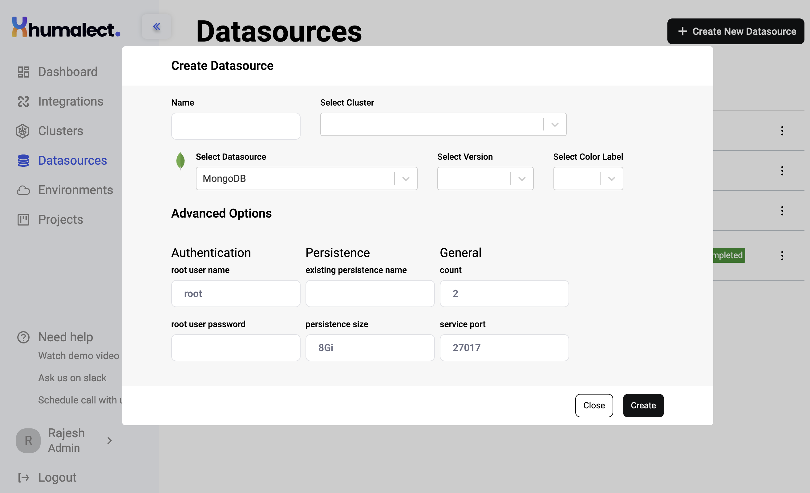

> This article covers:-
> 1. What do data sources mean in the Humalect world?
> 2. List of Databases/Caches and their supported versions.
> 3. Steps to create a Datasource via the Humalect platform
> 4. Can these be used in production?
> 6. Are these datasources fault tolerant?

## What do we mean by data sources?

Every application needs some kind of database or cache to store data. There are multiple ways to use databases:
1. Get a hosted database/cache from a cloud provider
2. Take an opensource image and host it yourself

It takes a lot of effort for dev teams to setup and maintain opensource databases. That is why we created a datasources feature on the Humalect platform. Choose a database or cache of your choice and we host it for you via helm charts in a few clicks.

Ephermal databases on demand made easy.

## List of Databases and their supported versions

> | Name     | Version supported        | Version Details |
> | -------- | ------------------------ | -- |
> | MongoDB  | `v6.0.1`, `v5.0.10` | [LINK](https://www.mongodb.com/evolved) |
> | Redis    | `v7.0.4`, `v6.2.7`       |[LINK](https://redis.io/download/#:~:text=Stable%20(6.2.6)) |
> | Postgres | `v14.11.0`,  `v11.14.0`  |[LINK](https://www.postgresql.org/support/versioning/) |

## Steps to create a Datasource in Humalect

To create a new datasource, click on the `+ Create New Datasource` at the center or click on the button towards the right top (you will see this option if you already have created some datasources previously).

Follow these steps to create a new datastore:

<i>Picture representing the state of UI while creating Datasources.</i>

**Step 1:** Enter Datasource Name

**Step 2:** Select your Cluster in which you want to host your datasource

**Step 3:** Select datasource of your choice from the list

**Step 4:** Select the Datasource version. You can also edit advanced options like username and replica count.

**Step 5:** Hit create button and Voila it's done.

## Can these datasources be used in production?

These datasources are meant to be used in a ephermal way and are best suited for non-production workloads.

## Is my data fault tolerant?

All the data is safe as we use PVs and PVCs to store your data. All the data is stored in fault tolerant block storage with your cloud provider.

> **Tip:**
> *Did not find your favorite database in the list? Reach out to us to raise a request for new datasources.*

### Troubleshooting
Need help? [Contact](./../Contact-us/reach-out-to-us) us
