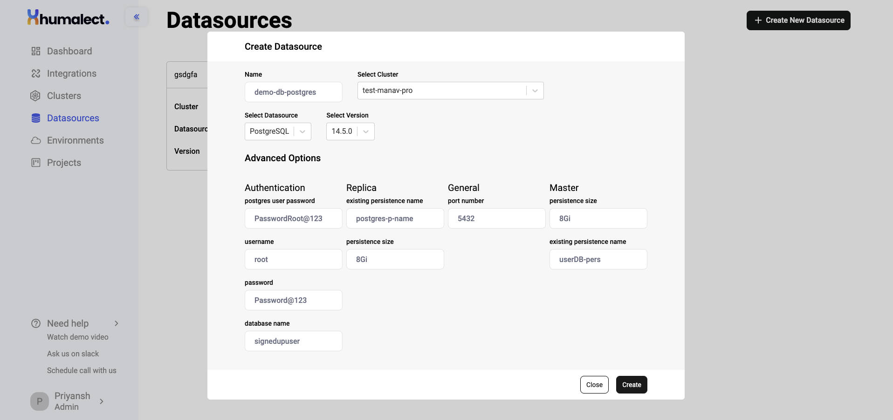

> This article covers:-
> 1. Create a Postgres Datasource
> 2. How to use existing datasources in a pipeline?

Humalect provides several databases that you can integrate and bring your data to the platform with minimal permissions from Humalect's side, in this article, we will be focusing on **Postgres**.

Postgres is a free and open-source *relational database* management system that is used for managing large amounts of structured data. It offers robust support for SQL, as well as several advanced features, including multi-version concurrency control, point-in-time recovery, and native replication.

> For more information, see [Postgres Docs.](https://www.postgresql.org/docs/)

> ## Prerequisite
> *1. have a connected Cloud provider*
> *2. have a connected Source Code provider*
> *3. have a cluster*

## Create a Postgres Datasource

Let's create a Datasource with `Postgres version 14.11.0`

**Step 1:** Go to the DataSources Tab from the UI ([or click here to get redirected](https://console.humalect.com/user/datasources)) and click on `+ Create New Datasource.`
**Step 2:** Enter the following details:

> | Field | Desc |
> | -- | -- |
> | **Name** | name of your Datasource|
> | **Select Cluster** | cluster name where you want your Datasource to be created |
> | **Select DataSource** | choose database/cache of your choice|
> | **Select Version** | `v14.11.0`, `v11.14.0` ([click for more details on Postgres versions](https://www.postgresql.org/docs/release/))|

**Step 3:** After you enter the above details, you'll be prompted to enter additional details such as `persistence size`, `port number`, etc. Refer to the below table for more information.

### Postgres Advanced Options

Under the `Advanced Options`, enter the following details:

| Authentication         | Desc | | General     | Desc |
| ---------------------- | ---- | -- | ----------- | ---- |
| **postgres user password** |   PostgreSQL password for the `postgres` user when username is not postgres    | | **port number** | The default port for Postgres is 5432, but it can be configured to listen on a different port using this setting.     | |
| **username**               |   PostgreSQL username. default value if `postgres`	   |             |     | |
| **password**               |  PostgreSQL password	    | | | |
| **database name**          |   PostgreSQL database   | | | |

| Value                     | Master | Replica | Desc |
| ------------------------- | ------ | ------- | ---- |
| **persistence size**          | 8Gi*   | 8Gi*    | This is a measure of size of a Postgres database and can vary depending on the amount and type of data stored, as well as the configuration of the Postgres instance.     |
| **existing persistence name** |   -     |     -    |  If you already have previous persistent volume claim and want to reuse it, you directly attach it using this setting.    |

`*default value`

**Step:4** After you successfully fill in all the required details, click on `Create` and the Datasource creation process will start.

<i>Picture representing the state of UI when all the details are entered.</i>

**Step 5:** Once the Postgres Datasource is successfully created, you'll see them listed in the DataSources tab with details like:

		a. Datasource Name
		b. Cluster Name
		c. Database used
		d. Database version used

**Step 6:** If you wish to **delete** the datasource, click on the vertical 3 dots next to the datasource card and click on `Delete`. This will initiate the deletion process.

> **Caution:** Do not delete any datasource if you are not sure about it as it can lead to dataloss.

## How to use existing datasources in a pipeline?
TBD

### Troubleshooting
Need help? [Contact](./../Contact-us/reach-out-to-us) us
