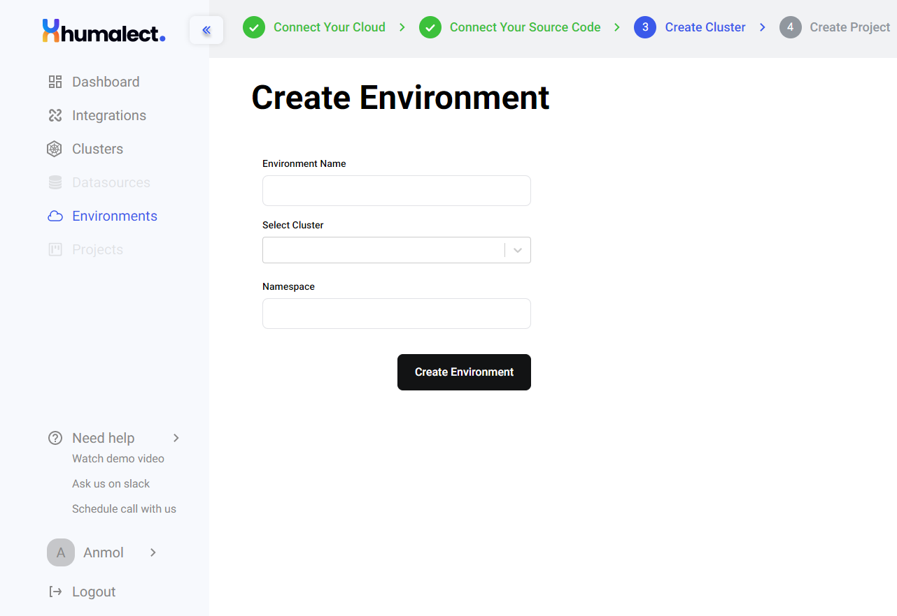

# Environment Page Overview
An environment refers to a kubernetes namespace that is completely isolated and self contained entity containing multiple application deployments and datasources.

## Some examples of environments that our users prefer:

### 1. Dev Environment
Ideally dedicated for `developers` to develop, play around and iterate.

### 2. Staging Environment
Can also be called `test/pre-prod/UAT environment`. Environments like these are created to test and validate code before the release.

### 3. Prod Environment
The environment which is customer facing. This is what will power your user facing application deployments.

## How to create an Environment
1. Go to Humalect's console's dashboard.
2. Click on `Environment`.
3. Click on `Create New Environment` button on top right.

To know more about the steps to create an environment, visit [Environment](https://docs.humalect.com/en/EnvironmentPage)

## Relationship between kubernetes namespaces and humalect's environment
Humalect enviornments use kubernetes namespaces under the hood. All your resources like deployments and datasources are created within a particular namespace that is linked to a specific environment. This allows for complete isolation without replicating additional infrastrcuture costs.

## Best practices for environment management
1. Always create separate environments for your`dev`, `staging` and `production` workloads.
2. Start every change from dev environment and move towards higher environments.
3. Follow a proper testing and code quality methodology.

### Troubleshooting
Need help? [Contact](./../Contact-us/reach-out-to-us) us
