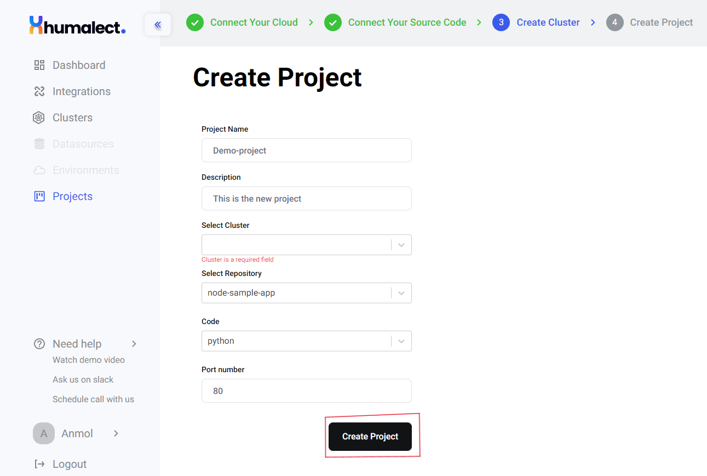
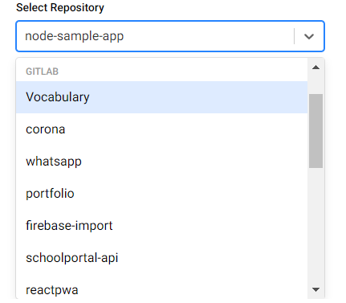
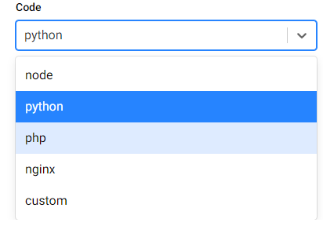

# Creating a new project

## Prerequisites for creating a project
There should be a running cluster to host the project.

## Create Project
1. To start creating a project, go to Humalect console's `dashboard` -> click on `Project` -> click on `Create New Project` button on top right.

2. Name the project. The name could be anything but it must be unique.
3. Give a brief description about the project. The description might include:- What the project is about?, What is the scope of the project, etc.
4. Select a `cluster` on which you want to host your project. To know more about clusters, refer to [Cluster](https://docs.humalect.com/en/Cluster/Cluster).

5. Select a `Repository` from the linked code repositories..

6. Select a `coding language` in which your code has been written. This helps populate a corresponding Dockerfile in subsequent steps

7. Assign a `port number` to your project. This is the port number on which your code runs eg. 80,8080 or 3000.

After you have entered all the required necessities mentioned above, click on the highlighted <b>Create Project</b> button at the bottom and Voila, your project is created. Move forward and create some pipelines for your newly created project

### Troubleshooting
Need help? [Contact](./../Contact-us/reach-out-to-us) us
