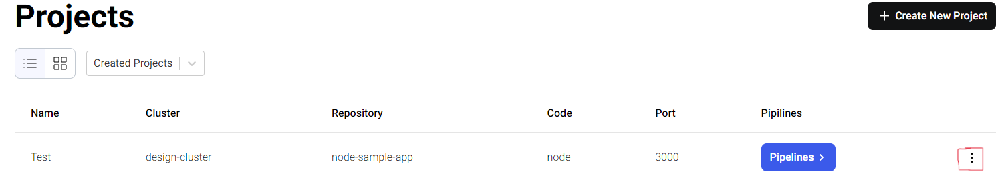

# Project Deletion

## What is Project?
To know more about projects, visit [Project](./../../projects/overview).

## Consequences of Deleting a Project

1. All the `pipelines` running in the project, will also be deleted.
2. `Sub-domain` on which the project's pipeline is deployed won't function anymore.
3. All the associated `ingress`, `deployments`, `secrets` and `services` of associated downstream pipelines will be deleted.

## Recommendation before Deleting the Project
It is recommended to have a backup of your `YAML`, `Dockerfile` and `secrets` before deleting a project.

## Deleting the Project
1. Go to Humalect's Console's `dashboard`.
2. Click on `Projects`.
3. Click on the `highlighted three dots` at the bottom right.

4. You will see `delete` button, click on this button.

5. Click on the ✅ icon to delete the project.

Your project will be deleted.

### Troubleshooting
Need help? [Contact](./../Contact-us/reach-out-to-us) us
