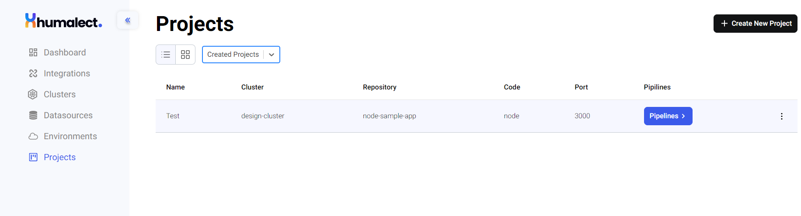
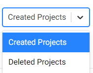

# Project Page Overview
A project is a logical entity in which the user selects two options:
1. The cluster on which the application is to be deployed
2. The code repository that is to be deployed

<b>Note:-</b> Project is not a physical/infra entity, it is just a logical entity to map the cluster and code repo for application deployments.

The projects page lists all the created projects, options to view pipelines associated with every project, create a new project, and options to delete existing projects.

Details for every project such as name, cluster, repository, etc. can be seen in each row corresponding to every project.

The drop-down menu provides us with two functionalities of seeing either `created projects` i.e. existing projects or `deleted projects` i.e. projects that don't exist anymore.

Once a project is deleted, all the pipelines associated with the project also get deleted automatically. This can also lead to the deletion of existing deployments that are linked to those pipelines, so be very careful while deleting projects.

## Creating a new project
Click on the `Create New Project` button at the top right corner to create a new project.
To know more about creating a new project, visit [Create Project](./create-a-project).

### Troubleshooting
Need help? [Contact](./../Contact-us/reach-out-to-us) us

