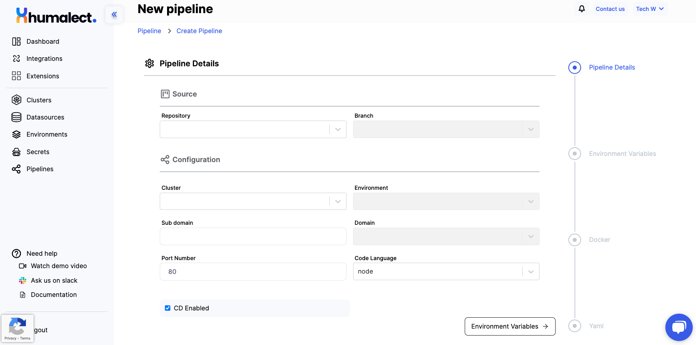
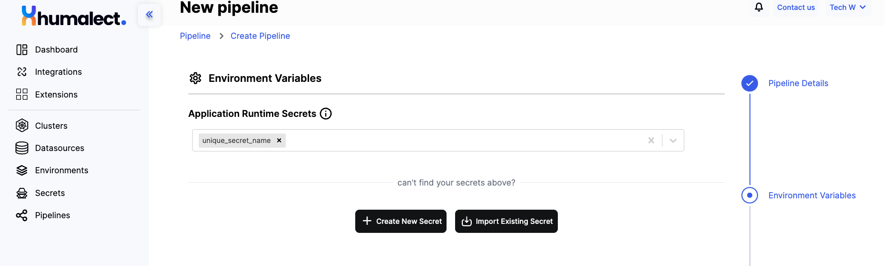
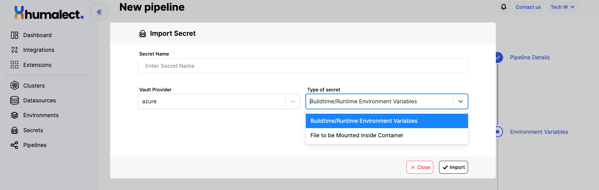
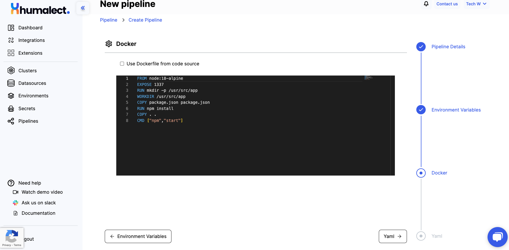
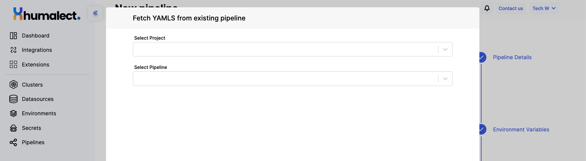
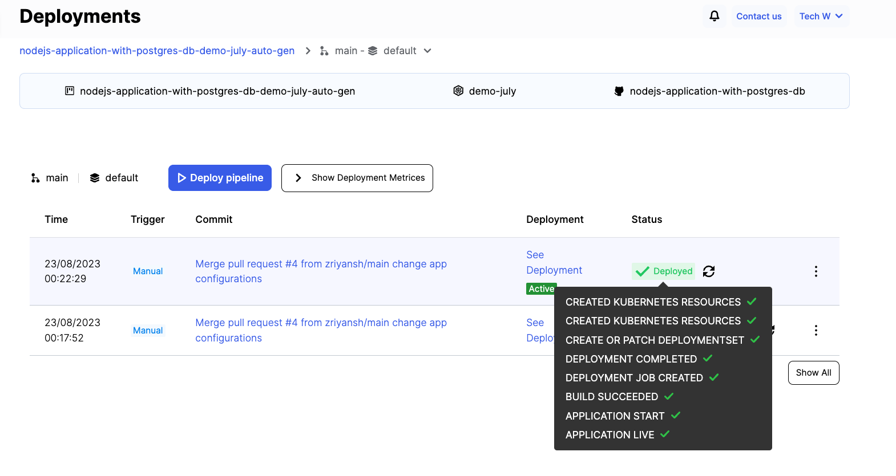
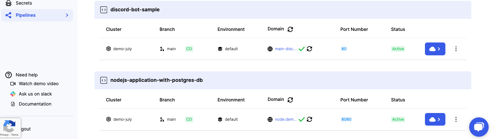
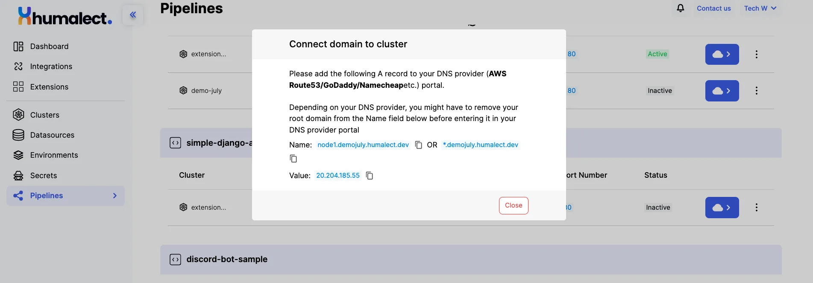
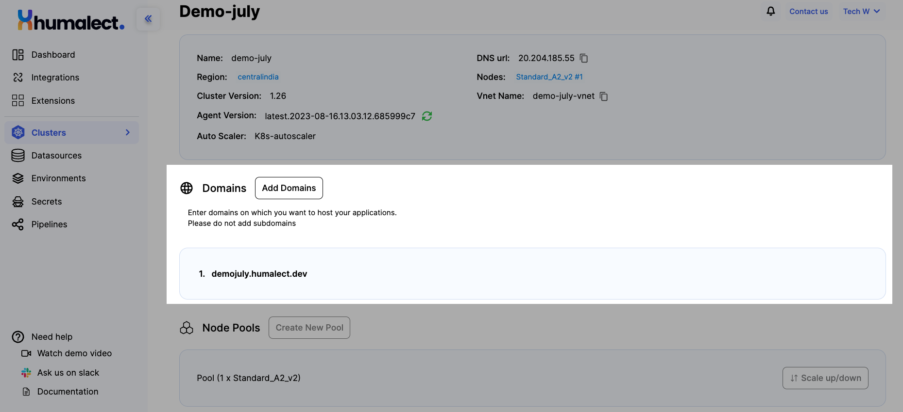

# Pipeline Creation Process

## Requirements for Establishing a Pipeline on the Humalect Platform

To set up a pipeline on the Humalect Platform, the following prerequisites must be met:

1. **Existence and Proper Configuration of AWS/Azure Cluster:**
   An AWS or Azure cluster must be in place and appropriately configured. Additionally, the cluster should possess a verified domain to ensure proper functioning.

2. **Availability of Source Code Integration:**
   A source code integration from platforms such as GitHub, GitLab, or Bitbucket is essential. This integration facilitates the retrieval of your repositories, enabling seamless pipeline implementation.

## Create Pipeline

To create a new pipeline, select `Pipeline` from the sidebar and Click on `+ Create New Pipelines` button at top right corner. 




**Procedure for Pipeline Creation:**

To establish the pipeline, adhere to the ensuing steps:

### Source Tab
1. **Repository Selection:**
   Opt for the repository housing your source code. The dropdown list will exhibit repositories from all affiliated source code providers for which you've granted Humalect access permissions.

2. **Branch Selection:**
   Subsequently, designate a branch for the newly connected repository. Options encompass common branches like `main`, `dev`, `prod`, or the option to select a custom branch.

### Configuration Tab
1. **Cluster Selection:**
   Choose a `Cluster` for hosting your project.

2. **Environment Selection:**
   Indicate an `Environment` for all pipeline deployments. If no prior environments exist, an option to select the 'default' environment will be presented.

3. **Sub-domain Assignment:**
   Allocate a `Sub-domain` to the pipeline. This sub-domain will serve as the host for all deployments within this pipeline.

4. **Domain Choice:**
   Opt for a `Domain` for the pipeline. You can edit the list of domains through the cluster information page linked to your cluster.

5. **Port Number Input:**
   Input the `Port Number` on which your code operates.

6. **Code Language Selection:**
   From the repository's dropdown list, elect the `Code Language`. Available choices encompass languages like `node`, `python`, `php`, `nginx`, `reactjs`, `nextjs`, `ruby on rails`, `django`, and the option to choose `custom` if none of the available options align.

7. **Continuous Deployment (CD) Preference:**
   Decide on enabling `Continuous Deployment (CD)` or not. By opting for CD, every commit to this branch will automatically trigger deployments.

These precise steps guide the creation of the pipeline in a structured manner.
   
<!-- 9.  (optional) If you want to use a `datasource` created in previous steps in your pipeline, select it from the `Select Datasource` drop down.  -->

Next, click on `Environment Variables` button to move to next screen to setup Secrets for your pipeline. 

### Under Application Runtime Secrets Tab
These secrets will be used as environment variables during application runtime. You can select multiple secrets too. 


#### Adding Secrets to the Pipeline
Now, let's explore the Environment Variables section. Here, you'll be presented with three options:
- Option 1: Select an already-made secret from the drop-down list.
- Option 2: Create a new secret file to store sensitive information securely.
- Option 3: Import an existing secret from your cloud account.

To create a new secret file. Click on the `Create New Secret` button and fill in the required fields.
- Provide a unique name for the secret
- Choose the Vault Provider option, such as AWS for AWS Secrets Manager or Azure for Azure Key Vault.
- Next, select the type of secret. The two options available are `Runtime Environment Variables` and `File to be Mounted Inside the Container`.


**Files to be Mounted Inside the Container:** With this option, AWS Secrets Manager stores the secret data securely and allows you to reference it using a specific file path. When you run your container, you can configure the container to mount the secret file from AWS Secrets Manager to a specific location inside the container.

:::caution
Humalect doesn't access your secrets.
:::



**Importing an Existing Secret**

If you possess a secret within your cloud account, you can proceed by selecting the "Import Existing Secret" button. Fill in the subsequent details:
- Secret Name
- Vault Provider
- Type of Secret



Upon completing the steps for either creating a new secret, choosing an existing one, or importing a secret, proceed by selecting the "Continue to Docker" button located at the lower right-hand corner of the screen. This action will allow you to make modifications to the "Dockerfile" and "YAML" files.

### Docker Configuration Tab

For those unfamiliar with Docker, an established Dockerfile is provided for your source code. This Dockerfile can be adjusted and edited through the user interface, and any changes made will be saved for future use.



Alternatively, you can directly utilize a Dockerfile from your source code repository by selecting the "Use Docker from code source" checkbox.

To proceed to YAML configuration, select the "YAML" button located at the bottom right corner.

### YAML Configuration Tab

The platform generates "Deployment YAML," "Service YAML," and "Ingress YAML" automatically. These YAML configurations can be customized to match your requirements, or you can choose to use the recommended configurations.


Fetching YAML files from your source code repository or an existing pipeline is also an option.



Please adhere to the specified `variable names` when editing YAML files or incorporating your own configurations.


### Finalizing Deployment

By selecting the "Deploy pipeline on creation" checkbox, you can initiate automatic deployment immediately upon creation.

Once you've provided all the necessary details as mentioned above, click on the "Create Pipeline" button located at the bottom right.



The Deployments page will reflect a successful deployment.

## Verifying the Subdomain

After successfully creating the pipelines, the domain must be verified and linked to the load balancer URL/IP in the DNS provider settings. Refer to the provided images.



To confirm the status of the subdomain, click the ♺ button to refresh. A green tickmark ✅ indicates successful verification, while a ❌ indicates otherwise. Follow the steps outlined below in case of an unsuccessful verification.

:::note
Newly created subdomains are unverified ❌ by default.
:::



Add the specified record values to your domain provider's DNS for the following fields:
1. Domain Name
2. Domain Value.


 ```
 Please add the following A record to your DNS provider 
 (AWS Route53/GoDaddy/Namecheapetc.) portal.
 
 Depending on your DNS provider, you might have to remove your root domain 
 from the Name field below before entering it in your DNS provider portal
 
 Name: node1.demojuly.humalect.dev OR *.demojuly.humalect.dev
 Value: 20.204.185.55
 ```

Return back to the platform and press the ♺ button to confirm if the subdomain is properly working or not.


:::info
You can also get the DNS URL from the cluster details page and a list of connected domains.
:::



That's all for now. If you still get into trouble adding or verifying the domains, get in touch with us. 

### Troubleshooting
Need help? [Contact](./../Contact-us/reach-out-to-us) us

