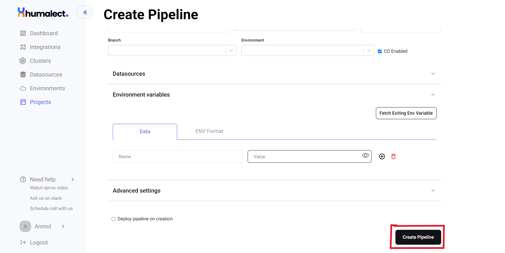
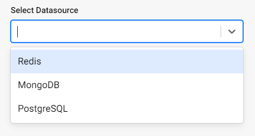
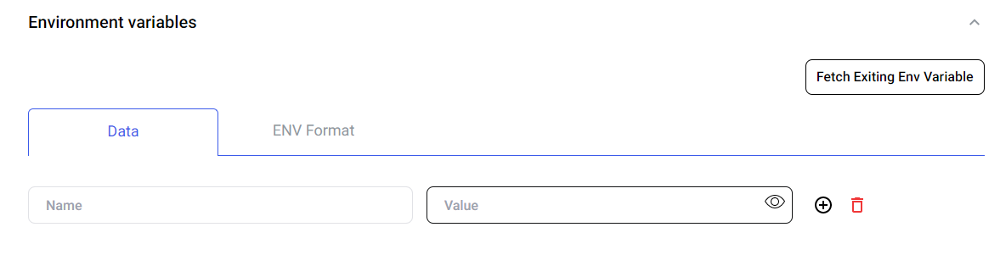
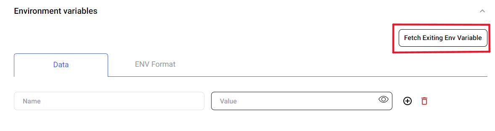
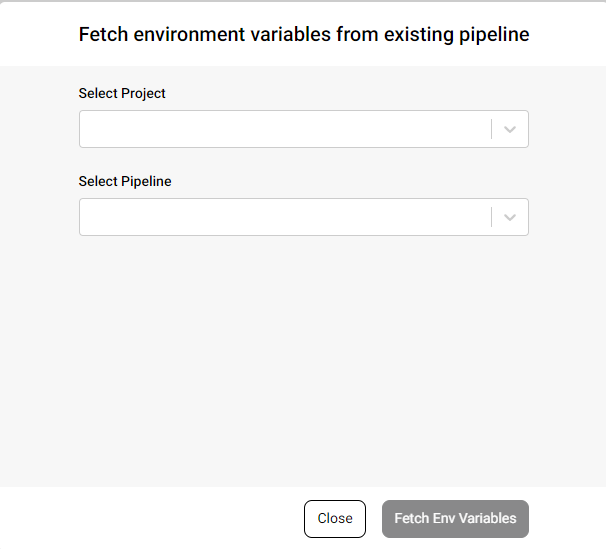
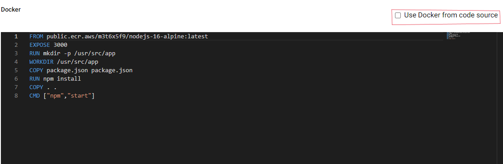
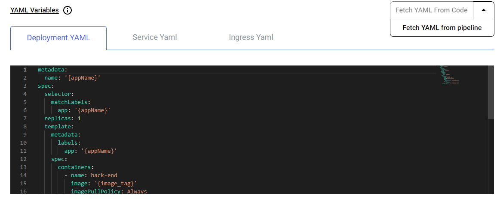
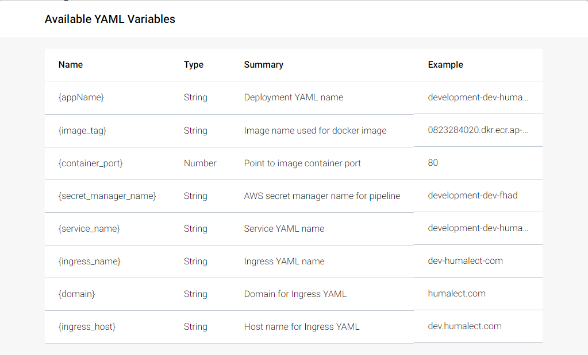

# Creating a new pipeline

## Prerequisites for creating a pipeline
1. A cluster and a project should exist.
2. To fetch your repositories, there should be a source code integration.

## Create Pipeline

To create a pipeline for a project, Go to Humalect console's `dashboard` -> Click on `Projects` -> Click on `Pipelines` button next to your choice of project -> Click on `Create New Pipeline` button on top right on the pipelines page.

At the top, you will see `Project`, `Cluster` and `Repository` being used in the current pipeline.

To create the pipeline, follow the steps below:-
1. Assign a `sub-domain` to your pipeline. This sub-domain will be used to host all deployments for this pipeline.
2. Select a `domain` for your pipeline. This list of domains can be edited on the cluster information page for your cluster.
3. Enter the `Port Number` on which your code runs.
4. Select the `branch` that you want to deploy in this pipeline
5. Select the `environment` which you want to use for all the deployments of this pipeline
6. Choose whether you want `CD enabled` or not. CD stands for Continuous Deployment, all your commits to this branch will be auto-deployed if this is checked.
7. (optional) If you want to use a `datasource` created in previous steps in your pipeline, select it from the `Select Datasource` drop down. 

If you wish to connect any datasource to the pipeline, you can select it and add it's respective connection string in the environment variables in the next step.
We currently support three datasources namely: Redis, MongoDB and PostgreSQL.
To know more about datasources, visit [Datasource](./../Datasources/Overview).

8. Next, enter the `environment variables` for your pipeline. You can either add it one by one or use `Env Format` tab and paste your .env file directly. These environment variables will be securely stored in vault/secret-manager in your cloud account. Humalect doesn't access your secrets.

There is also a provision to fetch existing environment variables from previously created projects and pipelines by clicking on the `Fetch Existing Env Variable` button.

9. Now you can move on to the `advanced settings` which give you the access to edit `Dockerfile` and `YAML` files.

<b>Dockerfile</b>

We have got you covered in case you are unfamiliar with Docker by providing you with a pre-defined Dockerfile for your source code. You can tweak and edit the Dockerfile as per your requirement on the UI and it will be saved for subsequent runs.

You can also use Dockerfile directly from your source code repository by clicking on the button `Use Docker from code source`.

<b>YAML</b>

The platform auto-generates `Deployment YAML`, `Service YAML` and `Ingress YAML`. You can customize them as per your need or use the recommended ones.

You can also fetch YAML files from your source code repository or from any existing pipeline.

Please ensure that you use the below mentioned `variable names` if you are editing YAMLs or bringing your own.

10. You can click on the checkbox `Deploy pipeline on creation` and it will automatically deploy your pipeline as soon as it is created.

After you have entered all the required necessities mentioned above, click on the `Create Pipeline` button at the bottom right.

### Troubleshooting
Need help? [Contact](./../Contact-us/reach-out-to-us) us

