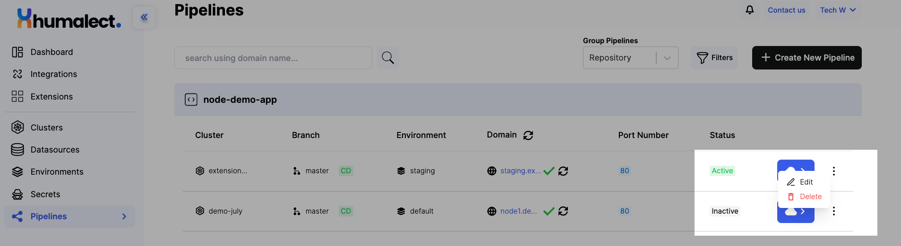
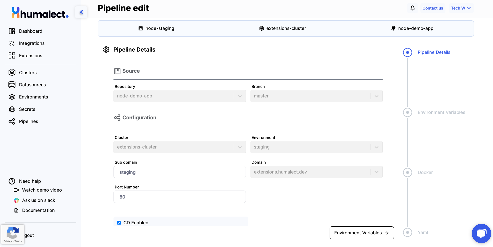

# Pipeline Editing Process

## Prerequisites for Updating a Pipeline

Before you proceed with updating a pipeline within the Humalect Console, ensure the following prerequisites are met:

1. **Running Cluster Availability:**
   A functional and active cluster should be established within the system.

2. **Existing Pipeline Creation:**
   The pipeline you intend to update must have been previously created.

## Updating the Pipeline

Follow these steps to make changes to an existing pipeline using the Humalect Console:

1. **Access the Dashboard:**
   Log in to the Humalect Console and navigate to the main dashboard.

2. **Navigate to Pipelines:**
   Click on the "Pipelines" tab to view the list of available pipelines.

3. **Select the Pipeline:**
   Identify and select the specific pipeline that requires modifications. Click on the highlighted three dots icon located on the right side of the corresponding row for the selected pipeline.

4. **Access Editing Options:**
   From the menu that appears, locate and click the "Edit" button.

6. **Implement Changes:**
   Make the necessary adjustments according to your requirements. You have the ability to modify various fields, including:
   - Sub-Domain
   - Port Number
   - CD Enabled Checkbox
   - Addition or Removal of a Preselected Secret
   - Importing a New Secret
   - Editing Dockerfile and YAML Configurations
   - Toggling the "Deploy Pipeline on Update" Button
   
7. **Save Changes:**
   After finalizing the modifications, click the "Update Pipeline" button located at the bottom-right corner of the interface.

Your pipeline will undergo an update process, and the applied changes will be redeployed accordingly.

### Troubleshooting
Need help? [Contact](./../Contact-us/reach-out-to-us) us
