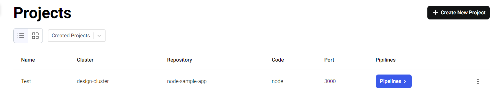
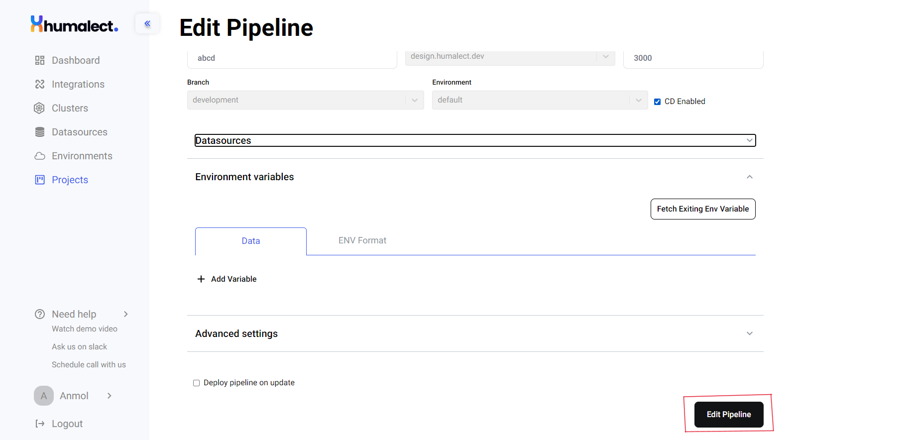

# Updating an existing Pipeline

To know more about pipelines, visit [Pipelines](https://docs.humalect.com/en/pipelineOverview).

## Prerequisites to Update a Pipeline
1. There should be a `running cluster`.
2. A project should be running as a pipeline is a part of it.
3. A pipeline should be created first.

## Updating the Pipeline
1. Go to Humalect Console's `dashboard`.
2. Click on `Projects`.
3. Click on the `Pipelines` button.

4. Click on the `highlighted three dots` available towards the right side of the respective row.

5. You will see `edit` button, click on this button.

6. Make the required changes and after making all the changes, click on the button `highlighted` below at the bottom right.

Your pipeline will be updated.

### Troubleshooting
Need help? [Contact](./../Contact-us/reach-out-to-us) us
