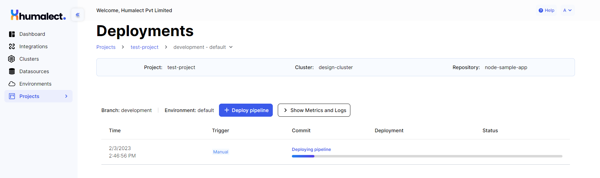

# How to deploy a pipeline?
## What is Deployment?

A deployment is an instance of a pipeline execution (which pulls the code from the source code repository, builds it and releases it in a particular environment).

Once the pipeline is created, it can be deployed via direct commits on code repositories (if CD is enabled) or manual deployments from the pipelines page UI.

## Accessing the deployment page
1. Go to Humalect console's `dashboard`.
2. Click on `Projects`. Select a Project of your choice.
3. Click on `Pipelines`. Select a Pipeline of your choice.
4. Click on `Deployments` and you will see the page as below.

## Components of Deployments
1. At the top, you can see the name of the `project`, `cluster`, and `repository` with which your pipeline is created.
2. You can see the `branch` and the `environment`(default in this case), to which your pipeline is linked.
3. `Deploy Pipeline` button can be used for manual deployment of the pipeline.
4. `Show Metrics and Logs` shows real time `CPU` and `memory` usage of your deployment. It also streams the logs of your existing Kubernetes deployment.
5. `Time` field displays timestamp of the deployment.
6. `Trigger` shows the type of deployment, it can be `manual` or `automatic`. The value of the field is `automatic` if `CD` was enabled in pipeline and `manual` if the pipeline was deployed manually.
7. `Commit` field redirects the user to the exact git commit which was deployed.
8. `Deployment` field shows the deployment progress
9. `Status` fields shows the status of various steps involved. 

## What are various ways of deploying my pipeline?
There are two ways of deploying your pipeline via Humalect's console:
1. <b>Manual</b>: It could be done by clicking on the `Deploy Pipeline` button.
2. <b>Automatic</b>: Deployment happens automatically on every commit in the specific branch of the source code repository.

### Troubleshooting
Need help? [Contact](./../Contact-us/reach-out-to-us) us

