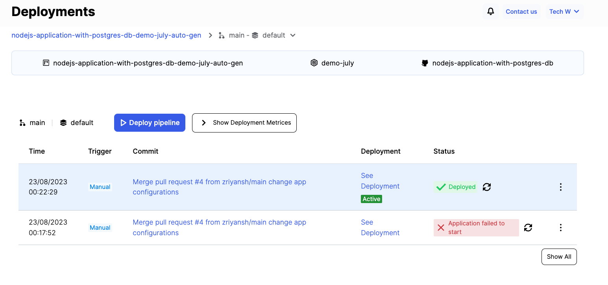
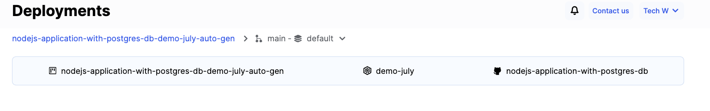
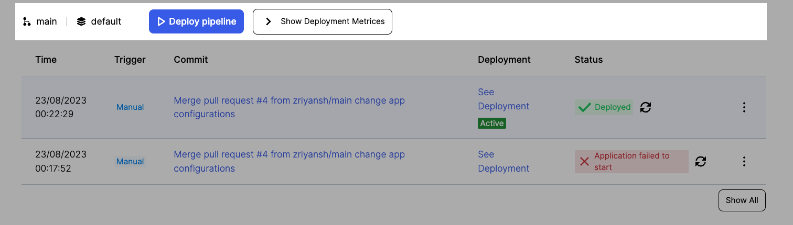
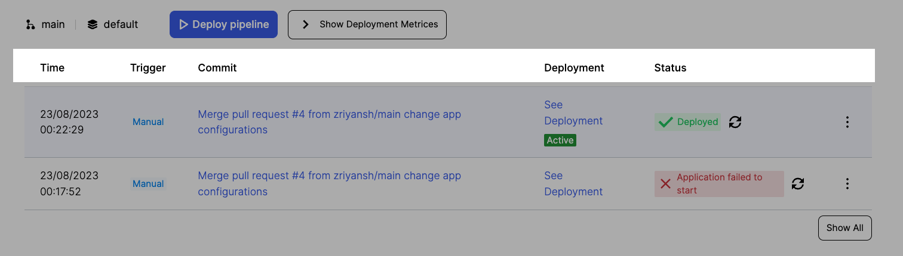
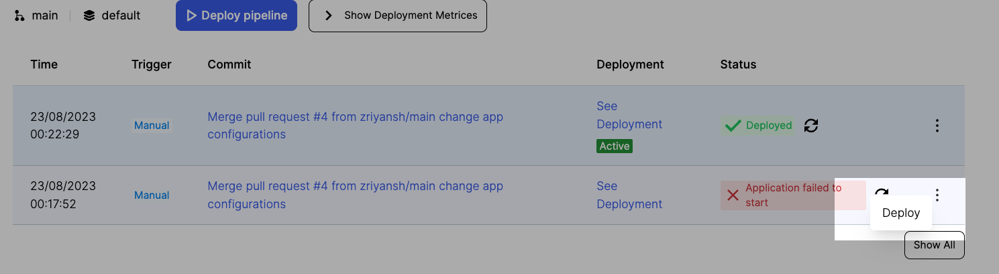
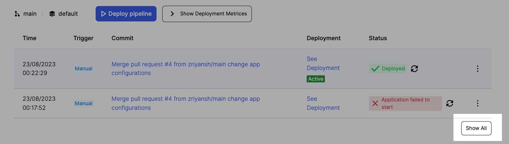

# Pipeline Deployment Process

## What is Deployment?

After the creation of a pipeline, the next step is initiating its deployment. This can be achieved through two primary methods: 
1. Direct commits on code repositories and 
2. Manual deployments via the pipelines page user interface (UI). 
   
The overarching goal is to facilitate the release of code changes to users in a controlled and efficient manner.

### 1. Direct Commits (Continuous Deployment, CD):
If the continuous deployment (CD) feature is enabled in the pipeline, any code commits made to the associated code repository trigger automatic deployments. This streamlines the process, as each code commit is swiftly transformed into a live deployment. 

This approach minimizes the delay between code development and user accessibility, enhancing development velocity and user satisfaction.

### 2. Manual Deployments from UI:
Alternatively, manual deployments can be initiated from the pipelines page's user interface. This grants developers more control over the release process. They can review the code changes, ensure that everything is in order, and then manually trigger the deployment. 

This approach is particularly useful for situations where a more cautious, hands-on approach to releasing code is desired, or when additional checks are necessary before deployment.

### Understanding Deployment:
A deployment signifies an instance of executing a pipeline. This process encompasses a series of stages: fetching code from the designated source code repository, building it to create the application or service, and finally, releasing it into the operational environment where users can engage with it. 

A successful deployment indicates that the code is ready to be consumed by users, while also ensuring that any testing, validation, and preparation steps have been successfully completed.

## Accessing the Deployment Page

To access the Deployment Page in the Humalect console, follow these steps:

1. Navigate to the `dashboard` within the Humalect console.
2. Select the `Pipelines` option. Choose a specific Pipeline from the list.
3. Click on the `Deployments` button. This action will lead you to the page illustrated below.

## Components of Deployments

The Deployment Page provides various components to facilitate the management of your pipelines and deployments:

1. **Pipeline Details:**
   At the top section, you can observe essential details about the pipeline:
   - Name of the `Pipeline`
   - Associated `Cluster`
   - Linked `Repository` for the pipeline's creation.
   
   

2. **Branch and Environment:**
   Information regarding the specific `branch` and `environment` (default by default) to which the pipeline is connected.

3. **Manual Redeployment:**
   The `Deploy Pipeline` button allows manual re-deployment of the pipeline when needed.

4. **Real-time Metrics and Logs:**
   Clicking the `Show Deployment Metrics` button provides real-time insights into `CPU` and `memory` usage for the deployment. Additionally, it offers live streaming of logs from the existing Kubernetes deployment.
   
   

5. **Deployment Timestamp:**
   The `Time` field displays the timestamp of the deployment.

6. **Deployment Trigger:**
   The `Trigger` field indicates the deployment type, distinguishing between `Manual` and `Automatic`. This designation is based on whether Continuous Deployment (`CD`) was enabled for the pipeline, leading to an `Automatic` trigger, or if the deployment was initiated manually, resulting in a `Manual` trigger.

7. **Associated Git Commit:**
   The `Commit` field serves as a hyperlink that directs the user to the specific git commit version that was deployed.

8. **Deployment Progress:**
   The `Deployment` field tracks and displays the progress of the ongoing deployment.
    
    

9. **Status Tracking:**
   The `Status` field provides insight into the current status of various involved steps.
    
   
 
10. **Redeploying Failed Deployment:**
    In cases of deployment failures, a user can initiate a redeployment by clicking on the three dots located on the far right of the corresponding deployment entry. Selecting `Deploy` from the options provided will trigger the redeployment process.
    
    

11. **Viewing All Deployments:**
    By default, the user interface displays the most recent 2 deployments. To view a comprehensive list of all deployments, both successful and failed, click on the `Show All` button located on the right-hand side.
    
    

### Troubleshooting
Need help? [Contact](./../Contact-us/reach-out-to-us) us

