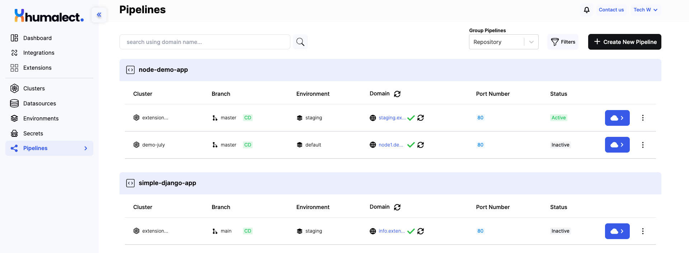
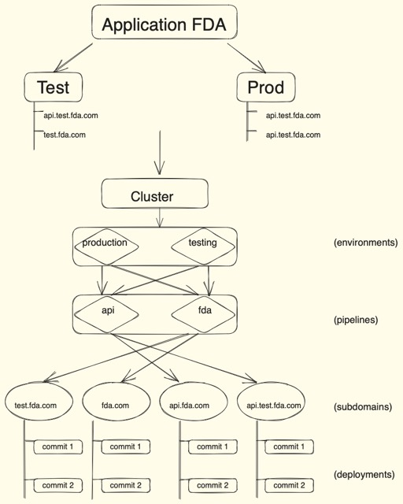

import DocCardList from '@theme/DocCardList';

# Pipelines Overview
## What is Pipeline?

Pipeline is a logical entity which lets you configure some vital details for the deployment. Configurations like selecting your connected repository, and choosing the specific branch that contains the code you wish to deploy, set the desired port number and indicate the code language for your application.

User can also enter their choice of subdomain on which the application deployment is to be hosted, the main domain related to the AWS/Azure cluster and all the manifests like Dockerfiles, YAMLs and environment variables can be edited in a pipeline.

Let's break down the concepts mentioned above:

1. **Connected Repository:** This is typically a version control repository (e.g., Git repository) where your application's source code is stored. The CI/CD pipeline integrates with this repository to fetch the code for building and deploying.

2. **Branch Selection:** Developers often work on different branches of the repository. The pipeline lets you specify which branch contains the code you want to deploy. This can include your main development branch, feature branches, etc.

3. **Port Number:** When your application runs, it listens on a specific port for incoming requests. In the pipeline, you can configure the port number on which your application should listen.

4. **Code Language:** The programming language used to write your application. The pipeline might need this information to set up the appropriate build and deployment environment.

5. **Subdomain:** This is the custom domain prefix that users will use to access your deployed application. For instance, if your main domain is `example.com`, a subdomain could be `app.example.com`.

6. **Main Domain and AWS/Azure Cluster:** The main domain refers to the primary domain under which your subdomains are hosted. AWS and Azure clusters refer to the cloud infrastructure where your application will be deployed.

7. **Manifests (Dockerfiles, YAMLs, Environment Variables):** These are essential files for containerized applications. Dockerfiles define how your application should be packaged into a container, YAML files specify configurations for services, and environment variables hold sensitive or customizable settings.

8. **Editing in the Pipeline:** Some CI/CD tools provide the capability to modify these manifests and settings directly within the pipeline setup. This allows for easy configuration changes without modifying the source code.

9. **Deployment Hosting:** The pipeline will automate the process of taking your code, building it (if necessary), and deploying it to a server or cloud environment. This involves setting up the infrastructure, deploying containers, configuring services, etc.

10. **CI/CD Pipeline:** All of these configurations and processes collectively form the CI/CD pipeline, which streamlines the steps from code development to deployment. Automated testing, quality checks, and staging environments can also be part of the pipeline.

**Why Pipelines Matter: Streamlining Development and Deployment**

1. **Enabling Multiple Environments and Subdomains:**
   - Pipelines play a pivotal role in managing complexity within a single cluster.
   - When a cluster hosts various environments (e.g., testing, production) and subdomains, pipelines provide a structured approach to isolate and control the deployment of distinct codebases.

2. **Empowering CI/CD via Git Repositories:**
   - Pipelines are the driving force behind continuous integration and continuous deployment (CI/CD) practices.
   - CI/CD automates the building, testing, and deployment of code changes from Git repositories.
   - By utilizing pipelines, teams can ensure a seamless flow of updates, enhancing development speed and maintaining code quality.

In essence, pipelines streamline the deployment process by effectively managing multiple environments and automating CI/CD, making development and release cycles more efficient and reliable.

Let us consider an example of a Food Delivery App(FDA) to understand the concepts better.

1. **FDA is a Food Delivery Company Requiring a Cluster on Humalect's Console:**
   - FDA, which stands for the Food Delivery Company, is a business that delivers food to customers.
   - To manage their software applications and services, they need to use a cluster within Humalect's console. A cluster is a group of interconnected servers or nodes used to deploy and manage applications.

2. **Two Running Environments - Test/Testing and Production:**
   - FDA's software applications are divided into different environments to segregate various stages of development and deployment.
   - The two environments mentioned are "test" or "testing" (used for testing new changes) and "production" (where the final, customer-facing version runs).

3. **Two Running Pipelines - API and FDA:**
   - Pipelines are automated workflows that handle the steps from code to deployment.
   - FDA's cluster has two pipelines: "api" and "fda." Each pipeline represents a different set of processes and stages for deploying code.
   - These pipelines are responsible for taking the code from repositories and moving it through various stages until it's ready for deployment.

4. **Multiple Deployments for Each Pipeline:**
   - Whenever new code changes are committed to the respective code repositories, the pipelines initiate actions to deploy those changes.
   - Additionally, manual deployment can also be triggered through the pipeline's interface.
   - Each pipeline can handle multiple deployments, allowing for the management of different versions of the codebase.

FDA is utilizing Humalect's console to manage their software deployments. They have organized their applications into environments (test and production) and pipelines (api and fda) to facilitate efficient development, testing, and deployment of their code. This structure helps FDA ensure that code changes are properly tested before being released to their production environment, providing a controlled and reliable software delivery process.

<DocCardList />

### Troubleshooting
Need help? [Contact](./../Contact-us/reach-out-to-us) us

