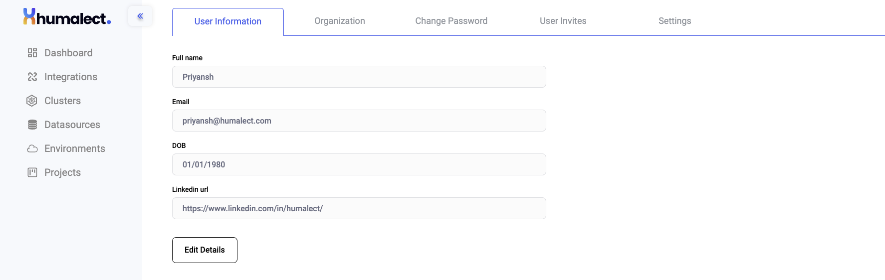
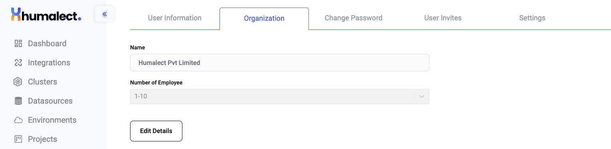
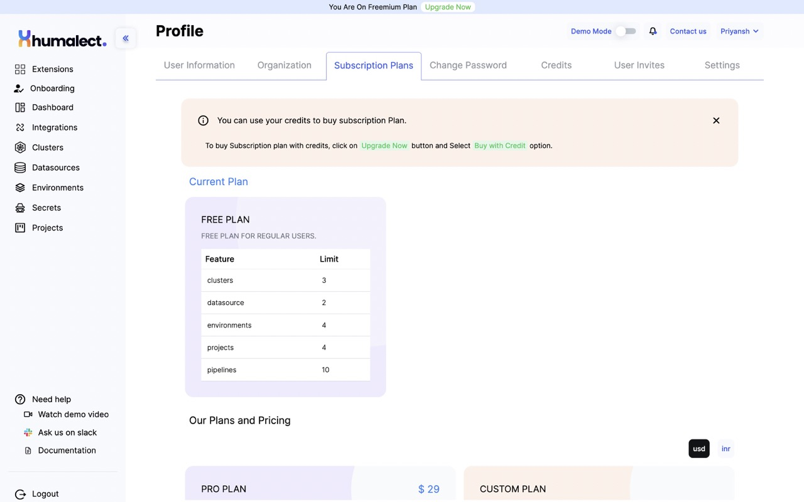
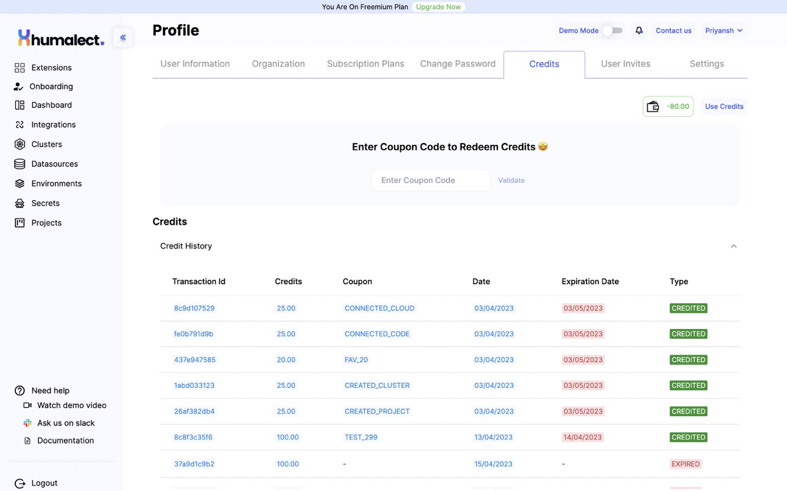
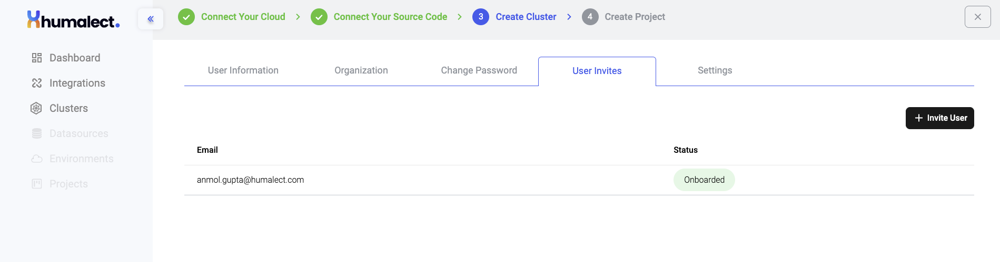
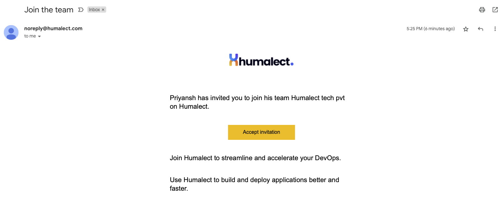

This article will walk you through the various options that you will see under the [Admin Section](https://console.humalect.com/user/profile) of the Humalect Platform. 

> ## This article covers:-
> 1. User Information
> 2. Organization Information
> 3. Subscriptino Plans
> 4. Change Password
> 5. Credits
> 6. Manage User Invites
> 7. Other Settings and Preferences Settings

Now let's discuss each of them in more detail:

## 1. User Information
This section allows you to enter and edit your personal account details like `Email`, `DOB` etc.

Here is a tabular representation of the data fields available in the [Admin Section](https://console.humalect.com/user/profile) of the Humalect Platform.

| Sl. | Value | Description | Editable? | Required? | 
| -- | -- | -- | -- | -- | 
| 1. | **Full Name** | Includes "First Name" and "Second Name". Middle Names can also be used. | ✅ | Yes |
| 2. | **Email**     | The email user used for signup  | ❌ | Yes | 
| 3. | **DOB**       | Date of Birth in DD/MM/YYYY format | ✅ | Optional | 
| 4. | **LinkedIn URL** | E.g- https://www.linkedin.com/in/humalect/ | ✅ | Optional | 

<i>Table showing details about the User Information Tab . </i>
 

Here's a quick look at the User Information section.

 

<i>Image showing profile section - User Information Tab. </i>
 

## 2. Organization Information
The Organization tab consists of options like the name of the organization and the number of employees. 

| Sl. | Value | Description | Editable? | Required? | 
| --  | --    | --          | -- | -- | 
|1. | **Name** | Name of the organization (org, Pvt ltd or LLC) you represent |  ❌ | Yes | 
|2. | **Number of Employees** |  Please select a range from a dropdown list representing the number of employees  | ✅ | Optional | 

<i>Table showing details about the Organization Tab . </i>

Here's a quick look at what this section looks like in the Humalect Platform. 

<i>Image showing profile section - Organization Tab. </i>
 

## 3. Subscription Plans
The Subscription gives a brief overview of your current subscription. 

 

:::info
You can use your credits to buy subscription Plan.

To buy Subscription plan with credits, click on `Upgrade Now` button and Select `Buy with Credit` option.
:::

## 4. Change Password
The change password tab allows you to change your current password which you used to log in to the Humalect platform. 

This section contains 3 options:-
1. Current Password - Enter the password which you used to log in.
2. New Passwordr  - Enter the new password you wish to set. 
3. Confirm New Password - Re-enter the new password you wish to set.

## 5. Credits 
You can enter Coupon Code to Redeem Credits. Every coupon comes with a Expiration Date have a certain credit point. 

  

## 6. Manage User Invites

If you wish to invite a new member to access the cluster and project and view pipelines, click on the `+ Invite User` button located at the right top. 

Once you click on the `+ Invite User` button, enter the email address of the person you wish to invite and click `Submit`. 

<i>Image showing profile section - User Information Tab. </i>
  

If the email entered by you is already invited or has access, then you'll see a prompt saying
`The provided email address is already in use`. 

Otherwise, you'll see a green notification saying `Invited User Successfully.`

:::info
**Please Note:** 
1. Invited users **cannot create** new clusters or delete existing clusters. They also cannot see logs of cluster creation (which otherwise could have been accessed by clicking on 3 dots towards the right of every cluster). 
2. Invited users **can** deploy pipelines.
3. Invited users **cannot invite** other members and cannot access settings for cluster creation or deletion. 
:::

 

<i>Image showing email invitation - User Invites Section. </i>
 

## 5. Other Settings and Preferences Settings

The settings tab allows you to set permissions for cluster deletion. 

|Name | Value | 
| -- | -- |
|**Cluster Deletion** | *False* | 

By default, this value will be set to `False` so you do not accidentally delete your cluster. 

**If you are the admin and want the Cluster Deletion option,**
1. Click on the `Update Settings` button situated at the right top,  
2. Checkmark the `Cluster Deletion` option and,  
3. Click `Submit`. 

:::caution
**A word of caution**: *Do not enable this setting if you do not need it, deleted clusters and any data associated with them is permanently lost.*
:::

### Troubleshooting
Need help? [Contact](https://docs.humalect.com/en/contact) us.

