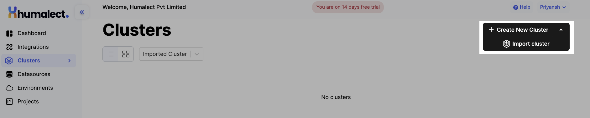
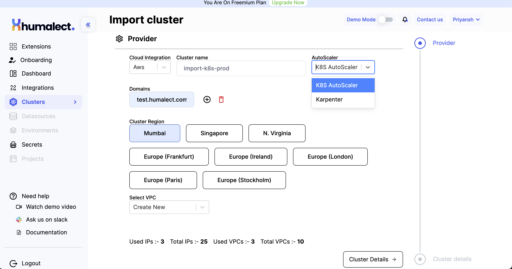
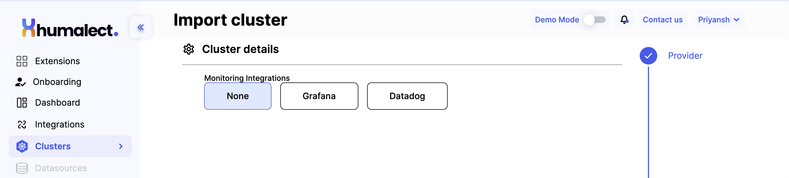
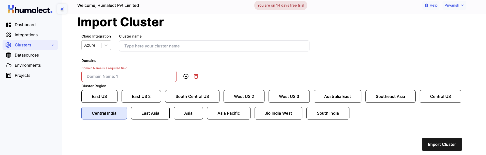

> ## This article covers:-
> 1. Import an existing Kubernetes Cluster to Humalect?  
> 	a. For AWS  
> 	b. For Azure

# Import an existing Kubernetes Cluster to Humalect

You can import an existing Kubernetes Cluster to Humalect. Follow along with the steps mentioned. 

## 1. For AWS
To import your existing Kubernetes cluster on AWS to Humalect, refer the following steps.

**Step 1:** Click on the `Import cluster` button present at the top right section as shown in the image.

<i>Image showing Import cluster button. </i>
 

**Step 2:** Select from the Cloud Integration drop-down menu your preferred cloud provider, `AWS / Azure`.

<i>Image showing Import cluster page part 1. </i>

 

<i>Image showing Import cluster page part 2. </i>

 

**Step 3:** Fill in the **Cluster name**.  
**Step 4:** Specify **Domain(s)**.  
**Step 5:** Choose **Cluster Region** from the following.   
`Mumbai /  Singapore / N. Virginia / Europe (Frankfurt) / Europe (Ireland) / Europe (London) / Europe (Paris) / Europe (Stockholm)
` 
**Step 6:** Select a **VPC** from the drop down list (*the one that you already created*). 
**Step 7:** Choose a **Monitoring Integrations**, `None / Datadog / Grafana`. 
**Step 8:** Finally, click on the `Import Cluster` button to start importing your cluster.  

---

## 2. For Azure
To import your existing Kubernetes cluster on Azure to Humalect, refer the following steps.

**Step 1:** Click on the `Import cluster` button present at the top right section as shown in the image.

<i>Image showing Import cluster button. </i>
 

**Step 2:** Select from the Cloud Integration drop-down menu your preferred cloud provider, `AWS / Azure`.

<i>Image showing Import Cluster page. </i>
 

**Step 3:** Fill in the **Cluster name**. 
**Step 4:** Specify **Domain(s)**. 
**Step 5:** Choose **Cluster Region** from the following. 
` East US / 
East US 2 / 
South Central US / 
West US 2 / 
West US 3 / 
Australia East / 
Southeast Asia / 
Central US /
Central India /  
East Asia /
Asia /
Asia Pacific / Jio India West / South India
` 
**Step 6:** Finally, click on the `Import Cluster` button to start importing your cluster. 

### Troubleshooting
Need help? [Contact](https://docs.humalect.com/en/contact) us.