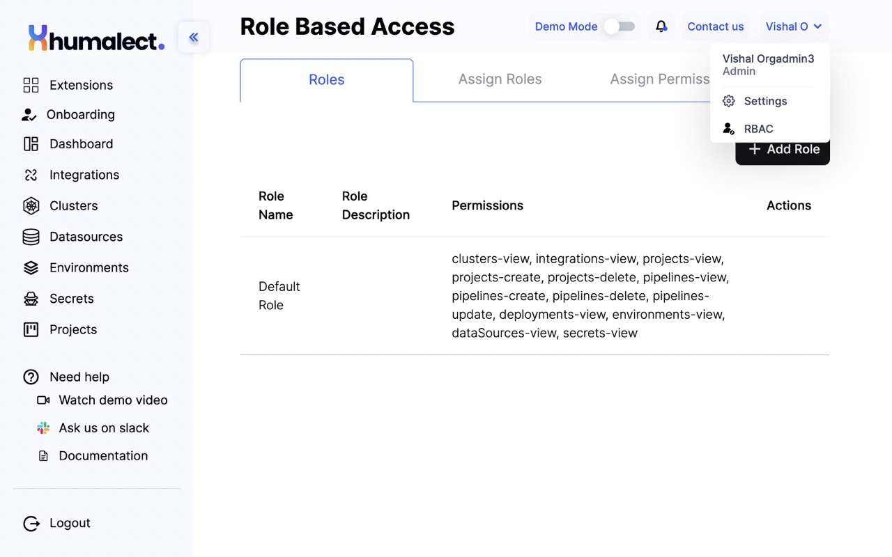
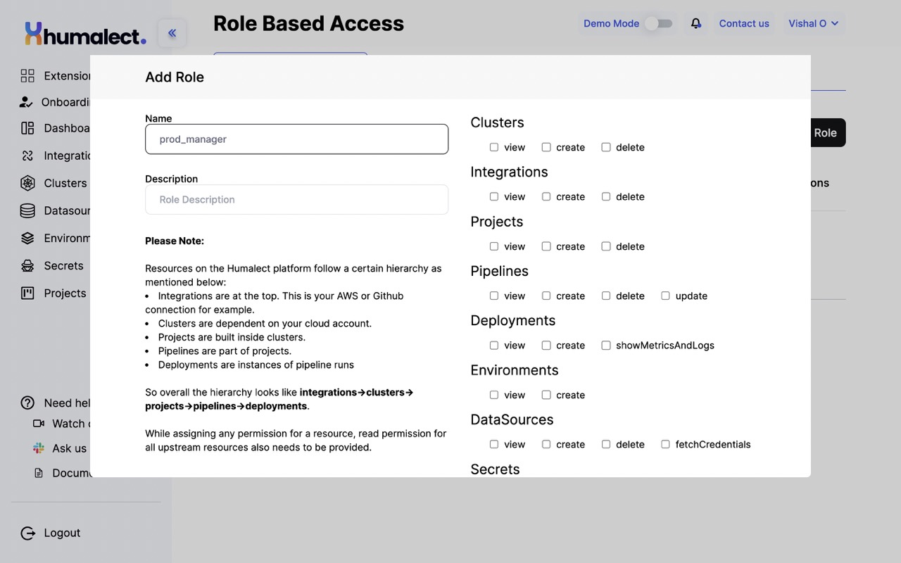
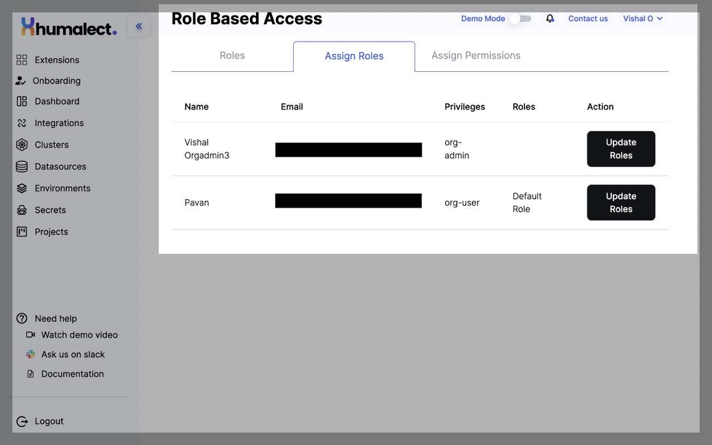
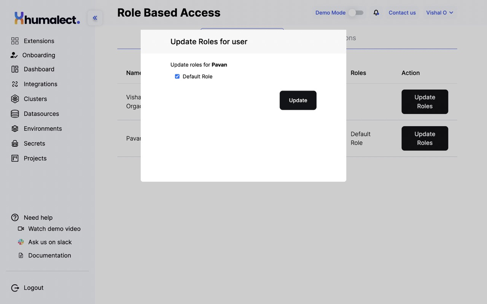
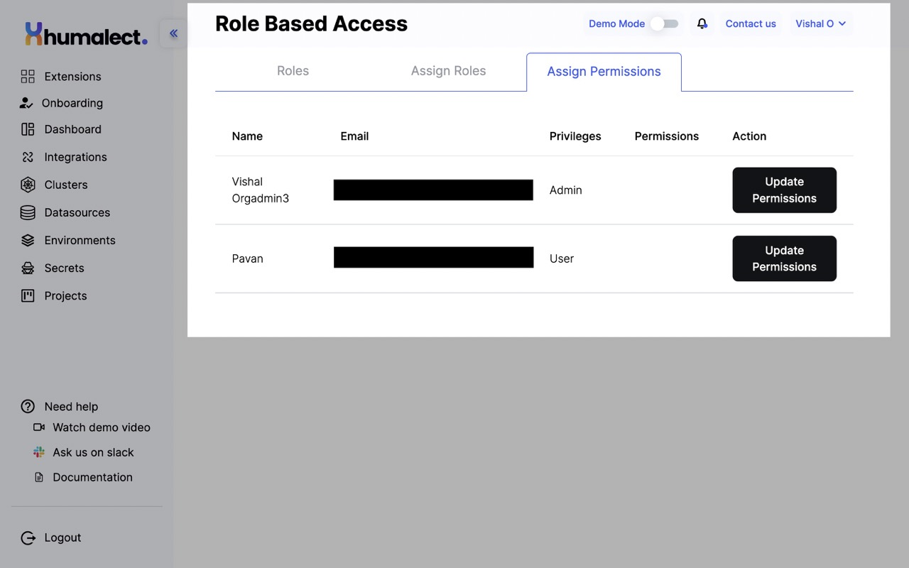
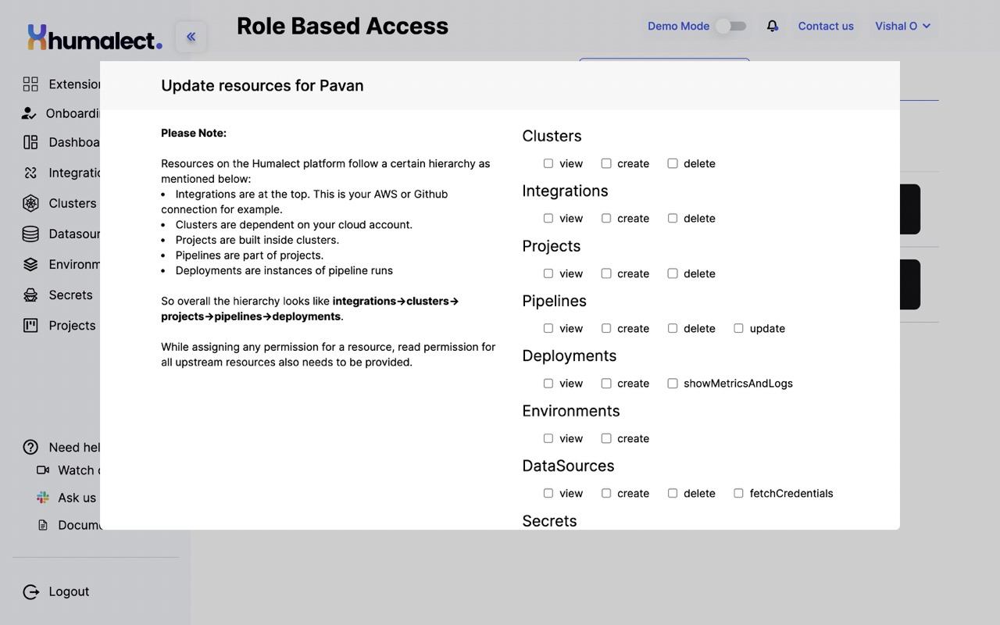

# Role Based Access Control (RBAC)

This article will walk you through the various Role Based Access Control options that you will see under the [RBAC](https://console.humalect.com/user/rbac) of the Humalect Platform. 

:::info
You need to have Pro plan to access this feature.
:::

## RBAC Roles
In this section, can see the created **Roles**, their **Descriptions**, **Permissions** and **Actions** in a tabular form. 

Click on `+ Add Role` button located at top right corner to add new roles. 

 

 

### Add Role
In order to add a new role, you need to:-

1. Specify a Role Name.
2. Specify a Role Description.
3. and tick mark the required permissions to the various resources that you want to assign a specific user.

| Resource Name | Permissions |
| ---            | --- |
| Clusters | `view`, `create`, `delete`|
| Integrations | `view`, `create`, `delete`|
| Projects | `view`, `create`, `delete`|
| Pipelines | `view`, `create`, `delete`, `update`|
| Deployments | `view`, `create`, `showMetricsAndLogs`|
| Environments | `view`, `create`|
| DataSources | `view`, `create`, `delete`, `fetchCredentials`|
| Secrets | `view`, `create`, `delete`, `update`|

4. After you are done assigning the permissions, click on the `Submit` button to add a new role. 

:::info
Resources on the Humalect platform follow a certain hierarchy as mentioned below:

1. Integrations are at the top. This is your AWS or Github connection for example.
2. Clusters are dependent on your cloud account.
3. Projects are built inside clusters.
4. Pipelines are part of projects.
5. Deployments are instances of pipeline runs

So overall the hierarchy looks like **integrations**->**clusters**->**projects**->**pipelines**->**deployments**.

While assigning any permission for a resource, read permission for all upstream resources also needs to be provided.
:::

## Assign Roles
In this section, you can view and update the assigned roles to an **invited user**. 

### Update Roles

To update the role of in invited user, click on the `Update Roles` button and select the list of roles you would like to assign. 

Once done, you can click on the `Update` button to reflect the changes. 

:::info
The Roles present at the screen will be the already made roles that you created or added. 
:::

## Assign Permissions
In this section, you can view and update the assigned permissions to an **invited user**. 

### Update Permissions

To update the permissions of in invited user, click on the `Update Permissions` button and update the resources you would like to assign. 

Once done, you can click on the `Update` button to reflect the changes. 

:::info
Resources on the Humalect platform follow a certain hierarchy as mentioned below:

1. Integrations are at the top. This is your AWS or Github connection for example.
2. Clusters are dependent on your cloud account.
3. Projects are built inside clusters.
4. Pipelines are part of projects.
5. Deployments are instances of pipeline runs.

So overall the hierarchy looks like **integrations**->**clusters**->**projects**->**pipelines**->**deployments**.

While assigning any permission for a resource, read permission for all upstream resources also needs to be provided.
:::

### Troubleshooting
Need help? [Contact](./../Contact-us/reach-out-to-us) us

