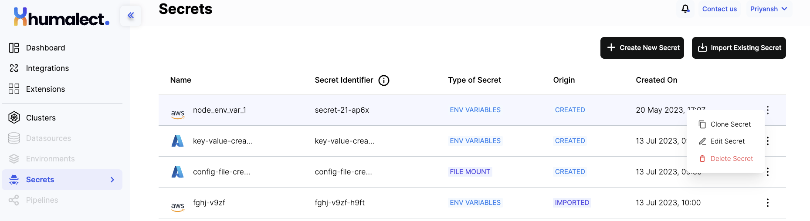
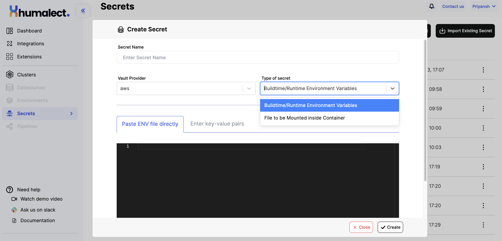
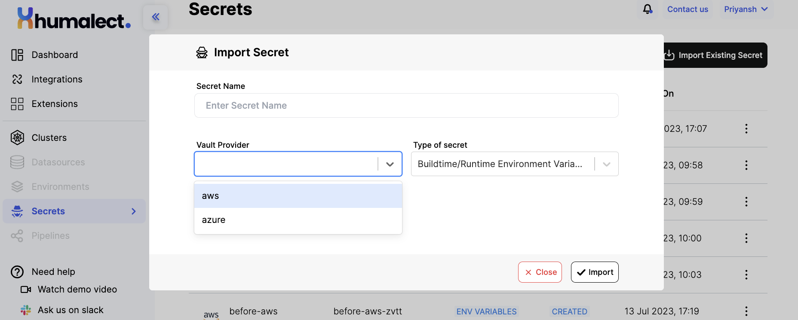

Humalect comes with a new feature called "Secrets" which allows users to store their environment variables securely in their own cloud account. In this documentation, we will discuss the features of Humalect's Secrets and how to use them effectively.

## Features of Secrets:

1. **Secure storage:** Secrets in Humalect are stored securely in your own cloud, so you can be assured that your sensitive information is safe from unauthorized access.
2. **Easy management:** With Humalect's Secrets feature, managing your environment variables has never been easier. You can easily store, update, and delete your secrets in a few clicks.
3. **Seamless integration:** Humalect's Secrets feature seamlessly integrates with Kubernetes, making it easy to deploy and manage your applications.

## Using Humalect's Secrets:

To use Humalect's Secrets feature, follow these simple steps:

1. Login to Humalect and navigate to the Secrets page from sidebar.



2. Click on the "Create New Secret" button and fill in the required fields.
- Provide a unique name for the secret



- Choose the Vault Provider option, such as AWS Secrets Manager or Azure Key Vault.
- Next, select the type of secret. The two options available are "Runtime Environment Variables" and "File to be Mounted Inside the Container."


Both AWS Secrets Manager and Azure Key Vault are secure solutions for managing and storing sensitive information, such as passwords, API keys, and encryption keys. They allow developers and administrators to centralize the management of these secrets and ensure their secure distribution to applications and services. 

When it comes to integrating secrets into containerized applications, both services provide options for accessing the secrets securely within containers.

### AWS Secrets Manager:

#### 1. Runtime Environment Variables:

  Using runtime environment variables is a common approach to injecting secrets into containers. AWS Secrets Manager allows you to store sensitive data as secrets and retrieve them as environment variables during the runtime of a container. Here's how it works:

  - **Container Configuration:** When launching a container, you configure the runtime environment variables to pull secrets from AWS Secrets Manager. These environment variables are set within the container's runtime context.

  - **Dynamic Access:** The container fetches the secrets from AWS Secrets Manager based on the environment variables you specified. The secrets are made available to the application within the container as environment variables.


#### 2. File to be Mounted Inside the Container:

  Another approach is to store the secret in AWS Secrets Manager and then mount it as a file inside the container. This method is particularly useful when your application expects secrets to be available in specific files rather than as environment variables:

  - **Mounting Secrets:** When launching the container, you can configure the container to mount the secret as a file within its filesystem.

  - **Accessing Secrets:** The application running inside the container can then read the secret from the mounted file. This allows applications to work with secrets in a file-based manner.


### Azure Key Vault:

  #### Runtime Environment Variables:

  Similar to AWS Secrets Manager, Azure Key Vault offers the option to retrieve secrets as runtime environment variables:

  - **Container Configuration:** When starting a container, you configure it to fetch secrets from Azure Key Vault and set them as environment variables.

  - **Dynamic Access:** The container pulls the secrets from Azure Key Vault using the configured environment variables, making them accessible to the application.

#### File to be Mounted Inside the Container:

  Azure Key Vault also supports the mounting of secrets as files within containers.

  - **Mounting Secrets:** When launching a container, configure it to mount the secrets as files within its filesystem.

  - **Accessing Secrets:** The application inside the container can access the secrets from the mounted files, adhering to file-based secret consumption.

---

3. Enter your environment variable name and it's value. You can also copy paste the .env file from your application.

```
# Sample
HOST=
USER=postgres
PASSWORD=
DB=testdb
DIALECT=postgres
```


4. Click on the `Create` button.


:::info
Click on the 3 dots in the secret's row to clone the secret, edit, as well as delete that particular secret.  
:::

## Importing Secrets

If you wish to import a secret from your cloud account, you can do so by clicking on the "Import Existing Secret" button and filling in the secret's name, vault provider and type of secret data field. 



Overall, the Secrets feature in Humalect provides a comprehensive solution for managing sensitive information and environment variables in a secure and efficient manner. It addresses the challenges of securely handling secrets in cloud-based environments and ensures that sensitive data remains protected throughout the application lifecycle.


