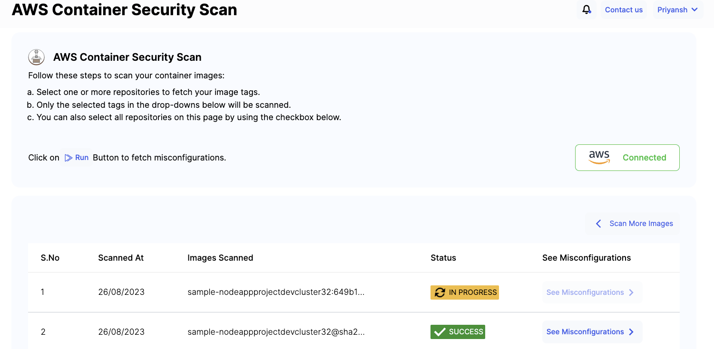
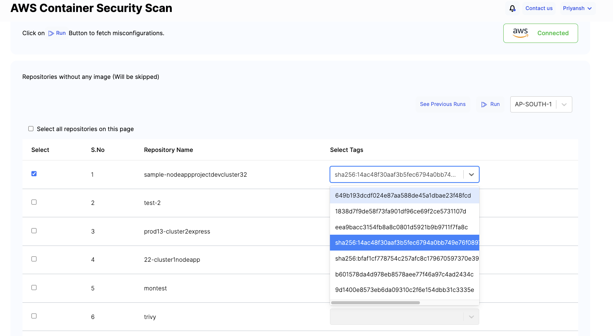
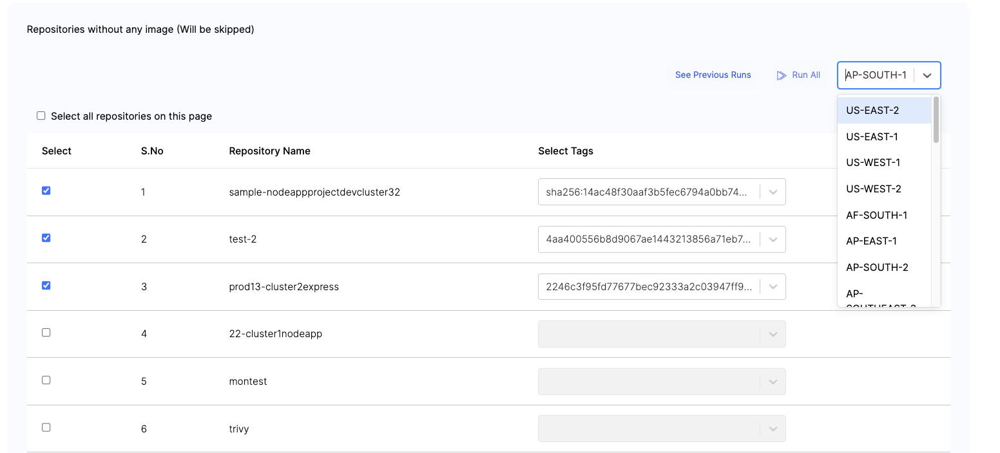
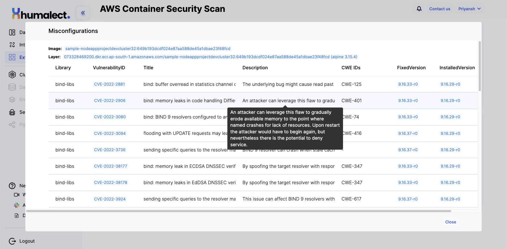

# AWS Container Security Scan

## Overview

The AWS Container Security Scan is a powerful feature that allows you to comprehensively assess the security of your container images. As containers play a critical role in modern application deployment, ensuring their security becomes of utmost importance. This scan is designed to identify vulnerabilities within your container images, thereby facilitating secure and reliable software deployment across your infrastructure.

## Usage

Here's a step-by-step guide on how to effectively perform an AWS Container Security Scan:

1. **Access the Container Security Scan:**
   Within the Cloud and Source Code Account Insights feature, navigate to the "Container Security Scan" option. This option is your gateway to initiating security scans on your container images.

   

2. **Choose Repositories:**
   Select one or more repositories from which you intend to retrieve container image tags. Only the image tags you select will undergo the scanning process. This selective approach allows you to focus on specific areas of interest.

   

3. **Tag Selection:**
   To customize your scan, utilize the drop-down menus provided to choose specific image tags for scanning. If preferred, you can opt to scan all repositories by using the provided checkbox. This flexibility ensures that you can adapt the scan to your specific needs.

   

4. **Initiate the Scan:**
   Once your repositories and tags are chosen, kick off the scan by clicking on the "Run" button. This action sets the scan process in motion, where each selected container image tag will be scrutinized for potential security vulnerabilities.

5. **View Results:**
   After the scan completes, a detailed and comprehensive report will be generated. This report presents the findings of the scan, highlighting any detected security vulnerabilities within the scanned container images. This information provides you with valuable insights to take informed actions.

   

6. **Address Vulnerabilities:**
   Armed with the scan results, review the report to gain a clear understanding of the identified vulnerabilities. Depending on the severity of the vulnerabilities, take appropriate actions to mitigate risks. This could involve updating container images, applying patches, or implementing security best practices to ensure your applications remain secure.

   

By following these straightforward steps, you can leverage the capabilities of the AWS Container Security Scan to bolster the security of your containerized applications. This feature equips you with the insights needed to make informed decisions, enabling you to deliver applications that are not only functional but also robust and resilient in the face of potential security threats.

