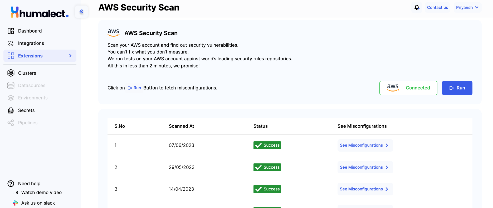
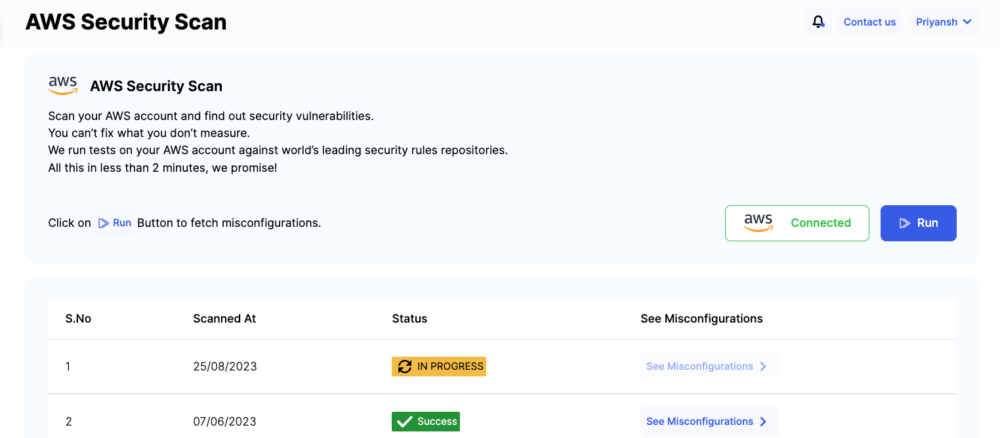
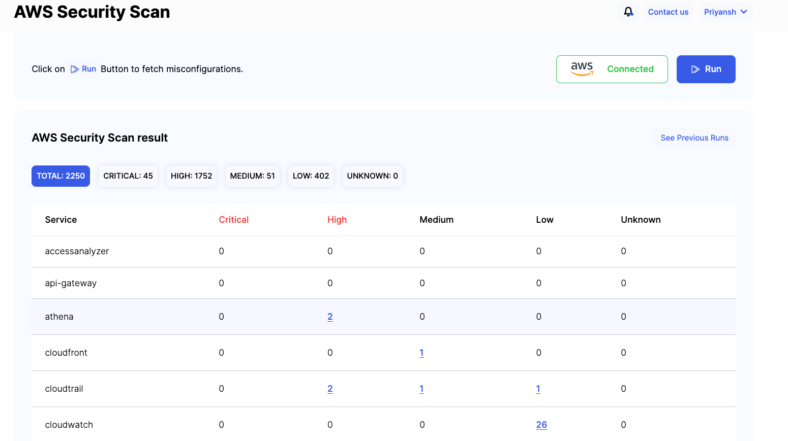
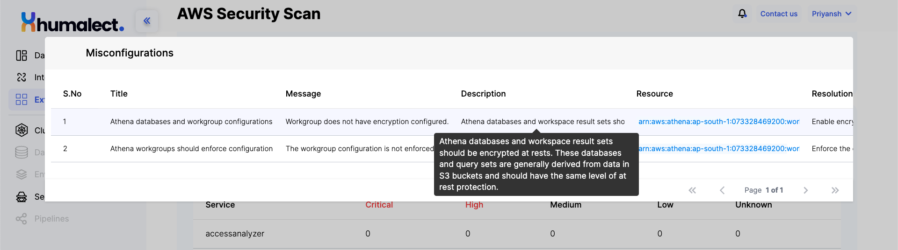

# AWS Security Scan

## Overview

The AWS Security Scan is a fundamental feature within the Cloud and Source Code Account Insights toolkit. This tool empowers users to proactively evaluate the security status of their AWS accounts by identifying potential vulnerabilities. 

By leveraging this scan, users can gain crucial insights into their AWS resources' security posture, enabling them to make informed decisions and improve overall security.

## Purpose

The AWS Security Scan serves as a proactive measure to identify security weaknesses within your AWS account. By conducting comprehensive security vulnerability assessments, this scan assists in pinpointing potential threats and vulnerabilities that may expose your AWS resources to risks. 

The scan provides users with actionable insights to address these vulnerabilities promptly, enhancing the overall security and resilience of your AWS infrastructure.

## Usage

Utilizing the AWS Security Scan is straightforward and involves the following steps:

### 1. Access the AWS Security Scan

- Start by navigating to the **Cloud and Source Code Account Insights** feature within your dashboard. This is typically accessible from the main menu or a designated security section of your user interface.

    

### 2. Initiate the Scan

- Once you are within the **Cloud and Source Code Account Insights** section, locate and click on the "Run" or "Initiate Scan" button to start the AWS Security Scan process. The scan will automatically run a series of tests against your AWS account, comparing its configuration and setup against established security rules repositories.

    

### 3. Review Results

- After the scan is completed, which typically takes less than 2 minutes, a comprehensive report will be generated. This report provides detailed insights into the security vulnerabilities that have been detected within your AWS account. The report may include information about specific vulnerabilities, their severity, affected resources, and suggested remediation steps.

    

### 4. Remediation

- Based on the information provided in the scan report, take proactive actions to address the identified vulnerabilities. This might involve applying necessary security patches, adjusting security group configurations, enhancing access controls, or reviewing identity and access management policies. The goal is to mitigate the detected vulnerabilities and strengthen the overall security posture of your AWS resources.

    

## Benefits

The AWS Security Scan offers several notable benefits:

- **Proactive Security Assessment:** Conduct regular scans to proactively identify and address security vulnerabilities within your AWS account before they can be exploited.
- **Timely Insights:** The scan typically takes less than 2 minutes, providing you with quick results to ensure timely response and remediation.
- **Actionable Reports:** The generated reports offer detailed insights into vulnerabilities, aiding in effective remediation planning.
- **Enhanced Security Posture:** By addressing identified vulnerabilities, you can bolster the security of your AWS resources, ensuring compliance and reducing risks.

## Conclusion

The AWS Security Scan is a vital tool that empowers users to take control of their AWS account's security. By identifying and addressing potential vulnerabilities, you can bolster your infrastructure's security, enhance compliance, and build a more resilient AWS environment. Incorporate the AWS Security Scan into your security practices to proactively safeguard your AWS resources.