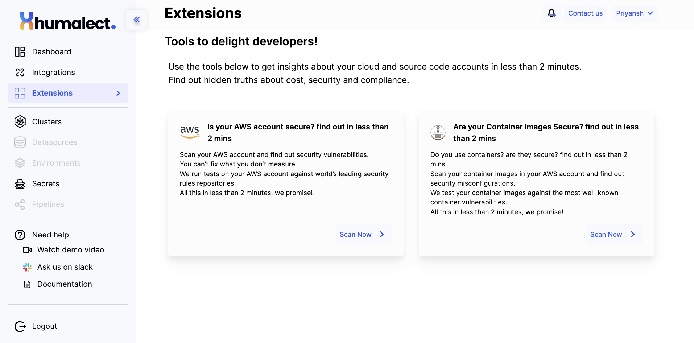

# Overview

import DocCardList from '@theme/DocCardList';

# Cloud and Source Code Account Insights Feature Documentation

Welcome to the documentation for the Cloud and Source Code Account Insights feature. This powerful tool allows you to gain valuable insights about your cloud and source code accounts in under 2 minutes, enabling you to uncover hidden truths about cost, security, and compliance. 

This documentation will walk you through the features and steps to utilize this tool effectively.

## Table of Contents

1. [AWS Security Scan](#aws-security-scan)
    - [Overview](#overview)
    - [Usage](#usage)
2. [AWS Container Security Scan](#aws-container-security-scan)
    - [Overview](#overview-1)
    - [Usage](#usage-1)

## 1. AWS Security Scan 

### Overview 

The AWS Security Scan is a key component of the Cloud and Source Code Account Insights feature. It allows you to perform security vulnerability assessments on your AWS account. By identifying potential security weaknesses, this scan provides you with crucial information that can be used to enhance the security posture of your AWS resources.

### Usage 

To utilize the AWS Security Scan:

1. **Access the AWS Security Scan:** Navigate to the Cloud and Source Code Account Insights feature within your dashboard.

2. **Initiate the Scan:** Click on the "Start Scan" button. The scan will run a series of tests against your AWS account, evaluating it against leading security rules repositories.

3. **Review Results:** After the scan is complete (usually within 2 minutes), a detailed report will be generated. This report will highlight security vulnerabilities that have been detected within your AWS account.

4. **Remediation:** Based on the scan results, take appropriate actions to address the identified vulnerabilities. This may involve applying security patches, updating configurations, or adjusting permissions.

## 2. AWS Container Security Scan 

### Overview 

The AWS Container Security Scan allows you to assess the security of your container images. Containers are a vital component of modern application deployment, and ensuring their security is paramount. This scan enables you to identify vulnerabilities within your container images, promoting secure and reliable software deployment.

### Usage 

To perform an AWS Container Security Scan:

1. **Access the Container Security Scan:** Within the Cloud and Source Code Account Insights feature, select the "Container Security Scan" option.

2. **Choose Repositories:** Choose one or more repositories from which you wish to fetch container image tags. Only the selected tags will be scanned.

3. **Tag Selection:** Utilize the drop-down menus to select specific image tags for scanning. Alternatively, you can choose to scan all repositories by using the provided checkbox.

4. **Initiate the Scan:** Click on the "Scan" button to start the container image scan process.

5. **View Results:** Once the scan is complete, a comprehensive report will be generated. This report will detail any security vulnerabilities found within the scanned container images.

6. **Address Vulnerabilities:** Review the scan results and take appropriate actions to address any identified vulnerabilities. This may involve updating container images, applying patches, or implementing security best practices.

By following these steps, you can make the most of the AWS Container Security Scan to enhance the security of your containerized applications.

---

With the Cloud and Source Code Account Insights feature, you have the power to uncover hidden truths about cost, security, and compliance within your cloud and source code accounts. By utilizing the AWS Security Scan and AWS Container Security Scan, you can proactively enhance the security and reliability of your resources. This feature is designed to empower you to take informed actions that contribute to the overall success of your projects.

Use the tools below to get insights about your cloud and source code accounts in less than 2 minutes.

Find out hidden truths about cost, security and compliance.

<DocCardList />