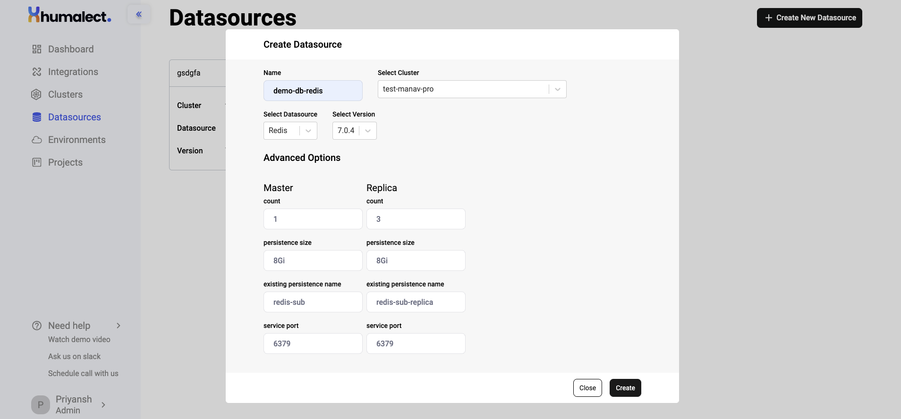
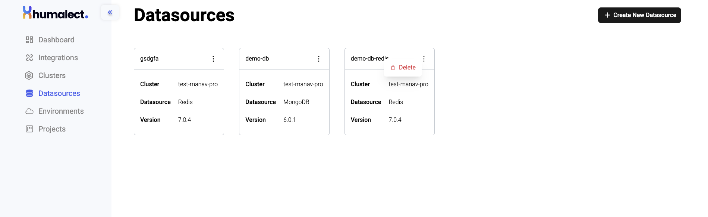

> ## This article covers:-
> 1. Create a Redis Datasource
> a. Redis Advanced Options
> 2. How to use existing datasources in a pipeline?

Humalect provides several databases that you can integrate and bring your data to the platform with minimal permissions from Humalect's side, in this article, we will be focusing on **Redis**.

Redis is an *in-memory data* structure store. It can be used as a database, cache, and message broker. It supports multiple data structures such as *strings, hashes, lists, sets, sorted sets with range queries, bitmaps, hyperloglogs, and geospatial indexes* with radius queries.

> For more information, see [Redis Docs.](https://redis.io/docs/about/)

> ## Prerequisite
> *1. have a connected Cloud provider*
> *2. have a connected Source Code provider*
> *3. have a cluster*

## Create a Redis Datasource

Let's create a Datasource with `Redis v7.0.4`.

**Step 1:** Go to the DataSources Tab from the UI ([or click here to get redirected](https://console.humalect.com/user/datasources)) and click on `+ Create New Datasource.`
**Step 2:** Enter the following details:

> | Field | Desc |
> | -- | -- |
> | **Name** | name of your Datasource|
> | **Select Cluster** | cluster name where you want your Datasource to be created |
> | **Select DataSource** | choose database/cache of your choice|
> | **Select Version** | `7.0.1`, `6.2.7` ([click for more details on redis versions](https://redis.io/download/))|

**Step 3:** After you enter the above details, you'll be prompted to enter additional details such as `persistence size`, `service port`, etc. Refer to the below table for more information.

###  Redis Advanced Options

> | Value                     | Master | Replica | Description |
> | ------------------------- | ------ | ------- | ---- |
> | **count**                     | 1*     | 3*      | number of replicas a master will remain connected with, number of instances of Master    |
> | **persistence size**          | 8Gi*   | 8Gi*    |  This is a measure of size of a Redis database and can vary depending on the amount and type of data stored, as well as the configuration of the Redis instance.    |
> | **existing persistence name** |        |         |  If you already have previous persistent volume claim and want to reuse it, you directly attach it using this setting   |
> | **service port**              | 6379*  | 6379*   |   The default port for Redis is 6379, but it can be configured to listen on a different port using this setting.|

`*default value`

> **Note:** Redis uses asynchronous replication, with asynchronous replica-to-master acknowledges of the amount of data processed. **Master-slave replication** enables data from one database server (the master) to be replicated to one or more other database servers (the slaves). The master logs the updates, which then ripple through to the slaves.

**Step:4** After you successfully fill in all the required details, click on `Create` and the Datasource creation process will start.

<i>Picture representing the state of UI when all the details are entered.</i>

**Step 5:** Once the Redis Datasource is successfully created, you'll see them listed in the DataSources tab with details like:
		a. Datasource Name
		b. Cluster Name
		c. Database used
		d. Database version used

**Step 6:** If you wish to **delete** the datasource, click on the vertical 3 dots next to the datasource card and click on `Delete`. This will initiate the deletion process.

> **Caution:** Do not delete any datasource if you are not sure about it as it can lead to dataloss.

<i>Picture representing the state of UI when the Datasource has been created.</i>

## How to use existing datasources in a pipeline?
TBD

---

> ### Further Reading:
> **1. [DataSources - MongoDB](https://docs.humalect.com/en/DataSources/MongoDB)**
> **2.  [DataSources - Postgres](https://docs.humalect.com/en/DataSources/Postgres)**

### Troubleshooting
Need help? [Contact](https://docs.humalect.com/en/contact) us.
