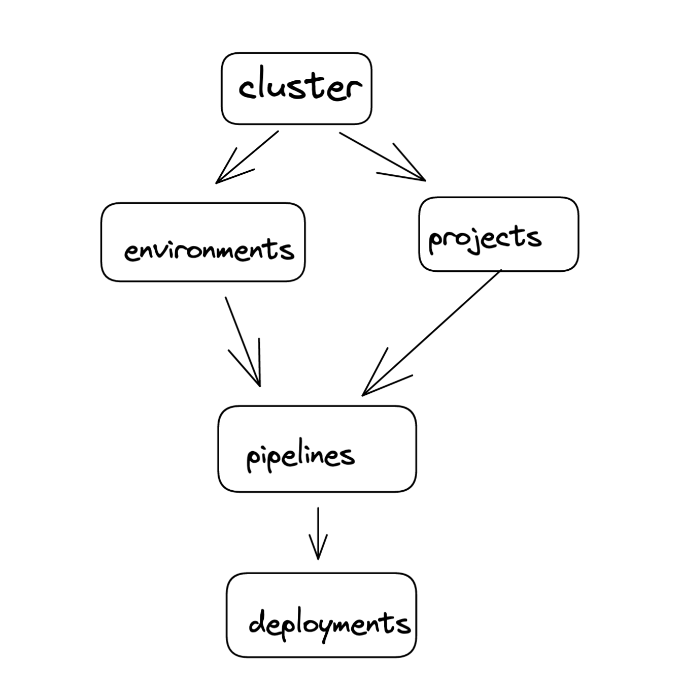
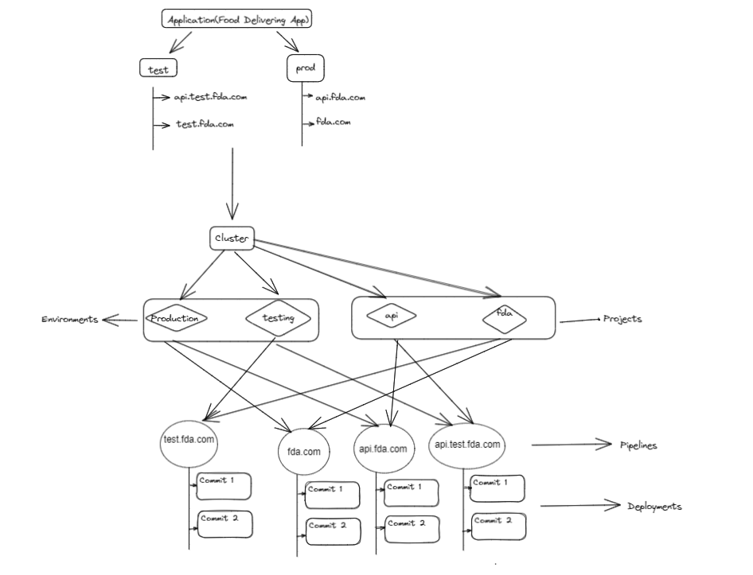

# Relationship between various commonly used terms

## Cluster
Cluster refers to the kubernetes clusters that are created via the Humalect platform. These are managed K8s EKS/AKS clusters provided by cloud providers. Cluster is the starting point and everything that exists in the Humalect world gets created inside clusters.

To know more about cluster, visit [Cluster](https://docs.humalect.com/en/Cluster/Cluster).

### Environments
An `environment` is a self contained namespace in the kubernetes cluster that hosts multiple application deployments and datasources.

Every cluster can have multiple environments. Each environment is logically separated from the other.

To know more about environment, visit [Environment](https://docs.humalect.com/en/EnvironmentPageOverview).

### Projects

A project is a logical entity in which the user selects two options:
1. The cluster on which the application is to be deployed
2. The code respository that is to be deployed

To know more about projects, visit [Project](https://docs.humalect.com/en/ProjectPageOverview).

<b>Note:-</b> Project is not a physical/infra entity, it is just a logical entity to map the cluster and code repo for application deployments.

### Pipelines
Pipeline is a logical entity, one level below the project. After selecting the cluster and the code repository on the project level, pipelines allow to select the environment and the git branch for the application deployment. In a pipeline, user can also enter the subdomain on which the application deployment is to be hosted. All the manifests like Dockerfiles, YAMLs and environment variables can be edited in a pipeline.

To know more about pipelines, visit [Pipelines](https://docs.humalect.com/en/pipelineOverview).

### Deployments
Once the pipeline is created, it can be deployed via direct commits on code repositories (if CD is enabled) or manual deployments from the pipelines page UI. A deployment is an instance of a pipeline execution (which takes the code from source code repository, builds it and releases it for the user to consume).

To know more about deployments, visit [Deployments](https://docs.humalect.com/en/deploymentPage).

## Example
Let us consider an example of a Food Delivery App(FDA) to understand the concepts better.

1. `FDA` is a Food Delivery Company which requires to run a cluster on Humalect's console. The cluster will have multiple environments and projects.
2. Let's say there are two running environments i.e. test/testing and production.
3. There are two running projects present in the cluster i.e. api and fda. These are two different code repositories being deployed on the same cluster.
4. Each of these has two pipelines each, one for each environment.
5. Each pipeline has multiple deployments as and when new code is commited or whenever a pipeline is deployed manually.

### Troubleshooting
Need help? Contact [Humalect support.](https://humalect.com/)
